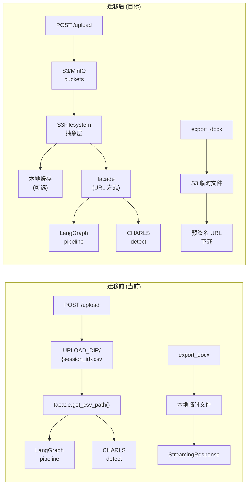

# Handoff: F12 - S3 文件存储

## 目标
将用户上传的文件从本地文件系统迁移到 S3 兼容对象存储，实现文件持久化、可扩展和跨容器可访问。本地开发使用 MinIO 模拟 S3，生产环境可对接 AWS S3 / 阿里云 OSS / 腾讯云 COS。

## 背景
- 当前实现：`POST /upload` 将 CSV 写入 `UPLOAD_DIR/{session_id}.csv`（本地文件系统）
- 文件路径通过 `facade.set_csv_path()` 和 `facade.get_csv_path()` 在 session 元数据中传递
- 下游消费方：`facade.run_upload_pipeline()` 传 `csv_path` 给 LangGraph 图，`facade.detect_charls()` 用 `pd.read_csv(csv_path)` 读取
- 文档导出（export_docx）也生成本地文件，通过 `StreamingResponse` 返回
- Docker 部署后（F11），本地文件系统在容器重启后会丢失，多容器间不可共享
- 项目内存已要求"禁止使用本地文件系统存储用户上传文件，生产环境必须使用对象存储"
- 当前 `backend/requirements.txt` 中无 S3 客户端依赖

## 架构决策



### 要点
- **不替换 facade 的 csv_path 接口**：`facade.get_csv_path()` 仍返回本地路径，新增 `S3Filesystem` 类在 upload 层将 S3 对象同步到本地缓存，下游代码无需改动
- **本地缓存策略**：upload 时下载到 `UPLOAD_DIR/.s3_cache/{session_id}.csv`，下游读取方式不变
- **MinIO 用于开发**：docker-compose 中增加 MinIO 服务，开发环境自动使用
- **生产环境**：通过 `S3_ENDPOINT_URL` 环境变量切换，可对接任意 S3 兼容服务

## 具体改动

### 1. 新增依赖

在 `backend/requirements.txt` 中添加：

```
boto3>=1.35.0
s3fs>=2024.9.0
```

`boto3` 为 AWS SDK Python 版，`s3fs` 提供 `fsspec` 文件系统接口（可选，用于 pandas 直接读 S3）。

### 2. S3 配置（backend/config.py）

在 `Settings` 类中新增 S3 相关配置：

```python
# --- S3 / Object Storage ---
S3_ENDPOINT_URL: Optional[str] = os.getenv("S3_ENDPOINT_URL")
S3_ACCESS_KEY_ID: str = os.getenv("S3_ACCESS_KEY_ID", "minioadmin")
S3_SECRET_ACCESS_KEY: str = os.getenv("S3_SECRET_ACCESS_KEY", "minioadmin")
S3_REGION: str = os.getenv("S3_REGION", "us-east-1")
S3_BUCKET: str = os.getenv("S3_BUCKET", "econpaper-uploads")
S3_PATH_PREFIX: str = os.getenv("S3_PATH_PREFIX", "uploads/")
# 本地缓存目录（用于兼容下游本地文件读取）
S3_CACHE_DIR: Path = Path(os.getenv("S3_CACHE_DIR", "./uploads/.s3_cache"))
```

### 3. S3Filesystem 抽象层

创建 `backend/storage/s3.py`：

```python
"""S3-compatible object storage abstraction.

Provides a unified interface for reading/writing files to S3 or
S3-compatible stores (MinIO, AWS S3, Alibaba OSS, etc.).

Local development uses MinIO; production uses the configured endpoint.
"""

from __future__ import annotations

import io
import os
from pathlib import Path
from typing import Optional, BinaryIO

import boto3
from botocore.client import Config
from botocore.exceptions import ClientError

from config import settings


class S3Filesystem:
    """Thin wrapper around boto3 for S3-compatible object storage.

    Usage:
        fs = S3Filesystem()
        fs.upload("local.csv", "remote/path/file.csv")
        content = fs.download("remote/path/file.csv")
        url = fs.presigned_url("remote/path/file.csv", expires=3600)
    """

    def __init__(self) -> None:
        self._client = None  # lazy init
        self._bucket = settings.S3_BUCKET

    @property
    def client(self):
        if self._client is None:
            kwargs = {
                "service_name": "s3",
                "aws_access_key_id": settings.S3_ACCESS_KEY_ID,
                "aws_secret_access_key": settings.S3_SECRET_ACCESS_KEY,
                "config": Config(
                    signature_version="s3v4",
                    connect_timeout=10,
                    read_timeout=30,
                ),
            }
            if settings.S3_ENDPOINT_URL:
                kwargs["endpoint_url"] = settings.S3_ENDPOINT_URL
                # MinIO requires path-style addressing
                kwargs["config"] = Config(
                    signature_version="s3v4",
                    s3={"addressing_style": "path"},
                )
            if settings.S3_REGION:
                kwargs["region_name"] = settings.S3_REGION
            self._client = boto3.client(**kwargs)
            self._ensure_bucket()
        return self._client

    def _ensure_bucket(self) -> None:
        """Create the bucket if it does not exist."""
        try:
            self._client.head_bucket(Bucket=self._bucket)
        except ClientError:
            self._client.create_bucket(Bucket=self._bucket)

    def _key(self, path: str) -> str:
        """Prefix the path with S3_PATH_PREFIX (acts as virtual folder)."""
        prefix = settings.S3_PATH_PREFIX.rstrip("/")
        return f"{prefix}/{path.lstrip('/')}"

    def upload(self, local_path: str | Path, remote_path: str) -> str:
        """Upload a local file to S3. Returns the remote key."""
        key = self._key(remote_path)
        self.client.upload_file(str(local_path), self._bucket, key)
        return key

    def upload_bytes(self, data: bytes, remote_path: str) -> str:
        """Upload bytes directly to S3. Returns the remote key."""
        key = self._key(remote_path)
        self.client.put_object(Bucket=self._bucket, Key=key, Body=data)
        return key

    def download(self, remote_path: str) -> bytes:
        """Download a file from S3 as bytes."""
        key = self._key(remote_path)
        buf = io.BytesIO()
        self.client.download_fileobj(self._bucket, key, buf)
        buf.seek(0)
        return buf.read()

    def download_to_file(self, remote_path: str, local_path: str | Path) -> Path:
        """Download an S3 object to a local file. Returns the local path."""
        key = self._key(remote_path)
        local = Path(local_path)
        local.parent.mkdir(parents=True, exist_ok=True)
        self.client.download_file(self._bucket, key, str(local))
        return local

    def presigned_url(self, remote_path: str, expires: int = 3600) -> str:
        """Generate a presigned download URL (default: 1 hour)."""
        key = self._key(remote_path)
        return self.client.generate_presigned_url(
            "get_object",
            Params={"Bucket": self._bucket, "Key": key},
            ExpiresIn=expires,
        )

    def delete(self, remote_path: str) -> bool:
        """Delete an object from S3. Returns True if successful."""
        key = self._key(remote_path)
        try:
            self.client.delete_object(Bucket=self._bucket, Key=key)
            return True
        except ClientError:
            return False

    def exists(self, remote_path: str) -> bool:
        """Check if an object exists in S3."""
        key = self._key(remote_path)
        try:
            self.client.head_object(Bucket=self._bucket, Key=key)
            return True
        except ClientError:
            return False

    def list(self, prefix: str = "") -> list[str]:
        """List objects under the given prefix."""
        key_prefix = self._key(prefix) if prefix else settings.S3_PATH_PREFIX
        response = self.client.list_objects_v2(
            Bucket=self._bucket, Prefix=key_prefix
        )
        return [
            obj["Key"]
            for obj in response.get("Contents", [])
        ]


# Module-level singleton
s3_fs = S3Filesystem()
```

### 4. 更新 upload 端点（backend/routers/sessions.py）

修改 `upload` 函数，在写入本地文件后同步到 S3：

```python
# 在文件顶部添加
from storage.s3 import s3_fs

# 修改 upload 函数（第 97-101 行，本地 CSV 写入后）
# 5. Persist the uploaded CSV to S3 (and local cache).
upload_dir = Path(settings.UPLOAD_DIR)
upload_dir.mkdir(parents=True, exist_ok=True)
csv_path = upload_dir / f"{session_id}.csv"
csv_path.write_bytes(content)

# 同步到 S3（如果配置了 S3_ENDPOINT_URL）
s3_remote_path = f"{session_id}/data.csv"
try:
    s3_fs.upload_bytes(content, s3_remote_path)
except Exception:
    # S3 不可用时降级到本地存储（F7 降级模式）
    facade.record_degradation(
        session_id, "upload", "S3 upload failed, using local storage", "local_fs"
    )
```

### 5. 更新 facade 缓存逻辑（backend/facade.py）

在 `get_csv_path` 中添加 S3 回退：

```python
def get_csv_path(self, session_id: str) -> str:
    """Resolve the CSV path stored for this session.

    If the local file does not exist but an S3 object is available,
    download it to the local cache transparently.
    """
    entry = self.get_session_entry(session_id)
    csv_path = entry.get("csv_path")
    if not csv_path:
        state = entry.get("state", {}) or {}
        datasets = state.get("uploaded_datasets", []) or []
        if datasets and datasets[0].get("path"):
            csv_path = datasets[0]["path"]
    if not csv_path:
        raise HTTPException(
            status_code=400, detail="No dataset path in session"
        )

    # 本地文件不存在时，尝试从 S3 缓存拉取
    if not os.path.exists(csv_path) and settings.S3_ENDPOINT_URL:
        try:
            s3_remote = f"{session_id}/data.csv"
            if s3_fs.exists(s3_remote):
                cache_dir = Path(settings.S3_CACHE_DIR)
                cache_dir.mkdir(parents=True, exist_ok=True)
                local_cache = cache_dir / f"{session_id}.csv"
                s3_fs.download_to_file(s3_remote, local_cache)
                csv_path = str(local_cache)
                # 更新 entry 的 csv_path 指向缓存
                entry["csv_path"] = csv_path
        except Exception:
            pass  # 降级：使用原始路径（会触发下游 404）

    return csv_path
```

### 6. 更新文档导出（backend/routers/sessions.py export 端点）

文档导出生成的 PDF/DOCX 文件也上传到 S3：

```python
# export 端点中，生成文件后
if settings.S3_ENDPOINT_URL:
    try:
        s3_remote = f"{session_id}/export/{Path(file_path).name}"
        s3_fs.upload(file_path, s3_remote)
        # 返回预签名 URL 供下载
        presigned = s3_fs.presigned_url(s3_remote)
        # 返回重定向或预签名 URL
    except Exception:
        pass  # 降级到本地 StreamingResponse
```

### 7. 更新 .env.example

在 `.env.example` 中添加 S3 相关配置：

```env
# --- S3 / Object Storage (MinIO for dev, AWS/OSS/COS for prod) ---
S3_ENDPOINT_URL=http://localhost:9000
S3_ACCESS_KEY_ID=minioadmin
S3_SECRET_ACCESS_KEY=minioadmin
S3_REGION=us-east-1
S3_BUCKET=econpaper-uploads
S3_PATH_PREFIX=uploads/
S3_CACHE_DIR=./uploads/.s3_cache
```

### 8. 更新 docker-compose.yml（F11 集成）

在 `docker-compose.yml` 中添加 MinIO 服务：

```yaml
services:
  # ... 现有 postgres, backend, frontend 服务 ...

  minio:
    image: minio/minio:latest
    command: server /data --console-address ":9001"
    environment:
      MINIO_ROOT_USER: minioadmin
      MINIO_ROOT_PASSWORD: minioadmin
    volumes:
      - minio_data:/data
    ports:
      - "9000:9000"
      - "9001:9001"
    healthcheck:
      test: ["CMD", "curl", "-f", "http://localhost:9000/minio/health/live"]
      interval: 10s
      timeout: 5s
      retries: 5

volumes:
  # ... 现有 volumes ...
  minio_data:
```

同时更新 backend 的 `environment`，添加 S3 环境变量：

```yaml
backend:
  # ...
  environment:
    # ... 现有环境变量 ...
    - S3_ENDPOINT_URL=http://minio:9000
    - S3_ACCESS_KEY_ID=minioadmin
    - S3_SECRET_ACCESS_KEY=minioadmin
    - S3_BUCKET=econpaper-uploads
```

### 9. 更新 .gitignore

添加 S3 缓存目录：

```
# S3 缓存
backend/uploads/.s3_cache/
```

### 10. 更新 backend/main.py

在应用启动时初始化 S3 连接（如果配置了）：

```python
@app.on_event("startup")
async def startup():
    # ... 现有初始化代码 ...
    if settings.S3_ENDPOINT_URL:
        try:
            from storage.s3 import s3_fs
            # 触发连接测试
            s3_fs.client
        except Exception as exc:
            print(f"⚠ S3 connection failed (degraded): {exc}")
```

## 测试

### 新增测试文件

创建 `backend/tests/test_s3.py`：

```python
"""Tests for S3Filesystem abstraction layer."""

import pytest
from storage.s3 import S3Filesystem


@pytest.fixture
def s3_fs():
    """Return a real S3Filesystem (requires MinIO or S3_ENDPOINT_URL)."""
    return S3Filesystem()


def test_upload_and_download_bytes(s3_fs):
    """Upload bytes and download them back."""
    remote = "test/hello.txt"
    content = b"hello, s3!"
    s3_fs.upload_bytes(content, remote)
    downloaded = s3_fs.download(remote)
    assert downloaded == content
    s3_fs.delete(remote)


def test_exists(s3_fs):
    """exists() returns True for existing objects, False otherwise."""
    remote = "test/exists_check.txt"
    assert not s3_fs.exists(remote)
    s3_fs.upload_bytes(b"data", remote)
    assert s3_fs.exists(remote)
    s3_fs.delete(remote)
    assert not s3_fs.exists(remote)


def test_presigned_url(s3_fs):
    """presigned_url() returns a valid HTTP URL."""
    remote = "test/presigned.txt"
    s3_fs.upload_bytes(b"data", remote)
    url = s3_fs.presigned_url(remote)
    assert url.startswith("http")
    s3_fs.delete(remote)
```

### 更新测试配置

在 `conftest.py` 中添加 S3 相关 fixture：

```python
@pytest.fixture(scope="session")
def s3_enabled():
    """Check if S3/MinIO is available for integration tests."""
    import os
    return bool(os.getenv("S3_ENDPOINT_URL"))
```

### 测试注意事项

- 单元测试不要求真实 MinIO，S3Filesystem 的 `_ensure_bucket` 会静默跳过创建
- CI 中可通过 `S3_ENDPOINT_URL` 环境变量控制是否启用 S3 集成测试
- 默认不启用 S3 时，所有路径保持本地文件系统行为不变

## 文件清单

| 文件 | 操作 | 说明 |
|------|------|------|
| `backend/storage/__init__.py` | 创建 | 包初始化（空文件） |
| `backend/storage/s3.py` | 创建 | S3Filesystem 抽象层 |
| `backend/config.py` | 修改 | 添加 S3 配置项 |
| `backend/requirements.txt` | 修改 | 添加 `boto3`、`s3fs` |
| `backend/routers/sessions.py` | 修改 | upload 端点同步 S3 |
| `backend/facade.py` | 修改 | get_csv_path S3 缓存回退 |
| `backend/main.py` | 修改 | 启动时初始化 S3 |
| `backend/.env.example` | 修改 | 添加 S3 配置 |
| `backend/tests/test_s3.py` | 创建 | S3 抽象层测试 |
| `docker-compose.yml` | 修改 | 添加 MinIO 服务 |
| `.gitignore` | 修改 | 添加 S3 缓存目录 |

## 依赖

- **前置**：F11（Docker 部署配置）✅ — MinIO 集成在 docker-compose 中
- **后置**：F13（CI/CD 流水线）— 需要 S3 做测试 artifact 存储
- **不阻塞**：F13 可在无 S3 时使用本地文件系统继续

## 验收标准

- [ ] `backend/storage/s3.py` 创建，S3Filesystem 类实现 upload/download/exists/delete/presigned_url
- [ ] 无 `S3_ENDPOINT_URL` 时，上传行为与当前一致（纯本地文件系统）
- [ ] 有 `S3_ENDPOINT_URL` 时，上传文件同步到 S3
- [ ] 本地文件删除后，`get_csv_path` 自动从 S3 缓存拉取（降级路径）
- [ ] `docker compose up -d` 启动 MinIO 服务，backend 可连接
- [ ] 上传文件 → 重启容器 → 文件不丢失（S3 持久化）
- [ ] 文档导出文件也上传到 S3（可选预签名 URL）
- [ ] 后端测试通过（`python -m pytest backend/tests/ -q`）
- [ ] 前端测试通过（`cd frontend && npm test`）
- [ ] MinIO Console 可访问（`http://localhost:9001`，admin/minioadmin）