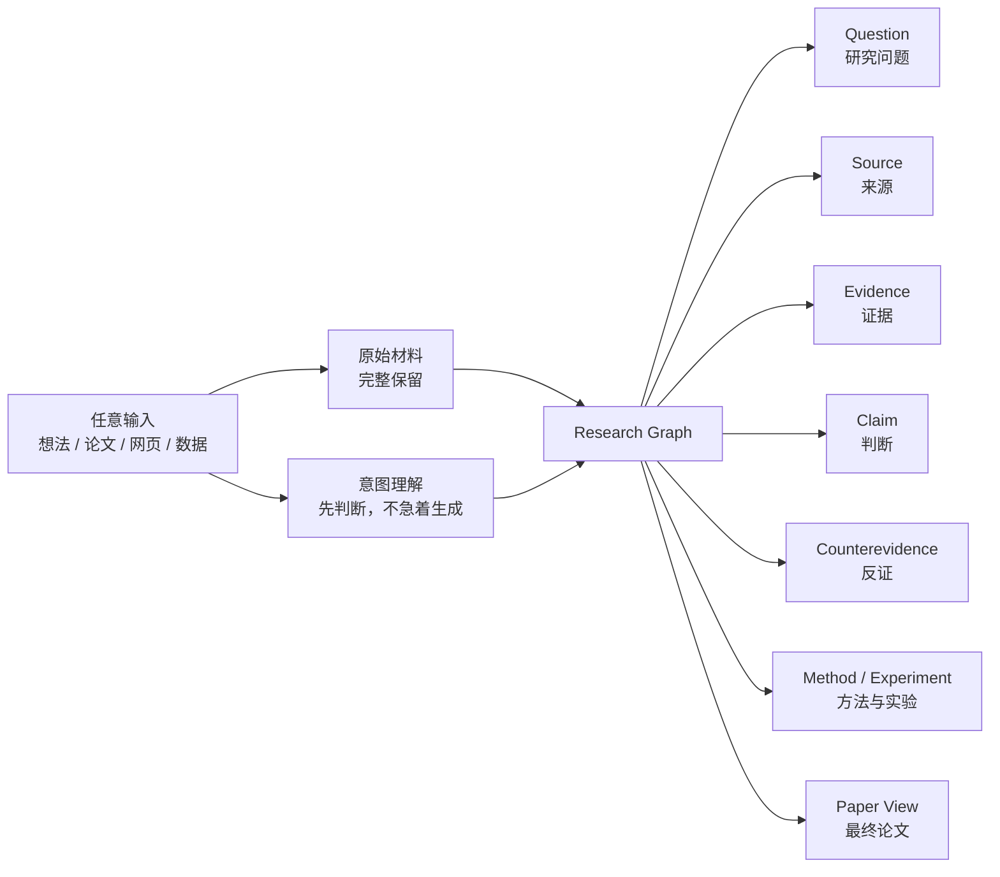

# 实验性 Idea：Research Canvas

> 状态：**Parked / 已留档，当前不开发**  
> 记录日期：2026-08-29  
> 当前产品主线：继续优化现有的对话式研究桌面与逐步论文生产流程。

## 一句话假设

研究论文不只是一段对话最终生成的长文，也可以被看作一张不断生长的研究关系图：用户放入任何尚未整理的材料，AI 先理解材料与用户意图，再把它展开成可追溯的研究对象与关系。

这不是“把聊天消息改成卡片”，而是把产品的基本单位从消息变成研究对象。

## 为什么值得保留

用户真实的起点未必是一篇 PDF 或一条结构完整的需求，也可能是：

- 一句话或一个模糊想法；
- 一篇完整论文；
- 一段网页或录屏；
- 一份数据；
- 一段暂时说不清用途、但觉得重要的材料。

产品的智能不应依赖用户先选对输入类型、写出完整指令。它应该先保留原始材料，同时判断：这是什么、用户可能在意什么、还缺哪一个会改变路径的问题。

无限画布的价值不是“大”，而是允许这些未定型对象在理解过程中逐渐显露关系。

## 概念模型



画布承载研究关系，文档承载最终表达。论文是研究图的一种 View，不是画布中唯一的对象。

## 关键交互原则

1. **先保留，再解释。** AI 的理解不能覆盖或改写用户的原始输入。
2. **先形成关系，再生成正文。** 默认动作不是“写一篇论文”，而是识别问题、证据、判断和缺口。
3. **意图识别可见且可纠正。** AI 应展示自己的理解与置信度，只追问会真正改变路径的问题。
4. **边有语义。** `supports`、`contradicts`、`cites`、`derived-from`、`requires`、`tests`、`belongs-to` 不等同于聊天的“下一条消息”。
5. **证据可回溯。** 论文中的重要判断可以反向定位到来源、证据和实验。
6. **用户始终保留方向权。** AI 可以扩展技术验收和研究路径，但不能替用户决定什么值得研究。

## 与当前产品的关系

当前产品继续采用已经存在的主路径：

```text
输入想法 → AI 追问与凝练 → 用户确认方向 → 数据与识别 → 逐章写作 → 评审与导出
```

Research Canvas 目前只是未来可能替代或包裹这条线性入口的实验，不改变现有 `DeskPage`、Agent 流程、接口或数据结构。

如果未来启动，现有对话能力不会消失；它更可能成为画布中针对某个研究对象进行讨论的一种局部交互。

## 当前不做

- 不引入 React Flow、tldraw 或其他无限画布依赖；
- 不修改当前页面入口和导航；
- 不把现有 Agent 输出机械地拆成卡片；
- 不设计完整的节点数据库或迁移现有会话数据；
- 不把视觉原型当成已确认的产品设计；
- 不因这个 Idea 中断当前对话式主路径的迭代。

## 概念原型

Codex 中已经做过一份独立的交互草图，用于验证空间关系和意图批注的表达。它不属于产品构建产物，也没有接入真实数据或 Agent：

```text
/Users/mahaoxuan/.codex/visualizations/2026/08/29/
01a04c42-67e2-7ee1-b70a-b7f2010bb632/research-canvas-concept.html
```

草图中值得保留的是：材料、工作判断、证据缺口、下一步方法和 AI 意图批注同时存在于一个空间。视觉风格与具体布局仍未定稿。

## 重新启动的条件

只有当下面至少三项成立，才把它从 Idea 升级为产品实验：

1. 现有对话式主路径已经稳定，用户能完整走通“想法 → 论文”；
2. 实际使用反复出现“对话太线性、研究关系难回看”的问题；
3. 已有真实用户材料可以用于验证，而不是只用虚构节点演示；
4. 能定义一个小范围实验，例如只做“材料 → Claim / Evidence 图”，而非一次重写整个产品；
5. 已明确成功证据，例如用户能更快找回依据、发现证据缺口或修正 AI 的意图判断。

## 首个可验证实验（未来）

当重新启动时，第一版只验证一件事：

> 用户放入一句话、一篇论文或一段网页后，系统能否保留原文，并生成一张用户看得懂、可以纠正的“材料—判断—证据—缺口”小图？

这一实验不包含完整论文写作、多人协作、复杂拖拽排版或自动研究闭环。验证成立后，再讨论画布是否应成为主界面。

