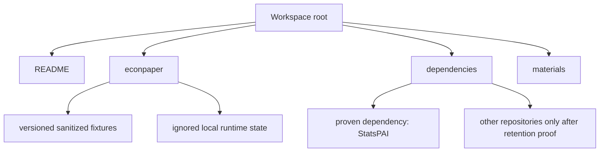
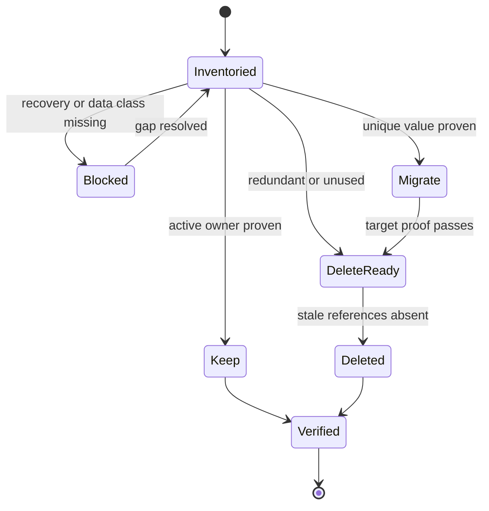

# Local Workspace Repository Cleanup - Plan

**Target workspace:** the directory that contains `econpaper/`. Paths in this plan are relative to that workspace.

## Goal Capsule

- **Objective:** Opening the economics-paper workspace makes the one active product, its proven dependencies, and its necessary research materials immediately understandable, without losing useful unique code or user data.
- **Means:** Classify every current item through a recoverable migrate-or-delete gate, then converge on one product-centered workspace (KTD1–KTD6).
- **Authority:** The confirmed Product Contract in this plan overrides older workspace maps. `econpaper/docs/adr/0010-one-product-merge.md` remains authoritative for product identity where it does not conflict with the newer delete-after-extraction decision.
- **Execution profile:** Characterize first, migrate second, delete last. Do not combine safety capture, migration, and irreversible cleanup into one operation.
- **Stop conditions:** Stop before deleting any item that contains an unclassified database, upload, uncommitted change, unpushed commit, or live path dependency.
- **Tail ownership:** The executor owns the cleaned workspace and verification evidence. The user owns the final approval to discard temporary recovery snapshots.
- **Research-value ownership:** The executor prepares a concise disposition ledger for human-authored notes, paper outputs, and source materials, including provenance, replaceability evidence, and a recommended action. Items with decisive evidence follow the retention gate; the user decides only candidates whose irreplaceable research value remains ambiguous before deletion.

---

## Product Contract

### Summary

Make `econpaper` the only active paper product. Retain other local repositories only when the current product proves it uses them; extract useful content from old projects and delete the redundant containers.

### Problem Frame

The workspace root is not a Git repository, but it currently contains ten independent Git repositories, four linked legacy worktrees, generated data, old product prototypes, upstream mirrors, and multiple documentation layers. Two local checkouts point at the same GitHub product repository. Several root-level directories look like peer products even though the accepted product identity says only `econpaper` is active.

The risk is not just visual clutter. The legacy checkout contains uncommitted work and local-only branch history, while three SQLite databases and the root `runs/` and `uploads/` directories may contain persistent state. A cleanup that treats all of this as cache could lose work or data. A cleanup that preserves everything as an archive would keep the original comprehension problem.

### Key Decisions

- **One active product:** `econpaper` is the only product checkout. (session-settled: user-approved — chosen over keeping the legacy CLI and web product as parallel products: one visible product line is easier to understand and maintain.) Governs R1, R2, R10.
- **Usefulness decides retention:** Old projects and external clones stay only when current behavior, tests, or necessary research material proves their value. (session-settled: user-directed — chosen over permanent archival: keeping unused projects would preserve the same confusion under a new label.) Governs R3–R5.
- **Recoverability precedes deletion:** Dirty repositories, local-only commits, and unclassified data receive temporary recovery protection before removal. (session-settled: user-approved — chosen over immediate deletion: the current workspace contains changes and data that cannot yet be regenerated safely.) Governs R6–R9.

### Requirements

**Product identity and layout**

- R1. `econpaper/` is the only active paper-product repository and the only place for new product code.
- R2. The final visible root contains only a workspace entry point, `econpaper/`, proven dependencies, and necessary research materials.
- R3. Every current top-level item receives one terminal disposition: keep as active infrastructure, migrate into an owner, or delete.

**Usefulness and deletion**

- R4. Unique behavior from `实证论文项目模板/`, `agent_paper/`, and `papers/` moves into `econpaper/` only when it serves the current product contract and has executable proof or irreplaceable research value.
- R5. Redundant, superseded, or unused repositories and artifacts are deleted after their retention gate passes; no permanent archive area is created.
- R6. External repositories remain local only when an enumerated consumer closure proves that the product imports them, executes them, or reads a necessary versioned resource from them. The closure covers code imports, subprocess calls, configuration, editable installs, and skill or plugin loaders; every retained checkout records its upstream identity and immutable revision and passes an integrity check.

**Safety and data**

- R7. Every independent or nested repository with local-only history has its own validated Git bundle and ref manifest, and every dirty checkout or linked worktree has a complete file manifest and working-tree snapshot covering modified, deleted, and untracked files before cleanup begins. Recovery storage is encrypted at rest, owner-only, outside cloud-synchronized locations, and never committed or uploaded.
- R8. Every database, upload, run, session, cache, and learning-label store records a provenance basis before classification as user state, reusable fixture, or generated test data. Generated-data classification requires affirmative reproducible evidence; unresolved cohorts remain protected as user state until explicitly accepted for deletion.
- R9. Path moves update code, tests, documentation, editable installs, and local runtime configuration before the old path is removed.

**Acceptance**

- R10. A new contributor can identify the product, dependency boundary, material boundary, and development entry point from the root README without opening legacy documents.
- R11. The product starts and its focused backend, agent, and frontend checks pass without any removed directory present.
- R12. No tracked product file contains an absolute path to this machine or a live reference to a deleted workspace directory.

### Success Criteria

- The visible root converges on `README.md`, `econpaper/`, `dependencies/`, and `materials/`; hidden tool configuration remains only when the current workspace loader uses it.
- `dependencies/` contains only repositories that pass R6. Current evidence proves `StatsPAI` is active; AERS and `stata-code` must still pass the gate.
- The legacy template checkout, its four linked worktrees, its nested repositories, and duplicate reference mirrors no longer exist after extraction and acceptance.
- Persistent user state has one documented local location, owner-only permissions, an explicit retention rule, and no cloud-sync or version-control exposure; it is not mixed with source, fixtures, or test output.
- Temporary recovery snapshots have recorded locations, creation times, access controls, and destruction status; snapshots and their decryption material are discarded only after the cleaned workspace and migrated assets are accepted.

### Acceptance Examples

- AE1. **Covers R4, R5, R7.** Given a legacy-only module with a focused test, when the same capability is absent from `econpaper`, then migrate the smallest coherent capability and its proof before deleting the legacy copy.
- AE2. **Covers R4, R5.** Given a legacy file whose behavior is already present in `econpaper`, when comparison and focused tests show equivalence, then delete the legacy file without copying it.
- AE3. **Covers R6.** Given a repository named as a dependency only in documentation or unused diagnostic constants, when the enumerated consumer closure finds no unresolved consumer and every declared affected path passes without it, then remove the repository and correct the stale contract; if a surface cannot be resolved or exercised, deletion remains blocked.
- AE4. **Covers R8.** Given a database, upload, run, session, cache, or learning-label cohort whose provenance is uncertain, when cleanup reaches its directory, then stop deletion and protect it as user state until provenance supports another class or the user explicitly accepts deletion.
- AE5. **Covers R9, R11.** Given a dependency moved under `dependencies/`, when the old path is absent, then installation, import, and the affected product path still succeed.

### Target Output Structure

```text
经济学论文/
├── README.md
├── econpaper/
│   ├── .local/                 # ignored persistent runtime state
│   ├── docs/
│   ├── fixtures/               # small, sanitized, reproducible gold cases
│   └── ...                     # product code
├── dependencies/
│   └── StatsPAI/               # plus only dependencies that pass R6
├── materials/
│   └── README.md               # local-only source data and paper materials map
├── .agents/                    # keep only if workspace tooling still resolves it
├── .claude/                    # keep only the live skill bridge
└── skills-lock.json            # keep with the live skill bridge
```

`econpaper/.local/` and private material data must remain outside Git tracking and cloud-synchronized locations. Their directories and files are owner-readable and owner-writable only; migration preserves or tightens those permissions. Each retained data class has a documented retention and verifiable deletion rule. `materials/README.md` documents ownership and location without committing restricted datasets.

### Current Inventory and Target Disposition

| Current item | Observed role | Planned disposition | Retention gate |
|---|---|---|---|
| `econpaper/` | Sole web product; same GitHub repository as the legacy template | Keep as canonical product | Protect current dirty work; retain `main` and its upstream relationship |
| `StatsPAI/` | Imported by estimation and cleaning paths; editable local dependency | Move to `dependencies/StatsPAI/` | Import and focused estimation/cleaning checks pass from the new path |
| `_refs/StatsPAI-ref/` | Clean duplicate at the same commit as `StatsPAI/` | Delete | Confirm tree identity and no unique refs |
| `stata-code/` | Mentioned by setup and diagnostics, but no current runtime import or call was found | Delete unless R6 proof appears | Product translation path and tests pass without the checkout |
| `_refs/AERS-ref/` | Used by stale upstream diagnostics; no active skill content read was found outside that surface | Delete unless R6 proof appears | Identification and robustness paths pass without the checkout |
| `实证论文项目模板/` | Legacy CLI checkout with dirty files, seven local commits on its active branch, four worktrees, and nested repositories | Extract useful content, then delete the whole local checkout | R7 snapshot validated; candidate capability ledger resolved; migrated tests pass |
| `papers/` | Three historical paper cases, one nested dirty Git repo, generated outputs, and potentially reusable evidence | Extract minimal gold cases and necessary local materials, then delete the container | Each case classified as fixture, private material, or generated output |
| `agent_paper/` | Superseded standalone prototype with generated paper outputs | Extract only unique evaluation cases, then delete | Product has equivalent or better covered behavior |
| `agent-skills/` | Clean external clone with no product reference | Delete | No workspace skill loader resolves this checkout |
| Root `docs/`, `DESIGN.md`, and journey image | Mixed historical product docs, current design rules, and review artifacts | Move current material into `econpaper/docs/`; delete stale duplicates | Product decisions remain traceable and broken links are removed |
| `.workbuddy/` | One current audit, screenshot, and local memory | Move durable product evidence if still useful, then delete tool output | Relevant findings exist in product-owned docs |
| `.ship/` | Completed 2026-06 task state | Delete after extracting any still-active decision | No active task or external process uses it |
| Root, product, and backend `runs/` and `uploads/`; three SQLite databases; session, cache, and learning-label stores | Mixed test artifacts and possible persistent state across multiple configured paths | Record each store, classify it, migrate retained state to named paths under `econpaper/.local/`, then delete superseded copies | Per-store provenance, counts, and selected hashes reconcile; product reads the new location; old locations are absent |
| `scratch/` and root preview artifacts | One-off logs, prototypes, and generated papers | Migrate approved artifacts; delete the rest | No active specification or test links to a removed artifact |
| Root caches, orphan `node_modules/`, empty directories, `.DS_Store`, and zero-byte temp files | Regenerable or empty | Delete | None beyond confirming they are not symlink targets |
| `.agents/`, `.claude/`, and `skills-lock.json` | Current workspace skill installation and bridge | Keep while loader resolves them | Skill remains discoverable after cleanup |
| `项目入口.md` | Current workspace map | Replace with root `README.md` | README matches the final tree and product commands |

### Scope Boundaries

**In scope**

- Local repository and worktree consolidation.
- Minimal product changes required to remove path coupling and relocate runtime state.
- Extraction of useful legacy capabilities, tests, documentation, fixtures, and research materials.
- Deletion of redundant local repositories and generated artifacts after their gates pass.

**Outside this cleanup**

- Rewriting product features for unrelated UX or architecture goals.
- Merging the full legacy Git history into `econpaper/main`.
- Pushing, deleting, or rewriting remote GitHub branches.
- Committing private datasets, uploaded user files, credentials, or local databases.
- Moving any code, documentation, fixture, or material index into Git before credential, personal-data, restricted-content, and absolute-path scans pass and the staged diff is reviewed.

---

## Planning Contract

### Key Technical Decisions

- KTD1. **Use a three-gate lifecycle for every deletion candidate:** inventory and recovery, usefulness decision, then deletion and verification. This prevents both data loss and permanent archival drift. (session-settled: user-approved — chosen over one-pass cleanup: current dirty repositories and databases require recoverability.)
- KTD2. **Group surviving external repositories under `dependencies/`:** the root then communicates product versus dependency without relying on prose. Product paths must resolve from a workspace configuration boundary instead of hard-coded sibling names.
- KTD3. **Require executable evidence and provenance for repository retention:** enumerate code imports, subprocess calls, configuration, editable installs, and skill or plugin loaders; then exercise every declared affected path with the repository unavailable. A retained checkout also needs a verified upstream identity, immutable revision, and integrity check. Documentation claims alone do not retain AERS or `stata-code`, and an unresolved consumer blocks deletion.
- KTD4. **Separate three data classes:** sanitized fixtures belong in `econpaper/fixtures/`; private source material belongs under `materials/`; runtime state belongs in ignored `econpaper/.local/`.
- KTD5. **Capture legacy state without publishing it:** each independent or nested repository with local-only history receives a validated Git bundle and ref manifest, while each dirty checkout and linked worktree receives a complete file manifest and working-tree snapshot. Restore every recorded ref and validate every snapshot manifest in temporary storage. The protection remains temporary, encrypted, owner-only, outside cloud synchronization and the daily workspace, and is destroyed with its decryption material after acceptance.
- KTD6. **Delete by dependency closure:** references and runtime paths move first, focused checks run with the old path absent, and only then is the old directory removed.

### High-Level Technical Design

The final topology separates ownership at the directory boundary.



Every existing item follows the same reversible lifecycle.



### Sequencing

1. Freeze the current inventory and create temporary recovery protection.
2. Establish the target path contract and move the one proven dependency.
3. Evaluate and extract legacy product capabilities.
4. Consolidate documentation, fixtures, paper materials, and runtime state.
5. Delete redundant containers and run the full workspace acceptance pass.
6. After user acceptance, discard temporary recovery snapshots.

### System-Wide Impact

- **Development:** install and import paths change when dependencies move.
- **Product runtime:** database, upload, and run defaults converge on `econpaper/.local/`.
- **Tests:** the hard-coded CFPS path in `econpaper/backend/tests/test_paper_draft.py` must become a product-owned fixture.
- **Documentation:** product specs that link into the legacy template must internalize the necessary source or drop the stale link.
- **Git safety:** local-only legacy branches are not present on GitHub and must exist in the temporary bundle until acceptance.

### Risks and Mitigations

| Risk | Evidence | Mitigation |
|---|---|---|
| Unique code disappears with the legacy checkout | The checkout has untracked modules, 705 added lines in tracked diffs, and local-only branch objects | Characterize each candidate cluster and validate the recovery bundle before deletion |
| User state is mistaken for test output | Runtime stores exist at root, product, and backend paths; three databases contain different user-row counts | Record per-store provenance; require reproducible evidence for generated output; otherwise protect as user state and reconcile counts/hashes |
| Recovery protection becomes a new sensitive-data exposure | Bundles and snapshots can contain credentials, private data, local-only history, and uploads | Encrypt recovery storage, restrict it to the owner, keep it outside cloud sync, and verify destruction after acceptance |
| Legacy material leaks into Git during extraction | Code, fixtures, documents, and material indexes can contain credentials, personal data, restricted content, or machine paths | Scan all staged migration content and review the staged diff before the old copy becomes delete-ready |
| Moving dependencies silently breaks environments | Editable installs and code contain workspace-relative assumptions | Reinstall editable dependencies and verify with the old path absent |
| Stale docs reintroduce the old mental model | Root docs and product specs link to the legacy template and old dependency layout | Make product-owned docs canonical and reject stale-path matches |
| Cleanup creates a new archive swamp | Old artifacts are numerous and often “potentially useful” | Require current contract plus proof; otherwise delete after recovery |
| Hidden tooling stops loading | `.claude/skills/system-design` links to `.agents/skills/system-design` | Preserve or recreate only the live bridge and verify discovery |
| A running process writes into a path during migration | No matching process was active during planning, but execution-time state can change | Recheck listeners and workspace-bound processes before every runtime-data or directory cutover |
| Root layout changes have no enclosing Git history | The workspace root is not a repository | Keep the canonical plan and path contract in `econpaper/docs/`; treat the root README as a generated local entry point |

---

## Implementation Units

### U1. Establish the recovery and disposition baseline

- **Goal:** Make every destructive decision reversible until final acceptance.
- **Requirements:** R3, R7, R8; KTD1, KTD5.
- **Dependencies:** None.
- **Files:** `econpaper/`, `实证论文项目模板/`, `papers/StatspAI_跑通一次_CHARLS_DID/`, `StatsPAI/`, `stata-code/`, `agent-skills/`, `_refs/`, `econpaper.db`, `econpaper/econpaper.db`, `econpaper/backend/econpaper.db`, root/product/backend `runs/` and `uploads/`, `econpaper/data/learning_labels.jsonl`, `econpaper/backend/data/sessions.json`, and every path resolved by `DATABASE_URL`, `UPLOAD_DIR`, `RUNS_DIR`, `SESSIONS_PATH`, `S3_CACHE_DIR`, and `LEARNING_LABELS_PATH`.
- **Approach:**
  1. Record every independent and nested repository root, current branch, HEAD, remote, upstream divergence, worktree link, and concise dirty-state count.
  2. Create one Git bundle and ref manifest for every repository with local-only history, plus one complete file manifest and working-tree snapshot for every dirty checkout and linked worktree.
  3. Store recovery artifacts encrypted with owner-only access outside the visible workspace and cloud synchronization; record location, creation time, protection method, and later destruction status without copying secrets into Git.
  4. Restore every recorded ref and validate every snapshot manifest in a temporary directory before any containing directory is moved or marked delete-ready.
  5. Record schemas, provenance signals, and per-store row/file counts and selected hashes for every configured database, run, upload, session, cache, and learning-label path.
  6. Recheck active processes and listeners immediately before any directory or runtime-data cutover.
- **Execution note:** Treat this as migration preflight. No cleanup operation starts until restoration proof exists.
- **Patterns to follow:** Preserve unrelated dirty work and use explicit targets; never use broad recursive cleanup from the workspace root.
- **Test scenarios:**
  - Restore every local-only ref from each bundle into a temporary checkout and confirm its recorded object identity.
  - Verify every dirty checkout and worktree snapshot against its complete file manifest, including the dirty paper repository and nested `demo-project-shell` repository.
  - Reconcile every configured database, run, upload, session, cache, and learning-label store before and after any later migration.
  - If a process holds or writes a migration target, stop the cutover and leave the original path unchanged.
- **Verification:** A reviewer can map every independent or nested repository, dirty worktree, and configured persistent-data surface to validated restoration evidence or a retention decision, and can verify that recovery storage is protected and still present until final acceptance.

### U2. Establish the canonical layout and dependency contract

- **Goal:** Make the physical directory layout match the one-product model.
- **Requirements:** R1, R2, R6, R9, R10, R12; KTD2, KTD3, KTD6.
- **Dependencies:** U1.
- **Files:** `README.md`, `dependencies/`, `StatsPAI/`, `_refs/AERS-ref/`, `stata-code/`, `econpaper/agent/upstream.py`, `econpaper/Makefile`, `econpaper/README.md`, `econpaper/docs/deployment.md`, `econpaper/fixtures/charls_did/`, `econpaper/agent/tests/test_upstream.py`, `econpaper/backend/tests/test_paper_draft.py`.
- **Approach:**
  1. Add a root README that names the sole product and the allowed workspace categories.
  2. Move `StatsPAI/` under `dependencies/` and replace hard-coded workspace sibling assumptions with one configurable dependency root.
  3. Remove the absolute CFPS test path by creating or selecting a sanitized product-owned fixture.
  4. Apply R6 to AERS and `stata-code`: enumerate imports, subprocess calls, configuration, editable installs, and skill or plugin loaders; exercise every declared affected path with the checkout absent; block deletion when a surface cannot be resolved.
  5. For every retained dependency, record the canonical upstream URL and immutable revision, verify the checkout matches them, and quarantine any checkout whose provenance or integrity cannot be established.
  6. In every existing Python 3.12 virtual environment that imports `StatsPAI`, recreate the editable install from `econpaper/` with `python -m pip install -e ../dependencies/StatsPAI` instead of relying on stale metadata; confirm each editable-install record resolves only to the new path.
- **Execution note:** Start with path-contract characterization while the old directories still exist; verify again with old paths unavailable.
- **Patterns to follow:** `econpaper/fixtures/charls_did/` for product-owned sanitized cases and environment-backed configuration for local-only paths.
- **Test scenarios:**
  - With `StatsPAI` only under `dependencies/`, estimation and cleaning import it and focused tests pass.
  - Every backend or agent Python environment that imports `StatsPAI` reports its editable source as `dependencies/StatsPAI`, with no metadata reference to the former root path.
  - With AERS absent, identification and robustness behavior remains unchanged or exposes a concrete failing contract that justifies retention.
  - With `stata-code` absent, the code-export path remains functional or exposes a concrete failing contract that justifies retention.
  - From a different absolute checkout path, no test resolves files through the original machine-specific workspace prefix.
  - Missing optional dependencies produce an explicit diagnostic rather than a misleading “installed” flag.
- **Verification:** The product passes focused dependency and fixture checks with every old root-level dependency path absent.

### U3. Extract useful legacy product capabilities and prepare the old checkout for removal

- **Goal:** Preserve only current-product value from the legacy template, then make its main checkout, worktrees, and nested repositories deletion-ready for U6.
- **Requirements:** R4, R5, R7, R9, R11; KTD1, KTD3, KTD5, KTD6.
- **Dependencies:** U1, U2.
- **Files:** `实证论文项目模板/Product/backend/empirical_agent/`, `实证论文项目模板/Product/backend/orchestrator_v2.py`, `实证论文项目模板/Product/backend/pi_runtime/`, `实证论文项目模板/runtime/`, `实证论文项目模板/Product/cli/`, `实证论文项目模板/tests/`, `econpaper/agent/`, `econpaper/backend/`, `econpaper/agent/tests/`, `econpaper/backend/tests/`.
- **Approach:**
  1. Build a candidate ledger for legacy-only orchestration, Pi runtime, literature search, data acquisition, design-card, specification-curve, and CLI behavior.
  2. Compare each candidate against the current product contract and existing `econpaper` behavior.
  3. Migrate the smallest coherent capability only when it passes AE1; otherwise record equivalent proof under AE2.
  4. Prove each linked worktree no longer supplies product or documentation content, then mark it deletion-ready after its refs and dirty state are validated under U1.
  5. Classify nested `demo-project-shell` and `vendor/penguin-harness`; mark them deletion-ready unless a migrated capability proves a live need.
- **Execution note:** Add characterization coverage before adapting any legacy behavior. Do not merge the legacy branch or copy its directory wholesale. U3 does not remove the checkout, worktrees, or nested repositories; U6 owns their deletion after U4 finishes using the source material.
- **Patterns to follow:** Existing `econpaper` service, node, protocol, and focused-test boundaries; the product contract takes precedence over legacy architecture.
- **Test scenarios:**
  - A legacy-only capability selected for migration fails its new characterization test before migration and passes after the minimal integration.
  - A rejected candidate has an existing product test or comparison proving it is redundant, obsolete, or outside scope.
  - Making every legacy worktree path unavailable to product and documentation checks leaves no live ref dependency or product link to that checkout.
  - The product test suite does not access `实证论文项目模板/` after extraction, while U4 can still read the source notes it has not yet internalized.
- **Verification:** Every candidate has a keep-or-delete reason with evidence, migrated behavior is product-owned, and the legacy checkout is no longer a product dependency and is ready for U6 deletion after U4 completes.

### U4. Consolidate documentation, fixtures, and research materials

- **Goal:** Keep useful knowledge under a clear owner and delete historical containers that no longer serve the product.
- **Requirements:** R2–R5, R8, R10, R12; KTD3, KTD4.
- **Dependencies:** U2, U3.
- **Files:** `docs/`, `DESIGN.md`, `econpaper-journey-step-1.png`, `.workbuddy/`, `papers/`, `agent_paper/`, `scratch/`, `econpaper/docs/`, `econpaper/fixtures/`, `materials/README.md`.
- **Approach:**
  1. Move current design rules, accepted product decisions, and still-used audit evidence into `econpaper/docs/`.
  2. Convert only small, sanitized, reproducible paper cases into fixtures with an explicit expected outcome.
  3. Map private or large source materials in `materials/README.md` without committing them into the product repository.
  4. Before any code, documentation, fixture, or material index enters Git, scan it for credentials, personal information, restricted data fragments, unsafe executable content, and absolute paths; manually review the staged diff and block source deletion until every hit is resolved.
  5. Remove generated PDFs, caches, logs, stale PRDs, superseded workspace maps, and prototypes after link and fixture checks pass.
  6. Internalize the necessary source notes behind `copaper-pivot-v1.md` or remove those legacy links.
- **Execution note:** Prefer one current document over copying historical layers. Preserve provenance for retained factual sources.
- **Patterns to follow:** Product-owned ADRs, specs, fixtures, and design docs already under `econpaper/docs/` and `econpaper/fixtures/`.
- **Test scenarios:**
  - Each retained gold case runs from a product-owned fixture and has a deterministic expected result.
  - Removing `papers/` and `agent_paper/` does not break product tests or documentation links.
  - A repository-wide stale-reference scan finds no deleted workspace path or absolute machine path.
  - The root README alone directs a contributor to setup, development, tests, materials, and dependency ownership.
- **Verification:** Product knowledge has one owner, necessary materials have a clear map, and no historical container is required for normal development.

### U5. Consolidate persistent runtime state and remove generated clutter

- **Goal:** Separate real local state from disposable test output, then remove runtime clutter from the workspace root.
- **Requirements:** R2, R3, R5, R8, R9, R11; KTD1, KTD4, KTD6.
- **Dependencies:** U1, U2.
- **Files:** `econpaper.db`, `econpaper/econpaper.db`, `econpaper/backend/econpaper.db`, root/product/backend `runs/` and `uploads/`, `econpaper/data/learning_labels.jsonl`, `econpaper/backend/data/sessions.json`, `econpaper/.local/`, `econpaper/backend/config.py`, `econpaper/backend/.env.example`, `econpaper/.gitignore`, `econpaper/docker-compose.yml`, `.ship/`, `.workbuddy/`, `.playwright-mcp/`, `.pytest_cache/`, `pytest-cache-files-gp02irhs/`, `node_modules/`, `scratch/`, `.DS_Store`, and zero-byte temporary files.
- **Approach:**
  1. Inventory every path resolved by `DATABASE_URL`, `UPLOAD_DIR`, `RUNS_DIR`, `SESSIONS_PATH`, `S3_CACHE_DIR`, and `LEARNING_LABELS_PATH`, including root, product, and backend cohorts.
  2. Record the provenance basis for each store. Classify it as user state, fixture candidate, or generated test output only when reproducible evidence supports that class; treat unresolved cohorts as user state until the user accepts deletion.
  3. Choose named database, upload, run, session, cache, and learning-label subpaths under `econpaper/.local/`; migrate only retained state.
  4. Apply owner-only permissions, keep the state root outside version control and cloud synchronization, preserve or tighten source permissions during migration, and document retention and verifiable deletion behavior for each retained class.
  5. Update local defaults and ignore rules while preserving container-specific production paths.
  6. Reconcile per-store row counts, file counts, and selected hashes before removing every superseded copy.
  7. Delete caches, orphan `node_modules/`, empty directories, `.DS_Store`, zero-byte temp files, completed tool state, and rejected scratch output.
- **Execution note:** Use a migration smoke check rather than unit coverage alone because this unit changes persistent local paths.
- **Patterns to follow:** Environment-backed backend configuration and explicit Docker overrides already used by the product.
- **Test scenarios:**
  - A retained local user/session record remains readable after migration and product restart.
  - Test-generated users, runs, uploads, sessions, caches, and learning labels are excluded from the retained-state count only by a reproducible provenance rule.
  - Missing `.local/` directories are created safely by normal product startup.
  - The product refuses or repairs broader-than-owner-only permissions on local state, and no retained state appears in Git or a cloud-synchronized path.
  - Container configuration continues to use container paths and does not inherit the host-only `.local/` location.
  - A failed or partial copy leaves the original state untouched and blocks deletion.
- **Verification:** One protected local-state root owns persistent data, every configured old store is absent or has an explicit retained owner, counts and hashes reconcile, and the workspace root has no runtime databases, runs, uploads, or regenerable caches.

### U6. Delete redundant repositories and run workspace acceptance

- **Goal:** Finish the cleanup only after every retention and migration gate is proven.
- **Requirements:** R1–R12; KTD1–KTD6.
- **Dependencies:** U2, U3, U4, U5.
- **Files:** `_refs/`, `stata-code/`, `agent-skills/`, `实证论文项目模板/`, its linked worktrees and nested repositories, `papers/`, `agent_paper/`, `.ship/`, `.workbuddy/`, `.playwright-mcp/`, `.pytest_cache/`, `pytest-cache-files-gp02irhs/`, `node_modules/`, `scratch/`, `项目入口.md`, `README.md`, `econpaper/Makefile`.
- **Approach:**
  1. Confirm each candidate's terminal disposition, consumer closure, upstream identity, immutable revision where retained, and gate evidence.
  2. Delete only explicit resolved targets; never use a broad workspace-root recursive target.
  3. Delete the legacy checkout, its linked worktrees, and its nested repositories only after U4 has internalized or removed every remaining source link and all U3 candidates are deletion-ready.
  4. Harden `make verify` so required frontend health, backend health, and import checks fail closed with nonzero status instead of being converted into informational messages.
  5. Run stale-path, Git-root, dependency, data, product, documentation, and sensitive-content acceptance checks.
  6. Present the final root tree, retained repositories/remotes and revisions, migrated data counts, deleted targets, and recovery status for user acceptance.
  7. After acceptance, verify destruction of temporary recovery snapshots and their decryption material and record the result.
- **Execution note:** This is the irreversible tail. Stop on any unexplained diff, missing count, stale reference, or unclassified item.
- **Patterns to follow:** Explicit-target destructive-action rules and product-level verification from `econpaper/Makefile`.
- **Test scenarios:**
  - The final root contains only the target structure and live hidden tooling.
  - Exactly one local checkout points at `yishu-ziyu/empirical-paper-workbench`.
  - Every retained dependency has a proven consumer and correct remote.
  - No nested `.git` directory or worktree pointer remains under a deleted container.
  - Every required service or import failure makes `make verify` return nonzero.
  - The full focused product acceptance set passes with deleted paths unavailable.
  - A fresh reader can answer “where do I develop, where are dependencies, and where is local data?” from `README.md`.
- **Verification:** The workspace matches the target tree, product behavior remains available, and the user accepts the deletion and migration report.

---

## Verification Contract

| Check | Applies to | Completion signal |
|---|---|---|
| `git -C econpaper diff --check` | U2–U6 | No whitespace or patch-format errors in the product diff |
| Focused `econpaper/agent/tests/test_upstream.py` and estimation/cleaning tests | U2 | Dependencies resolve from the new layout and optional clones do not masquerade as active |
| Focused `econpaper/backend/tests/test_paper_draft.py` | U2–U4 | The paper-draft proof uses a product fixture and no legacy absolute path |
| Backend and agent pytest using their existing Python 3.12 virtual environments | U3–U6 | Before product configuration imports, `DATABASE_URL`, `UPLOAD_DIR`, `RUNS_DIR`, `SESSIONS_PATH`, `S3_CACHE_DIR`, and `LEARNING_LABELS_PATH` all resolve under one new temporary root; tests pass and retained `.local/` counts/hashes remain unchanged |
| Frontend test, type-check, and production build | U4–U6 | Documentation/fixture cleanup and path work do not break the visible product build |
| `make verify` from `econpaper/` with services running | U5–U6 | Required frontend and backend HTTP checks fail on non-success responses, required imports are unsuppressed, and the command returns nonzero if any required service or import is unavailable |
| Stale-reference scan for removed directory names and the original machine-specific workspace prefix | U2–U6 | No live code, test, or canonical doc depends on the old workspace shape |
| Git/worktree inventory scan | U1, U3, U6 | Only intended repositories remain and no deleted worktree is registered |
| Database and artifact reconciliation | U1, U5, U6 | Every configured database, run, upload, session, cache, and learning-label store has provenance and a terminal disposition; retained rows/files/hashes match the preflight ledger; rejected test data has reproducible evidence |
| Recovery protection and restoration | U1, U6 | Every recorded ref and dirty-tree manifest restores successfully; recovery artifacts remain encrypted, owner-only, and outside cloud sync until acceptance, then their destruction is verified |
| Migration-content exposure scan | U4–U6 | Credential, personal-data, restricted-content, unsafe-executable, and absolute-path scans pass, and the staged diff contains no unresolved sensitive content |
| Execution-time process and listener scan | U1, U5, U6 | No process can write to a path while it is moved or deleted |
| Manual root-tree and README review | U6 | A reader can identify product, dependencies, materials, and local state without opening legacy artifacts |

---

## Definition of Done

- R1–R12 and AE1–AE5 are satisfied with evidence.
- `econpaper/` is the only active product checkout and the only local checkout of `yishu-ziyu/empirical-paper-workbench`.
- Every surviving external repository has a closed, executable consumer inventory, a verified upstream identity and immutable revision, and a correct remote; duplicate mirrors and unused clones are gone.
- Useful legacy capabilities are integrated at product-owned boundaries with focused tests; rejected legacy code and containers are deleted.
- Private materials and persistent local state are separated from source and generated test artifacts, have owner-only permissions and retention rules, and remain outside Git and cloud synchronization.
- Root documentation matches the final tree, and canonical product docs contain no stale links or machine-specific paths.
- Focused product checks and the real local health path pass with all deleted directories absent.
- The final report lists retained items, migrated items, deleted items, unresolved risks, and the status of temporary recovery snapshots.
- No abandoned migration scripts, duplicate documents, temporary bundles, copied archives, decryption material, or experimental cleanup files remain in the accepted workspace.

---

## Appendix

### Grounding Sources

- `项目入口.md` and `econpaper/docs/adr/0010-one-product-merge.md` define the current one-product identity.
- `econpaper/README.md`, `econpaper/Makefile`, and `econpaper/agent/upstream.py` expose the existing sibling-path dependency contract.
- `econpaper/backend/tests/test_paper_draft.py` contains a machine-specific dependency on legacy CFPS data.
- `econpaper/docs/specs/copaper-pivot-v1.md` links to research notes inside the legacy checkout.
- Current Git inspection found ten independent repositories, four linked worktrees, local-only legacy refs, and dirty state in the product, legacy template, and paper sample repositories.
- Current data inspection found SQLite user-table counts of 103, 787, and 275, plus 307 root run directories and 104 root uploads. These counts establish risk, not retention by themselves.

### Planning-Time Unknowns Deferred to Execution

- Which legacy candidate modules pass the usefulness gate after characterization.
- Whether any root database or UUID run/upload represents user-created state rather than generated test data.
- Whether AERS or `stata-code` has a live consumer hidden behind a currently unexercised product path.
- Which paper outputs are irreplaceable research materials rather than regenerable artifacts.
