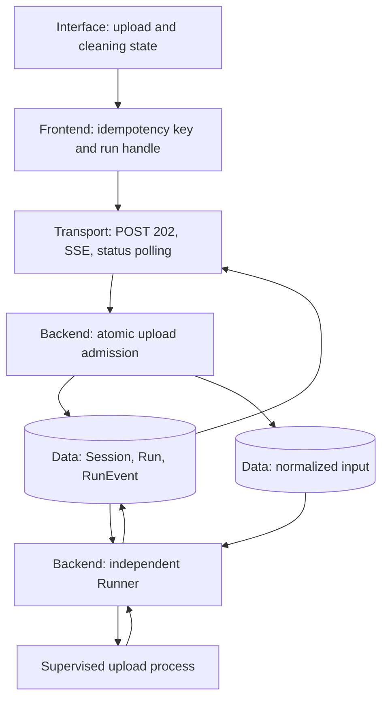
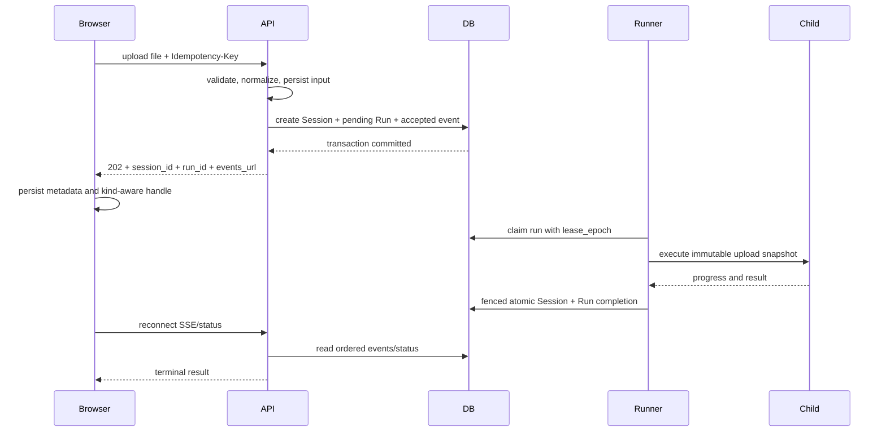
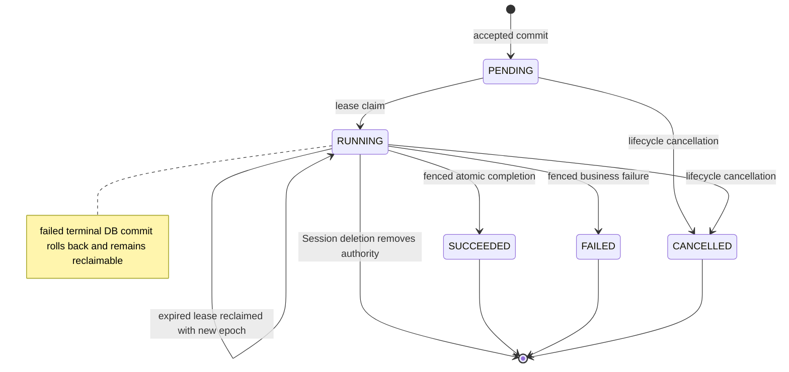

# Durable Upload Recovery - Plan

## Goal Capsule

- **Objective:** Once the product confirms that an upload was accepted, API or Runner restarts do not lose the analysis, duplicate the upload, or leave the browser unable to recover its result.
- **Means:** Admit uploads into the existing PostgreSQL-backed Run queue, execute them in the independent Runner, and resume them through the existing status/SSE channel (KTD1-KTD8).
- **Authority:** This plan governs the upload-analysis slice. `docs/design/econpaper-run-execution/DESIGN.md` remains authoritative for the broader Run architecture.
- **Execution profile:** Implement contract and migration tests first. Land work in dependency order. Preserve unrelated dirty-worktree changes.
- **Stop conditions:** Stop if a required migration would discard existing Session, Run, or RunEvent data; if the existing `prewrite` lifecycle cannot remain backward compatible; or if a required acceptance test depends on unavailable external credentials rather than local Postgres/SQLite infrastructure.
- **Tail ownership:** Subagents implement bounded units and report their acceptance evidence. The primary agent owns integration, generated contracts, adversarial review, complete regression checks, and the final user-visible fault-injection audit.

---

## Product Contract

### Summary

Move upload cleaning from the API request into the existing durable Run/Runner lifecycle. The API persists the normalized input, Session, Run, and accepted event before returning `202 Accepted`. The browser saves the Run handle before waiting and resumes the same Run after a refresh.

### Problem Frame

`POST /upload` currently creates a Session and a normalized CSV, then runs the full upload graph inside the API process. The Session receives its dataset state only after the graph completes. If the API process exits during cleaning, the database retains an incomplete Session and the disk retains a file, but no Run exists for the Runner to reclaim.

The repository already has the required recovery mechanics for `prewrite`: durable Run rows, bounded admission, leases, epoch fencing, an independent Runner, ordered RunEvents, SSE status recovery, and process-tree cancellation on Session deletion. The defect exists because upload analysis bypasses that lifecycle and because current browser recovery assumes every Run is a prewrite Run.

### Key Decisions

- **Use the existing independent Runner for upload cleaning.** This applies the already approved Candidate B to the missing upload stage. (session-settled: user-directed — chosen over retaining request-bound thread execution: only the independent durable path survives API and Runner restarts.) Governs R1-R8, R12.
- **Define acceptance at the durable commit.** A client may rely on recovery only after the normalized input and authoritative Session/Run records are committed. (session-settled: user-approved — chosen over treating request receipt as acceptance: bytes that have not reached durable storage cannot be recovered.) Governs R1-R4, R9.

### Requirements

**Durable admission and idempotency**

- R1. `POST /upload` returns `202 Accepted` only after the normalized input file, Session, `upload_pipeline` Run, and `run.accepted` event are durable and mutually consistent.
- R2. A new browser upload intent generates a UUIDv4 `Idempotency-Key`; retries by the same owner with the same normalized filename and raw-byte fingerprint return the original Session and Run.
- R3. Reusing an upload idempotency key with a different file or owner returns a non-disclosing conflict and never reveals the existing Session or Run identifier.
- R4. Validation, capacity, storage, or transaction failure leaves no accepted Run; immediate cleanup or age-gated reconciliation removes every unreferenced file created by that attempt.

**Independent execution and lifecycle safety**

- R5. The Runner claims and executes `upload_pipeline` Runs without the API process and commits the final Session state only through the current lease epoch.
- R6. A Runner exit leaves the Run reclaimable after lease expiry; a stale attempt cannot commit progress, terminal state, Session state, or an authoritative artifact path.
- R7. Deleting a Session revokes upload execution authority, terminates the active upload process tree within one second, prevents later state or artifact publication, and guarantees local/shared-volume cleanup; configured S3 cleanup remains best effort in this change.
- R8. Upload execution failures persist a stable, non-sensitive error category. Public HTTP/SSE payloads use an explicit allowlist and never expose local/S3 paths, raw step errors, file content, provider details, or credentials.

**Browser continuity and visible truth**

- R9. After receiving `202`, the browser persists the Session metadata and kind-aware Run handle before waiting for completion.
- R10. A refresh reconnects to the original upload Run, presents accessible upload-cleaning progress, applies the cleaning result, and enables direction submission only after the Session is upload-ready.
- R11. Session switches, logout, deletion, terminal failure, and authorization loss clear or isolate the relevant recovery state so a late result cannot overwrite another Session.
- R12. The browser persists the upload request key before submission and can resolve an already accepted upload by that key when the response was lost. Production lookup requires authenticated owner authorization; anonymous DEBUG treats the high-entropy key as a capability and never places it in a URL, log, telemetry event, or user-facing error.

**Compatibility and migration**

- R13. Existing databases accept both `prewrite` and `upload_pipeline` without losing Run or RunEvent rows; unsupported kinds remain rejected.
- R14. Existing `prewrite` idempotency, fencing, cancellation, status/SSE behavior, and one-active-Run-per-Session behavior do not regress.
- R15. CSV, Stata, Excel, GBK CSV, upload-size, authentication, and legacy synchronous `200` frontend compatibility remain covered.
- R16. Generated OpenAPI and TypeScript types remain synchronized with backend response models.

### Key Flows

- F1. **Fresh upload acceptance**
  - **Trigger:** A user selects a supported tabular file.
  - **Steps:** The API validates and normalizes the file, persists the input, atomically admits the Session and Run, then returns `202`; the browser persists the handle and waits through SSE or polling.
  - **Outcome:** The Runner completes cleaning and the browser shows the authoritative cleaning result.
  - **Covered by:** R1, R2, R4, R5, R9, R10.
- F2. **Lost response or API restart**
  - **Trigger:** The connection fails after the admission transaction may have committed.
  - **Steps:** The browser retries with the same key while the API resolves the existing owner-scoped request; the independent Runner continues or claims the Run.
  - **Outcome:** Exactly one Session and Run exist and the client receives the original handle.
  - **Covered by:** R1-R3, R5, R12.
- F3. **Runner restart**
  - **Trigger:** The Runner exits while upload cleaning is active.
  - **Steps:** The lease expires, a new Runner claims a new epoch, and the browser continues waiting on the same Run.
  - **Outcome:** Only the current epoch can publish the result.
  - **Covered by:** R6, R10.
- F4. **Session deletion during upload**
  - **Trigger:** The owner deletes a Session while the upload process is blocked or has descendants.
  - **Steps:** The database deletion removes Run authority; the supervisor detects the loss and terminates the process tree; cleanup removes Session-owned input and attempt artifacts.
  - **Outcome:** No late progress, state, or artifact becomes visible.
  - **Covered by:** R7, R11.

### Acceptance Examples

- AE1. **Covers R1, R5, R10.** Given an upload has returned `202`, when the API process is terminated and restarted before cleaning finishes, then the same Run reaches `SUCCEEDED`, the Session contains `cleaning_report`, the refreshed browser presents it, direction is disabled before `READY`, and direction becomes enabled after `READY`.
- AE2. **Covers R2-R4, R12.** Given the server committed admission but the response was lost, when the same owner resolves or retries the same key, then the API returns the original identifiers and no second Session, Run, event stream, or authoritative file is created.
- AE3. **Covers R6.** Given a Runner dies during cleaning, when its lease expires and another Runner reclaims the Run, then the new epoch may finish and the old epoch cannot publish progress, state, or artifact paths.
- AE4. **Covers R7, R11.** Given cleaning is blocked in a child or descendant process, when the owner deletes the Session, then the process tree exits within one second and no Session, Run, RunEvent, or Session-owned upload artifact remains.
- AE5. **Covers R9-R11.** Given the browser saved an accepted upload Run, when the page refreshes or SSE reconnects, then the UI remains in upload-cleaning state and never reports prewrite/estimation progress for that Run.
- AE6. **Covers R13-R14.** Given an existing database and existing frontend storage from the current release, when the new version starts, then historical Runs remain readable, prewrite execution still works, and old storage records are handled without a crash.
- AE7. **Covers R8, R15-R16.** Given success and failure results containing path/error canaries, when status, SSE, and generated clients expose them, then only allowlisted public fields remain and the file-format/OpenAPI compatibility suite passes.
- AE8. **Covers R3, R12.** Given an accepted upload, when another owner resolves its key or an anonymous caller lacks the exact DEBUG capability, then the API returns a non-disclosing authorization/not-found response without identifiers.

### Success Criteria

- The original process-termination reproduction changes from “Session and file remain, durable Run count is zero” to “one accepted Run is claimable and completes after API restart.”
- Fault-injection coverage proves API restart, Runner restart, stale-epoch fencing, SSE/status recovery, and Session-deletion cancellation on the upload kind.
- Focused tests, the full agent/backend/frontend suite, API drift checks, and a real local action-to-visible-result path pass.

### Scope Boundaries

**In scope**

- Durable admission, execution, recovery, cancellation, and visible status for upload cleaning.
- Explicit SQLite/PostgreSQL schema upgrades needed by the new Run kind and upload idempotency.
- Crash-convergent cleanup for local/shared-volume input owned by upload admission or Session deletion; current configured S3 deletion remains best effort and observable.

**Deferred to Follow-Up Work**

- Durable Runs for chapter generation and document export.
- Cross-machine object durability when API and Runner do not share the configured upload volume.
- Cross-fault-domain database and object-store backup automation.
- Automatic resubmission when refresh happens before server acceptance; without persisted file bytes the browser may require the user to reselect the file.
- A durable S3 deletion outbox; this change does not claim cross-fault-domain deletion guarantees.

---

## Planning Contract

### Key Technical Decisions

- KTD1. **Extend the existing Run lifecycle with `upload_pipeline`.** (session-settled: user-approved — chosen over a separate upload queue: one lifecycle preserves the current admission, lease, event, cancellation, and recovery semantics.) Applies to R1, R5-R8, R13-R14.
- KTD2. **Use a recoverable file-plus-database admission protocol.** The API writes and fsyncs a request-attempt input before one transaction creates the Session with its initial dataset path/state, pending Run, and accepted event. Immediate cleanup plus API/Runner startup and periodic age-gated reconciliation removes unreferenced attempts that die between file publication and database commit. Applies to R1, R4.
- KTD3. **Use a globally unique partial upload idempotency index plus an input fingerprint.** The application validates owner and `SHA-256(raw bytes + normalized filename)` before returning a replay; resolution reads the primary database and never discloses another owner's identifiers. Applies to R2-R3, R12-R13.
- KTD4. **Make upload execution a pure Run computation.** The child receives an immutable initial-state snapshot and returns state; only `RunRepository.complete` may merge Session state and publish its authoritative artifact path. Applies to R5-R8.
- KTD5. **Reuse one process supervisor with kind-specific child adapters.** Each claim writes to a Run/lease-epoch attempt workspace. A dedicated parent-liveness pipe lets a child watchdog terminate its own process group when the Runner disappears, so a stale or orphaned process cannot keep writing into a later attempt. Applies to R6-R8, R13.
- KTD6. **Make browser recovery kind-aware and reuse `waitForRun`.** The active handle records `prewrite` or `upload_pipeline`; SSE and polling remain shared, while visible busy state and result application differ by kind. Applies to R9-R12, R14-R16.
- KTD7. **Persist upload-only readiness in Session state.** Admission records `PROCESSING`. Fenced completion records `READY` only when the returned cleaned CSV exists and is readable; fatal executor/unreadable-output failure records `FAILED`, while individual cleaning-step failures remain report degradations. Prewrite never writes this field. Direction admission requires `READY` for upload-era Sessions, while legacy Sessions without the field use the existing usable-dataset rule. Applies to R5, R8-R11, R14-R15.
- KTD8. **Roll out consumers before producers.** Deploy a frontend that sends keys and accepts both legacy `200` and new `202`; apply additive schema and deploy the upload-capable Runner; stop old Runners; then enable new API admission. Rollback first disables new upload admission and retains the new Runner until queued upload Runs drain. Applies to R13-R16.

### High-Level Technical Design

The accepted upload crosses five layers but has one durability boundary.

Admission and execution follow this sequence.

The authoritative Run state machine remains shared by both kinds.

### Sequencing and Work Ownership

1. U1 establishes the schema and repository contract used by every later unit.
2. U3 creates the isolated upload computation and supervisor path.
3. U4 connects the upload-capable Runner and verifies restart, fencing, and deletion behavior.
4. U5 lands frontend rolling compatibility: keys plus support for both legacy `200` and new `202`.
5. U2 enables the new HTTP acceptance boundary only after the capable Runner and compatible frontend exist.
6. U6 regenerates contracts and performs cross-layer fault injection and regression review.

Subagents own disjoint implementation files where possible. The primary agent resolves shared-file integration and does not accept a unit until its listed tests and observable outcomes pass.

### System-Wide Impact

- **Interface layer:** Upload and cleaning remain visibly busy across refresh; direction entry stays unavailable until the dataset is ready.
- **Frontend layer:** Local recovery storage gains a Run kind and the upload path adopts the existing SSE/status waiter.
- **Transport layer:** `/upload` changes from synchronous `200` completion to durable `202` acceptance while the frontend retains rolling compatibility with `200`.
- **Backend layer:** The independent Runner dispatches a second Run kind and supervises upload cleaning as a process.
- **Data layer:** Existing Run tables gain a supported kind and a cross-Session upload idempotency constraint; old databases require a real upgrade because `create_all` does not alter existing constraints.
- **Operations:** Follow KTD8 so an old Runner never claims a newly admitted upload Run.

### Risks and Mitigations

| Risk | Failure mechanism | Mitigation |
|---|---|---|
| Existing local databases reject the new kind or lack uniqueness | ORM changes do not alter an existing table | Test upgrades from both constraint-bearing and constraint-missing SQLite schemas; apply equivalent locked PostgreSQL DDL |
| A lost response creates duplicate Sessions or an unreachable accepted Run | Current idempotency is scoped by a server-generated Session and the browser lacks a handle before `202` | Persist the key before submission, add authorized resolution, use a globally unique partial upload-key index, and store replay response data in Run payload |
| A dead Runner leaves a child writing into the next attempt | Abrupt parent death can outlive ordinary cleanup | Use epoch-specific attempt workspaces, a parent-liveness watchdog, and publish paths only through fenced completion |
| Session deletion races terminal completion | Filesystem cleanup is not transactional with the database | Revoke DB authority first, stop the process tree, then repeat best-effort artifact cleanup |
| The UI treats upload recovery as prewrite | Current handle has no kind and restore sets `directionBusy` | Version the handle shape with kind and preserve a legacy default of `prewrite` |
| S3 failure produces an ambiguous accepted task | Input must be readable by the Runner before acknowledgement | Make local/shared-volume input authoritative for the current topology; record best-effort S3 degradation without claiming durable deletion |
| An old Runner claims an unsupported upload kind | Producer/consumer rollout is mixed-version | Follow KTD8; stop old Runners before enabling API admission and disable admission before rollback/drain |

### Sources and Research

- `docs/design/econpaper-run-execution/DESIGN.md` defines the approved independent Runner, PostgreSQL queue, lease, and SSE architecture.
- `backend/run_repository.py` provides the current admission, lease, fencing, event, and atomic Session/Run completion patterns.
- `backend/prewrite_supervisor.py` provides process-tree cancellation and sanitized cross-process errors.
- `backend/routers/sessions.py` and `backend/facade/__init__.py` show the current request-bound upload execution and late Session persistence.
- `frontend/src/lib/workspace.ts` and `frontend/src/lib/runEvents.ts` provide the existing prewrite recovery and shared SSE/status transport.

---

## Implementation Units

### U1. Upgrade the Run schema and add atomic upload admission

- **Goal:** Existing and fresh databases can safely admit exactly one durable upload Run per idempotent request.
- **Requirements:** R1-R4, R12-R14; KTD2-KTD3.
- **Dependencies:** None.
- **Files:**
  - `backend/models/run.py`
  - `backend/database.py`
  - `backend/run_repository.py`
  - `backend/tests/test_run_execution.py`
- **Approach:**
  1. Extend the supported Run kind constraint and repository type without weakening rejection of unknown kinds.
  2. Add an owner-aware upload admission operation that writes a `PROCESSING` Session, Run, and accepted event in one locked transaction.
  3. Persist the initial state, dataset metadata, and an input fingerprint in the Run payload so a replay can reconstruct the original acceptance response.
  4. Add a globally unique partial upload-key index and explicit upgrade logic for PostgreSQL and both observed SQLite legacy shapes.
  5. For SQLite, use one `BEGIN IMMEDIATE` rebuild: copy parent and child replacement tables, verify row counts and `foreign_key_check`, drop child before parent, rename, recreate indexes/triggers, and write the migration marker in the same transaction.
  6. Make migration conflicts fail with actionable diagnostics while preserving all existing rows.
- **Patterns to follow:** `_write_transaction`, `RunRepository.enqueue`, `_ensure_run_lifecycle_constraints`, `DataMigration`, and the existing cross-process migration tests.
- **Execution note:** Start with failing tests against legacy database fixtures. Do not accept fresh-schema-only proof.
- **Test scenarios:**
  - Covers AE2. Two sequential and concurrent admissions by the same owner, key, and fingerprint return one Session and one Run.
  - The same key with another fingerprint or owner returns a conflict without existing identifiers.
  - A full queue or injected transaction failure leaves no Session, Run, or accepted event.
  - A fresh database accepts the two supported kinds and rejects an unknown kind.
  - A SQLite database with the old prewrite-only check upgrades without losing RunEvents.
  - A SQLite database matching the current constraint-missing local shape gains kind, active-Run, and idempotency enforcement.
  - Repeating or concurrently invoking the upgrade is safe; historical conflicting data produces an explicit rollback.
  - Existing prewrite idempotency and one-active-Run behavior remain unchanged.
- **Verification:** Repository tests prove atomicity and conflict semantics. Migration tests reconcile pre/post row content and constraints for each legacy shape.

### U2. Change `/upload` to durable acceptance

- **Goal:** The API acknowledges a recoverable upload without executing cleaning in the request process.
- **Requirements:** R1-R4, R8, R12, R15; KTD1-KTD3.
- **Dependencies:** U1, U4, U5 for production enablement.
- **Files:**
  - `backend/routers/sessions.py`
  - `backend/schemas/responses.py`
  - `backend/tests/test_upload.py`
  - `backend/tests/test_auth.py`
  - `backend/tests/test_error_handling.py`
- **Approach:**
  1. Require and validate `Idempotency-Key` before accepting file work.
  2. Keep the existing content sniffing, normalization, metadata, upload-size, and S3 fallback behavior.
  3. Write and fsync the normalized input through a request-attempt naming protocol before the admission transaction; reconcile old unreferenced attempts at API/Runner startup and every 15 minutes.
  4. Call U1 admission and return `202` with Session, Run, event URL, status, and dataset metadata.
  5. Add a key-resolution endpoint that returns the original accepted upload without requiring the file body: authenticated production checks the owner; anonymous DEBUG requires the exact high-entropy key as a header capability.
  6. Add the backend direction-readiness gate so upload-era Sessions cannot start prewrite until `READY`.
  7. Project Run status/events through a public allowlist; update `backend/routers/run_execution.py` and strip path/error canaries before serialization.
  8. Clean only files created by an unaccepted attempt; never delete the original accepted file during an idempotent replay.
- **Patterns to follow:** The direction endpoint's `202`, `SessionBusy`, `QueueFull`, `Retry-After`, and non-sensitive error contracts.
- **Execution note:** Begin with a failing HTTP contract test that asserts cleaning is never called in the request.
- **Test scenarios:**
  - Covers AE1. A valid CSV returns `202` only after the Session, Run, accepted event, path, and file are readable from a separate database session.
  - Missing or invalid idempotency headers are rejected before durable side effects.
  - Covers AE2. Resolving or retrying an ambiguously completed request returns the original response data.
  - Queue-full and injected storage/transaction failures leave no unreferenced local file from that attempt; configured S3 cleanup emits an observable best-effort result.
  - Killing the API between input publication and database commit leaves an age-gated orphan that reconciliation removes without touching referenced inputs.
  - A replay by another authenticated user returns a non-disclosing conflict.
  - CSV, DTA with and without modern headers, XLSX, GBK CSV, content sniffing, missing values, empty files, corrupt files, and size limits retain their current behavior.
  - Anonymous debug-mode ownership behavior remains consistent with existing session rules.
  - Status/SSE success and failure fixtures containing local paths, S3 keys, raw exceptions, and credential canaries expose none of them publicly.
- **Verification:** The upload route returns before any graph or cleaning executor runs, and all prior upload format/auth tests pass with the new acceptance response.

### U3. Add pure supervised upload execution

- **Goal:** Upload cleaning runs in a cancellable child process and cannot publish Session state directly.
- **Requirements:** R5-R8, R14; KTD4-KTD5.
- **Dependencies:** U1.
- **Files:**
  - `agent/engine/upload.py`
  - `agent/tests/test_upload_execution.py`
  - `backend/facade/__init__.py`
  - `backend/prewrite_supervisor.py`
  - `backend/tests/test_prewrite_supervisor.py`
- **Approach:**
  1. Extract an upload computation that applies the existing upload-data and clean-data behavior to an immutable state snapshot and returns the merged state.
  2. Preserve current node-level semantics while removing SessionStore writes from the child computation.
  3. Generalize the current supervisor internals and keep thin prewrite/upload entry points with shared cancellation, descendant termination, bounded message draining, error sanitization, and a dedicated parent-liveness pipe.
  4. Replace the child workspace with the current Run/lease-epoch attempt workspace before cleaning starts.
  5. Remove the attempt workspace after cancellation; only a later fenced completion may make its paths authoritative.
- **Patterns to follow:** `facade.execute_prewrite`, `execute_prewrite_supervised`, `agent.nodes.upload_data`, and `agent.nodes.clean_data`.
- **Execution note:** Characterize the existing two-node upload result before extracting it, then implement cancellation tests with blocking children.
- **Test scenarios:**
  - The pure executor returns complete upload metadata, eight-step cleaning report, cleaned dataset path, and progress without reading or writing SessionStore.
  - Cooperative cancellation exits through `ExecutionCancelled`.
  - A blocked upload child and an independent descendant are force-terminated within the existing one-second budget.
  - Abruptly killing the Runner parent closes the liveness pipe; the child watchdog terminates its process group and no descendant remains.
  - High-frequency progress cannot starve cancellation checks.
  - Child failures expose type/stage only and do not persist the original message.
  - Distinct lease epochs receive distinct attempt workspaces; cancelled attempt output is removed.
  - Existing prewrite supervisor tests remain unchanged in outcome.
- **Verification:** Agent tests prove upload behavior equivalence. Supervisor tests prove shared process controls for both Run kinds.

### U4. Dispatch upload Runs and preserve lifecycle invariants

- **Goal:** The independent Runner can finish, retry, fence, fail, or cancel upload Runs with the same guarantees as prewrite.
- **Requirements:** R5-R8, R13-R15; KTD1, KTD4-KTD5, KTD7.
- **Dependencies:** U1, U3.
- **Files:**
  - `backend/runner.py`
  - `backend/run_repository.py`
  - `backend/facade/__init__.py`
  - `backend/tests/spawn_helpers.py`
  - `backend/tests/test_run_execution.py`
  - `backend/tests/test_run_artifacts.py`
- **Approach:**
  1. Dispatch by supported Run kind while keeping one heartbeat, progress, failure, retry, and terminal-commit path.
  2. Pass the claim's lease epoch into attempt-workspace construction.
  3. Use fenced `complete` to merge the upload result, set Session readiness to `READY`, and publish the final CSV path in the same transaction as Run success.
  4. Revoke database authority before Session-owned local artifact cleanup and repeat cleanup after supervisor cancellation where a child could recreate files; report configured S3 deletion as best effort.
  5. Set readiness to `READY` only when the returned cleaned CSV exists and is readable. Treat individual cleaning-step errors as report degradations; set `FAILED` only for fatal executor/unreadable-output failure. Keep a successful computation reclaimable if its terminal database commit fails.
- **Patterns to follow:** Current `process_one_run`, `RunRepository.complete`, heartbeat authority probes, Session-before-Run lock ordering, and cancellation fault tests.
- **Execution note:** Add upload-kind versions of the existing lease, delete, and process fault tests; do not duplicate the lifecycle implementation.
- **Test scenarios:**
  - Covers AE1. A claimed upload Run reaches `SUCCEEDED` and atomically exposes its cleaning result and final CSV path through the Session.
  - Business failure marks only the current epoch and Session `FAILED` with a stable sanitized category; direction submission remains rejected.
  - Covers AE3. An expired lease is reclaimed and the stale epoch cannot append progress or complete.
  - A transient terminal commit failure leaves the Run reclaimable instead of reporting a false business failure.
  - Covers AE4. Session deletion during blocked upload kills the process tree within one second and prevents late state/artifact publication.
  - Local input, S3 input, Run directory, and attempt directories owned by a deleted Session are removed without affecting another Session.
  - Existing prewrite cancellation, fencing, reconciliation, and SSE tests remain green.
- **Verification:** Process-level backend tests prove the Runner restart and Session deletion paths against durable storage, not only mocked function calls.

### U5. Make frontend upload recovery kind-aware

- **Goal:** The browser saves and resumes an accepted upload Run while displaying the correct stage and isolating stale results.
- **Requirements:** R2, R9-R12, R14-R16; KTD6-KTD7.
- **Dependencies:** U2, U4.
- **Files:**
  - `frontend/src/lib/workspace.ts`
  - `frontend/src/lib/runEvents.ts`
  - `frontend/src/lib/paperPath.ts`
  - `frontend/src/App.tsx`
  - `frontend/src/components/DirectionForm.tsx`
  - `frontend/src/lib/i18n.tsx`
  - `frontend/src/lib/__tests__/workspaceRunRecovery.test.ts`
  - `frontend/src/lib/__tests__/runEvents.test.ts`
  - `frontend/src/__tests__/App.test.tsx`
- **Approach:**
  1. Generate and persist one UUIDv4 upload idempotency key per file-selection intent before submission, resolve it after refresh, reuse it for a bounded ambiguous-response retry, and clear it on terminal state or cancellation; a later file intent receives a new key.
  2. Support the new `202` shape and the old synchronous `200` shape by checking for `run_id`.
  3. Store `kind` with the active Run handle; treat legacy handles without kind as `prewrite`.
  4. Persist CSV metadata, Session ID, and the upload handle before awaiting `waitForRun`.
  5. Route restored busy state and terminal result application by Run kind; include `cleaning_report` as a valid upload snapshot.
  6. Abort and epoch-guard waits across Session switch, logout, deletion, and a newer upload action.
  7. Disable direction submission unless an upload-era Session has readiness `READY`; legacy Sessions without the field retain the current usable-dataset gate.
  8. Define terminal recovery actions: `FAILED`/`CANCELLED` keeps the failed Session visible with a reselect-file action; `401`/`403` clears sensitive recovery and prompts authentication/permission; missing Run/Session clears the handle and returns to the upload guide; key resolution `404` explains that the upload was not accepted and requires reselection.
  9. Announce progress through a live region, keep recovery actions keyboard reachable, and expose a readable reason whenever direction is disabled.
  10. Never place upload keys or persisted handles in URLs, telemetry, logs, or user-visible errors.
- **Patterns to follow:** The current direction single-flight, pending command, active handle, restore snapshot gate, and shared `waitForRun` behavior.
- **Execution note:** Write recovery-ordering tests before modifying the hook so local-storage timing is explicit.
- **Test scenarios:**
  - Every new upload includes a non-empty key; a bounded retry uses the same key.
  - A second file selection after terminal state receives a different key.
  - New `202` and legacy `200` responses both lead to a usable dataset.
  - Before submission, the request key is stored; before SSE completion, accepted upload metadata and a `kind=upload_pipeline` handle are stored.
  - A refresh after database acceptance but before the `202` response resolves the original Run by key without the file body.
  - Covers AE5. Refresh restores `uploading`, not `directionBusy`, waits on the same Run, and applies `cleaning_report` on success.
  - A legacy kind-less prewrite handle follows the prior recovery path.
  - A late result after Session switch or logout does not change the current workspace.
  - Failed, cancelled, forbidden, missing, and deleted Runs clear the correct handles and surface a recoverable visible state.
  - Direction submission is disabled until upload success and re-enabled afterward.
  - SSE terminal recovery and polling fallback stay shared across both Run kinds.
- **Verification:** Frontend tests observe local storage before the waiter resolves, distinguish both busy states, and prove result isolation between Sessions.

### U6. Synchronize contracts and run cross-layer fault acceptance

- **Goal:** Generated types, deployment behavior, and the complete visible path prove the repair under real process restarts.
- **Requirements:** R1-R16; all KTDs.
- **Dependencies:** U1-U5.
- **Files:**
  - `frontend/openapi.json`
  - `frontend/src/types/api.ts`
  - `docs/api/openapi.json`
  - `runtime/STATE.md`
  - `runtime/tasks/20260902-durable-upload-recovery.md`
  - `agent-learning/raw/2026-09-02_durable-upload-recovery.md`
- **Approach:**
  1. Generate OpenAPI and TypeScript types from backend code and verify drift rather than editing generated content manually.
  2. Exercise admission and Runner recovery in local process tests and the shared PostgreSQL Compose topology; the Postgres result is a completion blocker.
  3. Exercise the browser path from file selection through `202`, API restart, page refresh, Run success, visible cleaning report, and enabled direction entry.
  4. Record only de-identified fault evidence and remaining external-environment gaps in project-owned runtime records.
- **Patterns to follow:** `make gen-api`, `make check-api-drift`, existing runtime task records, and the prior cancellation fault-injection tests.
- **Execution note:** This unit is owned by the primary agent after all implementation subagents return; it is the integration gate, not a parallel coding unit.
- **Test scenarios:**
  - Covers AE1. Terminating and restarting the API after `202` does not interrupt or duplicate the Run.
  - Covers AE2. A deliberately dropped response followed by an idempotent retry returns the same Run.
  - Covers AE3. Terminating a Runner during cleaning permits lease-based reclaim and rejects the stale epoch.
  - Covers AE4. Deleting a Session during cleaning terminates its process tree and removes its durable/user artifacts.
  - Covers AE5. Disconnecting SSE and refreshing the browser still yields the terminal result.
  - Covers AE6. Upgrading a legacy database and loading legacy browser storage preserves prior behavior.
  - Covers AE7. Public status/SSE payloads remain sanitized and generated contracts stay synchronized.
  - Covers AE8. Owner/capability resolution rejects unauthorized recovery without disclosure.
- **Verification:** API drift checks, focused suites, full `make test`, build/lint where defined, dependency checks, mandatory PostgreSQL process fault injection, and the real browser flow all pass.

---

## Verification Contract

| Gate | Applies to | Pass condition |
|---|---|---|
| Agent upload and cleaning characterization | U3 | Existing upload/cleaning semantics and the new pure executor tests pass |
| Backend schema and repository tests | U1 | Fresh and legacy SQLite shapes pass atomicity, uniqueness, preservation, and supported-kind checks |
| Backend upload HTTP tests | U2 | `202`, idempotency, failure cleanup, ownership, and every supported file format pass |
| Backend process lifecycle tests | U3-U4 | Upload and prewrite cancellation, restart/reclaim, fencing, sanitized failure, and terminal commit behavior pass |
| Frontend recovery tests | U5 | Submission timing, kind-aware restoration, SSE/polling, failure cleanup, and stale-result isolation pass |
| Generated contract drift | U6 | Backend OpenAPI, committed OpenAPI files, and `frontend/src/types/api.ts` agree |
| Full repository regression | U6 | `make test` passes for agent, backend, and frontend |
| Dependency and import checks | U6 | `make smoke-agent` and `make verify-deps` pass |
| UI/runtime smoke | U6 | The local frontend and backend are running and `make verify` passes |
| PostgreSQL fault-injection acceptance | U6 | AE1-AE8 produce the stated durable outcomes on the shared PostgreSQL topology |
| End-to-end browser recovery | U6 | File selection → `202` → API restart → page refresh → same Run success → visible cleaning report → enabled direction passes in a real browser |

---

## Definition of Done

- Every requirement R1-R16 has implementation and test evidence.
- U1-U5 each pass their focused tests before U6 begins.
- The original API-termination reproduction leaves one recoverable upload Run instead of an orphan Session/file pair.
- API restart, Runner restart, stale-epoch fencing, SSE/browser resume, and Session-deletion cancellation are tested on the upload kind against PostgreSQL.
- Existing prewrite and legacy upload-format tests remain green.
- Existing SQLite data is preserved by the upgrade; PostgreSQL DDL is idempotent and protected by the existing migration lock.
- The UI never labels an upload Run as prewrite work and never enables direction submission before upload success.
- OpenAPI and TypeScript generated artifacts have no drift.
- The final diff contains no abandoned attempt, duplicate queue/supervisor/transport implementation, debug instrumentation, credentials, or unrelated cleanup.
- The primary agent inspects the complete diff, runs the full regression suite, passes the mandatory PostgreSQL fault path and real visible browser path, and records only genuinely external non-acceptance checks separately.
