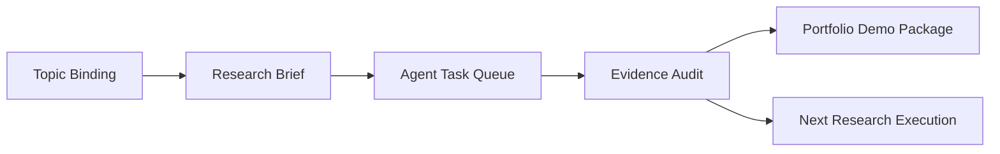
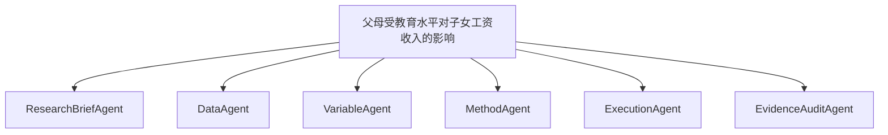

# 07 作品集 Demo 脚本

## Demo 题目

父母受教育水平对子女工资收入的影响

## 3 分钟讲述

第一分钟：我做的不是论文生成器，而是一个本地 AI 实证研究 OS。用户输入题目后，系统先确认当前项目 topic，避免旧项目、旧运行态和旧材料串题。

第二分钟：系统把研究推进拆成 Agent Task Queue。每个 Agent 都有输入、输出、状态和人工审阅点。当前 P0 阶段生成 6 个任务，但它们默认不能直接执行，必须先经过派工审阅。

第三分钟：Evidence Audit 告诉用户哪些东西已有本地证据，哪些还只是候选，哪些不能进入正式论文。作品集展示的重点是可审计流程，而不是一键生成结论。

## 产品流程图

## Agent 分工图

## 证据链状态

| Claim | Status | Evidence |
| --- | --- | --- |
| Topic binding audit | passed | `Results/json/product_control_demo_topic_binding_audit.json` |
| Agent Task Queue | passed | `state/product/agent_task_queue.json` |
| 真实文献候选 | needs_evidence | `Tasks/parent-education-wage/literature.md` |
| 数据与变量绑定 | needs_evidence | `Tasks/parent-education-wage/variables.yaml` |
| 方法执行证据 | needs_evidence | `Results/json/method_execution_result.json` |
| 正式层边界 | passed | `Reviews/product_control_demo_evidence_audit.md` |

## 当前做到哪里

- P0-A：topic binding audit 已通过。
- P0-B：Agent Task Queue 已生成，等待人工派工审阅。
- P0-C：Evidence Audit 已列出证据状态。
- P0-D：作品集脚本和 package 已生成。

## 还差哪里

- 真实文献候选和引用核验。
- 真实数据字段绑定和变量角色确认。
- 方法执行结果、run id、表格和 evidence_id。
- 前端/CLI 对 P0 产物的统一展示。
