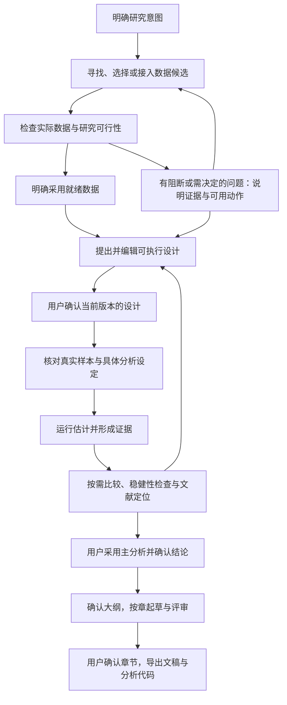

# econpaper 核心产品契约

状态：2026-09-17 已确认意图优先的新顺序；完整 P0 数据/方法验收范围仍待产品确认。
代码核对基线：`feat/progressive-research-flow@2d83c2c9c716` 加本地未提交修复。
本文件是业务阅读入口，不新增数据库对象、全局状态机或另一份设计规范。
顺序以用户新确认的 [研究意图到可执行设计](../specs/research-intent-to-design.md) 为准；原契约中不冲突的真实计算、批准、引用与权限规则保留。页面映射是前一版本盘点，最新接线及缺陷见 [独立评审](../reviews/20260917-formal-confirmation-chain-independent-review.md)。
首批接线的执行边界、失败测试与独立评审要求见 [执行与评审规范](../acceptance/formal-confirmation-chain.md)；该任务不等于完整 P0 已实施或范围已冻结。

## 1. 核心承诺

帮助做课程作业与学位论文的学生，把一个研究想法推进成有数据依据、可核对、可修改的实证论文。
系统承担查找、计算、检查和起草；用户保留研究取舍与采用结果的决定权。
成功不是生成了多少文字，而是用户能说明：研究问什么、为何这样分析、数字从哪来、证据支持到哪里。

默认文稿是六章：引言、文献综述、数据描述、实证方法、实证结果、结论。章节顺序与呈现由用户决定。
正式自带数据研究与 Card 教学案例是同一产品的不同入口；教学案例跑通不能代替正式研究验收。

依据：[已定原则 §1–5](../specs/frontend-interaction-principles.md)、[正式设计契约 §0](../contracts/infer-design-contract.md)。

## 2. 七类业务对象，不是七套存储

| 对象 | 回答什么 | 现有承载位置与边界 |
|---|---|---|
| 研究问题与预期 | 想回答什么？看到结果前如何预期？ | 入口想法可留本地草稿；正式记录在后端方向/问题对象。已有 `research.question`、`expectation`；无可检验判据不等于“符合预期”。 |
| 数据 | 采用哪份数据？从哪来？做过什么处理？ | 后端 dataset、来源与清洗记录。`upload_readiness=READY` 是处理就绪；`dataAttached=true` 才是确认用于研究，两者不同。 |
| 研究设计与分析设定 | 用什么比较回答问题？哪些变量、样本和方法？ | 正式设计是 `session.design`；`research_direction`、`main_specification` 是执行侧表达，不另立权威。`specification_space` 是已有多方案能力，不强迫每次研究都跑一批。 |
| 运行任务 | 这次具体执行了什么，是否结束？ | 既有 Run Engine / RunRepository / RunEvent。事件用于观察；运行终态不等于研究完成或用户已批准。 |
| 证据与文献 | 计算得到什么，哪些来源支撑解释？ | `/evidence`、真实估计、诊断、稳健性、`specification_runs` 与来源工件。文献是证据材料，不是可省掉的业务职责。 |
| 研究结论 | 用户决定采用哪条说法？它依赖什么证据？ | 已有 research lab 的 claims、版本与证据引用；机器的 `claim_mode` 不是用户批准。普通数据入口尚需补齐与此一致的采用链路。 |
| 文稿 | 哪些已采用内容写成了哪些章节？ | 既有 outline、body_chapters、versions、评审与导出；结果章引用被采用且仍有效的证据，不把所有尝试写入正文。 |

唯一研究真相在后端，Project Snapshot 是工作区恢复入口；前端只保留未提交输入、界面偏好、投递凭证和带运行归属的短期观察。
对话发起操作，账本保留历史；不同页面读同一对象，不因页面不同生成不同版本的事实。

依据：[ADR-0013](../adr/0013-workbench-v2-truth-owner.md)、[展示术语](terminology.md)、[数据契约 §2](../contracts/data-completion-contract.md#2-attach-gate--dataattached-confirm-attach)。

## 3. 主流程：依赖与确认，不是强制逐屏向导

正式路径前半段改为“研究意图 → 数据接入与可行性检查 → 可执行设计 → 用户确认 → 正式分析”。不再要求用户在看数据之前确认设计；也不等于上传后自动运行并采用估计。

图描述业务依赖，不是后台节点表，也不是必须新增的十二个页面。正常核查自动推进；只有真实待确认对象或风险决策才打断用户。
允许在没有设计时接入和检查数据、浏览候选与编辑意图；候选检查不等于采用数据或批准正式执行。方案仍可反复修订，受影响的批准必须重新核对。

**四个确认不可互相代替：**

| 确认 | 用户实际确认的对象 | 后端事实 |
|---|---|---|
| 研究设计确认 | 结合实际数据的比较方案、变量角色、交互项、拟用方法 | `session.design` 的当前版本确认，并绑定对应数据；早期“理解问题正确”不授予此锁 |
| 数据挂接确认 | 当前就绪数据用于这项研究 | 当前候选确认成功，`dataAttached=true` |
| 样本描述确认 | Table 1 中真实样本组成与描述 | `table1Confirmed=true` |
| 分析设定确认 | 以实际列、样本与公式落实的执行设定 | `specConfirmed=true`；不是之前设计确认的重复按钮 |

数据检查发现原思路需要调整时，解释依据并修订草稿，不静默更换问题或方法。方法文献在最终方法定稿前参与核查；主题文献主要服务贡献定位，早期必要查询不受禁。
应用内确认不等于预注册。已发生的描述统计或探索必须留痕；不能仅靠暂时隐藏结果，声称方案未受已有数据影响。

分开三种状态：研究对象是否就绪、运行是否结束、用户是否批准。一次 run 可以成功地停在待确认处；某项诊断完成也可以发现风险。
“下一步”由现有后端对象、许可和活动任务共同决定，不新增一个前端 `stage` 来覆盖它们。

依据：[新顺序与执行规范](../specs/research-intent-to-design.md)、[数据契约 §2a](../contracts/data-completion-contract.md)、[真实预写路径](../../agent/engine/prewrite.py)、[当前交互 §2–4](../specs/frontend-interaction-current.md)。旧设计契约中数据前锁定的顺序已被替代，其他确认完整性要求仍适用。

## 4. 人与系统的权力边界

系统可在已授权范围内扫描数据、提出候选、执行计算、核查、记录失败并起草；不能替用户批准设计、挂接、设为主分析、确认结论或章节。
不把“点击了按钮”当成批准成功：后端接受并回读确认事实之后，界面才显示已确认。

动作严格服从同一套 `allow / confirm / forbid` 许可。可越过的风险需明确动作和留痕；硬禁止项没有万能“继续”按钮。
未知既非通过也非方法无效：按 #40 的逐动作许可处理，允许的试验可继续，禁止的因果表述不能因用户点击而放行。
模型说“不行”之前须核查已有数据并提供具体依据；有必要且获准时做受控试验，但不绕过禁止项去凑证据。

必须保留的边界：未确认挂接不跑正式估计；已确认设计不被静默改写；OLS 不写成双向固定效应；交错处理下被规则禁止的 TWFE 不作主结果；未选用引用不进入正文；预览运行不自动替换主分析。
清洗与重跑不得暗中改掉已采用数据/设定，改变样本含义的选择要披露。

**修改不等于抹掉历史。** 重新提出设计撤销设计锁；更换数据或执行设定需要重新核对其依赖的确认与结果。已有证据和章节留作历史，受影响内容标记需重核，不自动沿用“已批准”。
已存在的 evidence revision / claim stale 机制优先复用；各入口能否完整传播失效属于实现验收项，不在这里宣称已全部实现。只改题目措辞、界面语言或排版，不应无理由重算研究。

依据：[已定原则 §5](../specs/frontend-interaction-principles.md)、[#40 验收](../acceptance/identification-state-gate.md)、[许可函数](../../agent/engine/identification_state.py)、[章节就绪判定](../../agent/engine/readiness.py)。

## 5. P0：先打通一条正式研究闭环

**建议待确认：**第一条新增端到端验收选“题目/问题 + 一份来源明确、获准使用的非 Card CSV + OLS”。已有 Card 案例作回归对照；保留其他方法，不将 OLS 变成全产品的唯一方法。
OLS 在这里验证相关性研究闭环，不将其结果包装成因果结论。测试数据可以由用户提供或明确公开授权；人工构造数据仅用于故障测试，并标明合成，不代替正式数据验收。

用户必须能从可见入口完成第 3 节直到导出。API 可用于准备隔离测试环境，但不得代替用户点击设计确认、挂接确认、样本/设定确认等关键动作，然后把结果计作“页面全程跑通”。
P0 覆盖一份数据、一个已确认设计、一条主分析、必要核查/稳健性、已采用结论、默认六章及一条可复跑的代码路径。
多方案扩展、更多数据源、更多方法与光标演示不要求在这一轮全面升级；已存在的能力与冻结规则不撤销。文献来源及引用真实性仍保留在文稿验收中。

## 6. “已经能用”的验收定义

| 必须证明 | 验收方式 |
|---|---|
| 关键确认确实生效 | 每次可见操作核对请求、响应与回读 snapshot；失败不显示已确认。直接 API 越过前置条件也应被拒绝。 |
| 结果是真算出的 | 主读数能追到数据、执行设定、run 和代码；独立复跑选定代码路径并在事先声明的容差内核对。不能只断言“有数字”。 |
| 风险没有被伪装 | 区分诊断执行、发现和许可；缺证据显示未知；blocked、失败、降级均有对应事实，不造百分比或成功。 |
| 恢复不改变研究 | 运行中刷新重新挂接同一 run；重投幂等意图不重复计算；新任务/新研究不收到旧运行结果。 |
| 变更会使相关批准失效 | 改设计、数据或采用的证据后，受影响结论/结果章需重核；原历史不消失；改界面语言不改变证据。 |
| 论文与代码对应 | 默认六章有实际正文且逐章确认；引用、方法和数字与采用记录一致；草稿导出不被称为论文完成；打开真实导出文件检查，不以 HTTP 200 代替。 |
| 交互可实际操作 | 桌面与 320×568 可完成关键动作；键盘可达；截图检查遮挡；VoiceOver 单列真人/GUI 验收，不用 DOM 属性代替。 |

实施顺序：修复已交付确认链的评审问题 → 实施意图优先的前半段闭环并独立验收 → 再扩展采用结论、文稿与导出。完整 P0 数据/方法范围单独确认，不妨碍修复已证实错误。
独立 QA 可用 Pi 调用 Playwright，但只在获准的模型/账户、代码版本与隔离环境下启动；报告不是通过证明，必须附截图、请求、snapshot 与失败步骤。本轮未启动 Pi。
