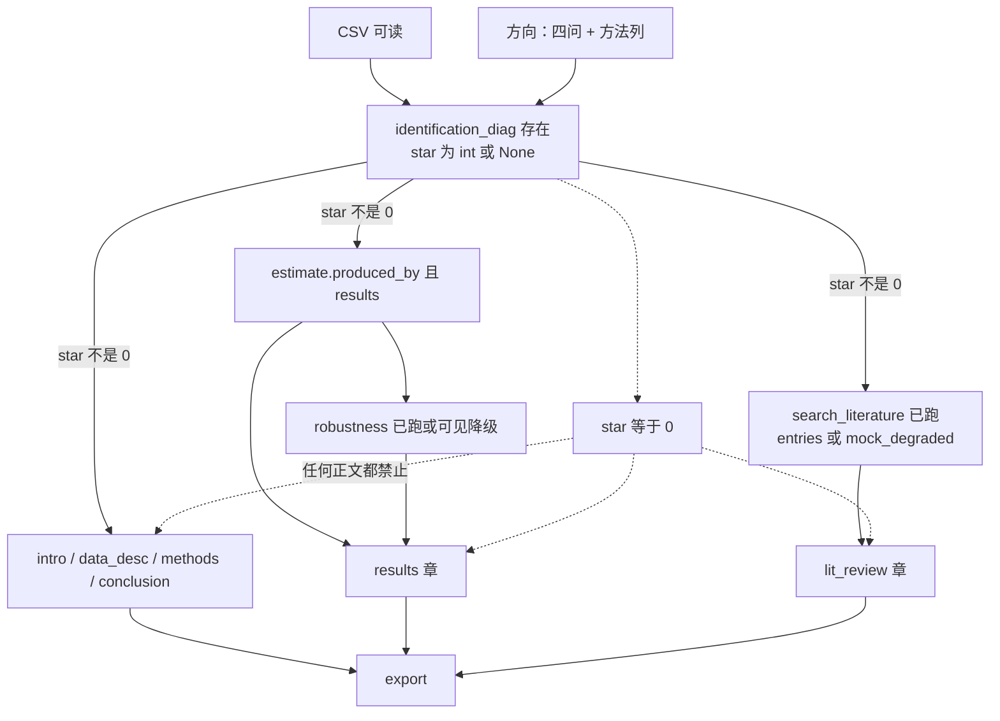
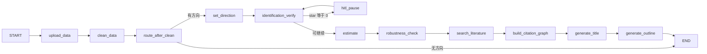
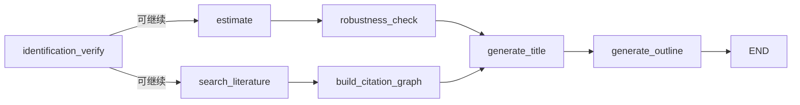

# econpaper 论文发动机：数字先于正文

| 字段 | 值 |
| --- | --- |
| 文档 | Paper Engine Design |
| 作者 | Grok Build（占位） |
| 日期 | 2026-08-16 |
| 修订 | 2026-08-16 r4（`literature_produced_by` / `literature_query` 列入 `TRUTH_KEYS`） |
| 状态 | Draft |
| 产品 | `/Users/mahaoxuan/Desktop/经济学论文/econpaper` |
| 范围 | `agent/` + StatsPAI / stata-code；FastAPI 只是门；操作台只展示发动机产物 |
| 权威 | `CONTEXT.md`、`docs/adr/*`、`agent/graph.py`、`backend/facade.py` |
| 机制目录 | Antonio Gulli《Agentic Design Patterns》中译（本地 `chapters/`）。书是机制清单，不是产品名。 |

**一句话：** 人坐着写一篇实证论文。发动机必须先交出可引用的数字和文献条目，再让模型填六章；OLS 禁止写成因果。

---

## Overview

econpaper 是工作区里唯一的实证论文网页产品（ADR-0010）。用户上传 CSV，回答四问方向，机器按方法跑识别诊断、主估计、稳健性、检索文献，再按固定六章写正文并评审、导出。方法是已知的（DiD / IV / RD / SCM / OLS 相关），六章骨架也是已知的。发动机不该再“发现该怎么写一篇论文”。

今天图和操作台不是同一条顺序。`agent/graph.py` 在清洗后立刻 `generate_title`，稳健性挂在六章循环之后。操作台真路径是 `POST /sessions/{id}/direction` → `AgentFacade.set_direction_and_outline`：识别非 0 星后跑 `estimate` 再出大纲，但**不跑文献、不跑稳健性**。`DirectionRequest` 是封闭模型，方法列进不来。`generate_chapter` 只要有 `outline` 就写，且只读 `outline[current_chapter_index]`，HTTP 的 `chapter.type` 被丢掉。`render_kwargs` 可把假 `results` 写进 state。评审 JSON 失败静默回 `mock_review_llm`。`check_structure` / `mock_review_llm` 仍按识别词打分，会把 OLS 方法章打回“因果”话术。

本设计保持**一张 LangGraph + 同一组节点函数**。改的是：类型化 `MainSpecification` 与按方法的估计/稳健性分派；门加宽到能送进那些列；按章就绪检查写在 `generate_chapter` 里；文献走预写路径（第一批 mock）；评审失败可见；关联主张下结构检查与 mock 评审不再奖励因果黑话。

第一批编译的是**线性图**：清洗后无方向则 `END`；有方向则预写到大纲后 `END`。章节与导出只走 Facade。后批才考虑文献∥估计。不发明 `wait_*` 节点。

---

## Background & Motivation

### 产品身份

ADR-0010：唯一产品是 `econpaper/` 网页端。StatsPAI 与 stata-code 是同级库，不是第二个产品。不合并两份本地仓的 Git 历史，不推本地 main。本设计不碰前台排版。

人做的事：定方向、看 0 星、改大纲要点、批章节、点导出。  
机器做的事：清洗、识别诊断、估计、稳健性、检索、填六章、接地评审、翻译代码、编参考文献、出 tex/pdf/docx。

### 今天两套顺序

图（`build_graph` 边）：

```
upload_data → clean_data → generate_title → set_direction
  → identification_verify
      0 星 → hitl_pause → 回到 identification_verify
      否则 → search_literature → build_citation_graph → estimate
  → generate_outline → generate_chapter ↔ review_chapter
  → robustness_check → translate_code → generate_references → export_docx
```

操作台（`backend/routers/outline.py` + `facade.set_direction_and_outline`）：

```
POST /direction
  → set_direction（写出 main_specification）
  → identification_verify
  → 0 星或 identification_failed：落盘，不生成大纲
  → 否则 estimate → generate_outline
```

`backend/` 不 import `search_literature`。章节写作是另一扇门：`POST /generate-chapter`。稳健性是第三扇门：`POST /robustness`，写作不检查它是否跑过。

`GET /journey` 用 `body_chapters` 非空当作“估计建模已完成”（`progress._infer_journey`）。正文出现被当成数字出现。

上传之后权威状态在 Facade 内存 `_sessions[id]["state"]`。`get_state` 优先内存，其次 PostgresSaver。`run_upload_pipeline` 的 `graph.invoke` 写的是 checkpointer；方向之后的产物若只 `save_state`，再 `graph.invoke` 同一 `thread_id` 看不见估计。这不是一个可 resume 的通道。

### 当前错误如何往下传

| 错位 | 代码 | 下游吃到什么 |
| --- | --- | --- |
| 标题在方向之前 | `graph.py`：`clean_data → generate_title → set_direction` | `generate_title` 只看见列名；`search_literature` 用早产标题拼查询 |
| 稳健性在六章之后 | `route_after_review` 走到 `"translate_code"` 才进 `robustness_check` | 结果章要写稳健性，state 里还没有表 |
| 操作台跳过文献与稳健性 | `set_direction_and_outline` 只串识别 + 估计 + 大纲 | `literature_entries` 空 |
| 门吃不下方法列 | `DirectionRequest` 只有 question/dv/iv/controls/method/template | `identification_verify` 缺 `time_col`/`instrument` 等则 `star_rating=None`；非 OLS 估计无法开工 |
| 主估计一律 OLS 风格 | `estimate._fit`：`statspai.feols` / `smf.ols` | IV/RD/SCM 诊断跑过，主表仍是 `y ~ treat + controls` |
| `DirectionSpec` 公式过窄 | `to_main_specification` | 无 IV/RD/SCM 字段；`cluster_levels` 恒 `[]` |
| 结果章靠顶层 `state.results` | `_collect_render_kwargs` | 空串时模型编系数 |
| HTTP 可注入假表 | `facade.generate_chapter` 把 `render_kwargs` 填进空键 | `test_chapter.py` 已用 `render_kwargs.results="R"` 出结果章 |
| HTTP `chapter.type` 被忽略 | 节点只读 `outline[idx]` | 方向后 `idx=0`，点结果章仍写引言 |
| 方法章把 OLS 写成识别 | `prompts/methods.py` | 模型被指令写成因果 |
| 结构检查逼因果话术 | `check_structure` 对 methods 一律 ≥2 条识别假设；OLS 走 `_DEFAULT_HYPOTHESES` | 按新 prompt 写的关联章结构失败、回炉 |
| mock 评审奖励识别词 | `mock_review_llm`：含「内生」「DID」加分 | pytest / JSON 降级路径把 OLS 章推向因果黑话 |
| 评审 JSON 失败静默 mock | `call_review_llm` except → mock；`test_review_bad_json_falls_back_to_mock` 钉死沉默 | `GET /review` 只有 score，像真审过 |
| 文献默认 mock | `resolve_literature_source` 运行时最后一档 `crossref`；pytest 仍 mock | 文献批次已取代 ADR-0010「默认 mock」 |
| 全图无方向仍往下跑 | `run_upload_pipeline` / `test_graph_has_three_nodes` 调 `graph.invoke` | 查询 `"economics"`，空 `results` 仍出大纲 |

`CONTEXT.md` 写正文章含 `discussion`；图与测试钉死的是 `intro / lit_review / data_desc / methods / results / conclusion`。发动机以图为准。discussion 不是第六章。

`protocols.EstimateOutput` 已存在（`results` / `estimate`）。`EconPaperState` 已有这两个键（`results` 在 state 里写了两次，是重复注解，不是两个字段）。新键是 `write_blocked`、`treatment_row`、`degradations`、`review_source` 等。

---

## Goals & Non-Goals

### Goals

1. 方向已设且 CSV 含点名列时：任何正文出现之前，`identification_diag` 已在 state 里。`star_rating` 是 `0–3` 的 int，或 `None`（OLS / 未知方法 / 诊断未跑成 → 按关联写）。`None` 不是失败。
2. 结果章生成之前，`state.estimate.produced_by == "estimate"`，`state.results` 是主估计 Markdown，且含 `estimate.treatment_row` 这一行。
3. 结果章生成之前，`robustness_check` 已跑过（`produced_by == "robustness_check"` 或含 `diagnostics` 键），或可见降级。占位 `{"summary_table": "No main specification available"}` 不算已跑。
4. 结果章 `content` 含那一行 `treatment_row`，且没有另一行处理变量表与之冲突。`versions[0] == prose + "\n\n" + results`。
5. 文献综述只引用本次检索列表里的 title/DOI/`[N]`。编号表为空则不得用 `(Author, Year)` 编造。
6. pytest 仍走 mock（`in_pytest()` / `ECONPAPER_LLM=mock`）。运行时仍走本机 MiniMax SSOT。
7. 图与 Facade 预写走同一函数 `run_prewrite`。`generate_chapter` 按章执行就绪检查。HTTP 不得用 `render_kwargs` 注入真值字段。
8. OLS / 关联方法章：不要求识别假设；mock 评审不因缺少「内生/DID」而压分；`causal_claim_forbidden` 在 rubric 之前判定。

### Non-Goals

- 前台视觉、旅程文案润色、新桌面壳。
- 把图换成开放 ReAct 规划器，或拆成 writer/reviewer/estimator/librarian 多智能体并加 A2A。
- 把 MCP 做成产品。
- 在线学习 / DPO / 用用户论文微调。
- 合并 `实证论文项目模板/` 或推本地 main。
- 训练专用评审模型；替换 ADR-0008 的 generate/review 分配置。
- 让 OLS 获得因果星级（识别节点已经如此；要关的是正文路径）。
- 第一批就编译文献∥估计的扇入扇出。

怎样算完：文末硬条测试全绿，且不能再指出一个本范围内、测试能抓住的功能或设计缺陷。做到就停。

---

## Proposed Design

### 抽走测试后的 DAG

边表示：抽走上游，下游**无法存在**（不是仅仅变差）。标题、大纲文案、引言润色都不是结果章的存在条件。



抽走检验：

| 下游 | 抽走什么仍能存在？ | 抽走什么就不能存在？ |
| --- | --- | --- |
| `identification_diag` | 标题、文献 | CSV 或方向 |
| 引言 / 数据 / 方法 / 结论 | 主表、稳健性、文献 | 识别报告，或 star=0 |
| `results` 章 | 文献、标题 | 主表或未跑稳健性 |
| `lit_review` 章 | 主表、稳健性 | 文献节点未跑 |
| 大纲对象 | 文献、稳健性、估计 | 方向（否则六槽无问题可绑） |
| `title_chapter` | 估计（只能写方向、不能点名发现） | 方向 |

线性预写仍按「估计 → 稳健性 → 文献(mock) → 标题 → 大纲」一次做完，那是固定工作流，不是把标题画成存在边。

### 按章就绪

```python
# agent/engine/readiness.py

SLOT_REQUIREMENTS = {
    "intro": ("identification",),
    "data_desc": ("identification",),
    "methods": ("identification",),
    "conclusion": ("identification",),
    "results": ("identification", "estimate", "robustness"),
    "lit_review": ("identification", "literature"),
}

TRUTH_KEYS = frozenset({
    "results", "estimate", "robustness_results",
    "identification_diag", "star_rating",
    "literature_entries", "literature_source", "citation_indices",
    "literature_produced_by", "literature_query",
    "citation_graph", "main_specification", "write_blocked",
    "produced_by", "treatment_row", "claim",
})


def paper_ready_to_write(state: dict, chapter_type: str) -> tuple[bool, list[str]]:
    missing: list[str] = []
    if state.get("star_rating") == 0:
        return False, ["star_0"]
    need = SLOT_REQUIREMENTS.get(chapter_type, ("identification",))
    if "identification" in need and not state.get("identification_diag"):
        missing.append("no_identification")
    if "estimate" in need and not _estimate_ran(state):
        missing.append("no_results")
    if "robustness" in need and not _robustness_ran(state):
        missing.append("no_robustness")
    if "literature" in need and not _literature_ran(state):
        missing.append("no_literature")
    return (not missing, missing)


def _estimate_ran(state) -> bool:
    est = state.get("estimate") or {}
    return (
        isinstance(est, dict)
        and est.get("produced_by") == "estimate"
        and est.get("status") in ("ok", "error", "degraded")
        and bool((state.get("results") or "").strip())
        and bool(est.get("treatment_row"))
    )


def _robustness_ran(state) -> bool:
    rob = state.get("robustness_results") or {}
    if not isinstance(rob, dict):
        return False
    if rob.get("produced_by") == "robustness_check":
        return True
    return "diagnostics" in rob


def _literature_ran(state) -> bool:
    """文献节点已跑。

    真：`literature_produced_by == "search_literature"`
    （与 estimate.produced_by 分键，避免抢名）；
    或 `literature_source in {mock_degraded, disabled}`；
    或 `literature_source` 为 mock/crossref/semantic_scholar
    **且** `literature_query` 是 str（可空串）。
    假：source 缺失，或 source 为 mock 但 query 键不存在（节点没跑）。
    """
    if state.get("literature_produced_by") == "search_literature":
        return True
    src = state.get("literature_source")
    if src in {"mock_degraded", "disabled"}:
        return True
    return src in {"mock", "crossref", "semantic_scholar"} and isinstance(
        state.get("literature_query"), str
    )
```

`search_literature` 的 NodeResult 增加 `literature_produced_by: str`，并写入 `EconPaperState`（`test_schema_consistency`）。

`generate_chapter` 开头：解析本章 `type`（见下节）→ `paper_ready_to_write` → 未就绪则返回 `write_blocked=True` 和 `write_blockers`，不写 `body_chapters`。Facade 映射 HTTP 409。

`outline[i].bind` 是 `generate_outline` 按 `SLOT_REQUIREMENTS` 和当时 state 写下的**快照**，给人看。节点开写只认 `SLOT_REQUIREMENTS[type]`，不认客户端改过的 bind（改 bind 不能放宽门）。

### 主张模式（只降不升）

```python
def machine_claim(state) -> str:
    rd = state.get("research_direction") or {}
    method = str(rd.get("method") or "").strip().lower()
    star = state.get("star_rating")
    if star == 0:
        return "blocked"
    if method in {"did", "iv", "rd", "rdd", "scm"} and isinstance(star, int) and star >= 1:
        return "causal_with_caveat"
    return "association"  # OLS、未知、star is None、诊断没跑成


def claim_mode(state) -> str:
    """机器只降级。用户写 association，2 星 DiD 也保持 association。"""
    machine = machine_claim(state)
    user = str((state.get("research_direction") or {}).get("claim") or "").strip().lower()
    if machine == "blocked":
        return "blocked"
    if user in {"association", "assoc", "correlation"}:
        return "association"
    return machine
```

OLS / `_norm_method` 返回 None：`star_rating is None`，`claim_mode == "association"`。这是成功路径。

### 目标对象

```text
目标：一篇六章实证文，正文引用的主数字来自估计器，引用的文献来自检索列表
怎样算完：
  1. identification_diag 存在；0 星不得进入任何正文
  2. 结果章：estimate.produced_by 且 treatment_row 在 content 里
  3. 结果章：robustness 已跑或可见降级
  4. 综述章：literature 节点已跑；无发明 DOI / (Author, Year)
  5. 关联章：结构检查不要求识别假设；无 causal_claim_forbidden
  6. 导出包能打开
何时停下来看：0 星；大纲要点；单章评审后；导出前
```

---

### 方法列如何进门

今天 `DirectionRequest` 丢掉一切额外键。`charls_config` 停在 session，不投影进 `research_direction`。识别在缺列时直接 `star_rating=None`。

**门加宽（同一批实现估计分派）：**

```python
# backend/routers/outline.py
class DirectionRequest(BaseModel):
    question: str
    dv: str
    iv: str
    controls: List[str] = Field(default_factory=list)
    method: str
    template: str = "cn_journal"
    claim: Optional[str] = None
    time_col: Optional[str] = None
    id_col: Optional[str] = None
    first_treat_col: Optional[str] = None
    instrument_col: Optional[str] = None
    instruments: Optional[List[str]] = None
    endogenous_col: Optional[str] = None
    running_var: Optional[str] = None
    cutoff: Optional[float] = None
    unit_col: Optional[str] = None
    treated_unit: Optional[str] = None
    treatment_time: Optional[Any] = None
    cluster: Optional[str] = None
    cluster_levels: List[str] = Field(default_factory=list)
    heterogeneity_groups: List[str] = Field(default_factory=list)
    model_config = {"extra": "allow"}
```

`set_direction` 组装方向时按此优先级填方法列（先出现的赢，不覆盖用户已填）：

1. 本次 `DirectionRequest` 字段  
2. `state.charls_config.variable_mapping` 与确认过的 `waves`（CHARLS：`pid`→`id_col`，`wave`→`time_col`）  
3. `state.panel_id` / `state.time_col`（清洗平衡步留下的）  
4. CSV 列名恰好等于 `year`/`wave`/`id`/`pid`/`state` 时的保守猜测，并写入 `degradations`（`reason="column_guessed"`）

没有猜测到的列保持缺失。识别与估计按缺失降级，不编列。

---

### `MainSpecification` 与主表契约

`DirectionSpec.to_main_specification` 按 `method` 写出下面形状。`produced_by="set_direction"`。

公共键：`method`, `outcome`, `treatment`, `controls`, `cluster`, `cluster_levels`, `heterogeneity_groups`, `produced_by`。

| method | 额外键 | 估计器调用（禁止用诊断当主表） | `treatment` 行标签 |
| --- | --- | --- | --- |
| `ols` | `formula = "y ~ treat + controls"` | `statspai.feols(formula, data=df, cluster=cluster)`；失败则 `statsmodels.formula.api.ols` | 处理列名 |
| `did` | `time_col`, `id_col`, `first_treat_col?`, `feols_formula = "y ~ treat + controls \| id + time"` | 默认 `statspai.feols(feols_formula, data=df, cluster=id_col)`。仅当识别里 Bacon forbidden 超阈 **且** `first_treat_col` 有值：改走 `statspai.callaway_santanna(df, y=outcome, g=first_treat_col, t=time_col, i=id_col)`。没有队列列就保持 TWFE，并 `degraded` | TWFE：处理列名；CS：`ATT` |
| `iv` | `endogenous`, `instruments`, `iv_formula = "y ~ (endog ~ z1+z2) + controls"` | **`statspai.ivreg(iv_formula, data=df, cluster=cluster)`**。禁止把 `iv_diag.beta_2sls` 当主表。`iv_diag` 只留在识别节点 | 内生列名 |
| `rd` | `running_var`, `cutoff` | `statspai.rdrobust(df, y=outcome, x=running_var, c=cutoff)` | `RD` |
| `scm` | `unit_col`, `treated_unit`, `treatment_time` | `statspai.synth(df, outcome=..., unit=..., time=..., treated_unit=..., treatment_time=...)` | `SCM_gap` |

`estimate` 节点写出（扩现有 `EstimateOutput`，不是新 TypedDict 名）：

```python
estimate = {
    "status": "ok" | "error" | "degraded",
    "produced_by": "estimate",
    "method": "iv",
    "estimator": "statspai.ivreg",  # 或 feols / rdrobust / synth / callaway_santanna / statsmodels.ols
    "n": 1200,
    "coef": 0.1234,
    "se": 0.0456,
    "p": 0.0078,
    "treatment": "endog",          # 与 treatment_row 第一列一致
    "treatment_row": "| endog | 0.1234 | 0.0456 | 0.0078 |",
    "formula": "y ~ (endog ~ z) + x1",
}
results = "\n".join([
    "# 主结果",
    "",
    f"估计器：`{estimate['estimator']}`",
    f"公式：`{estimate['formula']}`",
    f"N = {estimate['n']}",
    "",
    "| 变量 | 系数 | SE | p |",
    "|------|------|----|---|",
    estimate["treatment_row"],
])
```

系数、SE、p 一律 `f"{x:.4f}"`。缺 SE/p 时该格为 `—`（Unicode em dash 与现 `_fmt` 一致），但 `treatment_row` 整行字符串仍是接地的唯一针。

CS / RD / SCM 走 `CausalResult`：**不要** `float(result)`（该类无 `__float__`）。统一助手：

```python
def effect_from_fit(fit) -> tuple[float | None, float | None, float | None, int | None]:
    """抽出 (coef, se, p, n)。"""
    if hasattr(fit, "estimate") and not hasattr(fit, "params"):
        # CausalResult: rdrobust / synth / callaway_santanna
        coef = float(fit.estimate)
        se = None if fit.se is None else float(fit.se)
        p = None if fit.pvalue is None else float(fit.pvalue)
        n = None if getattr(fit, "n_obs", None) is None else int(fit.n_obs)
        return coef, se, p, n
    # EconometricResults（feols / ivreg）：沿用现有 _coef_se_p + nobs
    ...
```

缺公式或列：`status="error"`，`results` 为错误句，`treatment_row` 为空。结果章就绪失败（`no_results`），不让模型补系数。

---

### 稳健性同一张分派表

`robustness_check` 读 `main_specification.method`，禁止在 IV/RD/SCM 上再跑一遍 `y ~ treat` 的 OLS。

| method | 套餐 | 失败 |
| --- | --- | --- |
| `ols` / `did`（TWFE 主估计） | 现有：`cluster_levels` 上 `feols`；异质性交互；`wild_cluster_bootstrap` | 无 cluster 则 `degraded=True, reason="no_cluster_or_groups"`，`diagnostics` 仍写出（算已跑） |
| `did`（CS 主估计） | 交替 `control_group` / `notyet_cutoff`；不做 OLS 重拟合 | 不能跑则 `reason="cs_battery_failed"` |
| `iv` | `statspai.ivreg(..., cluster=level)`；可选 `vce="wild"`。**不是** `feols(y ~ treat)` | `reason="iv_battery_failed"` |
| `rd` | `rdrobust` 换 `kernel` / `bwselect` / `donut` | `reason="rd_battery_failed"` |
| `scm` | 已有 `synth_time_placebo` / in-space | 已有 error 记入 diagnostics |
| 公式对不上方法 | 不跑 OLS 冒充 | `degraded=True, reason="ols_battery_on_non_ols"`，`diagnostics=[{...}]` |

节点始终写 `produced_by="robustness_check"` 和 `diagnostics`（可为 `[]`）。这样 `_robustness_ran` 为真，空表是可见降级，不是“没跑”。

---

### 预写函数与第一批线性图

抽 `agent/engine/prewrite.py`：

```python
def run_prewrite(state: dict) -> dict:
    """图与 Facade 共用。估计在文献之前。"""
    from nodes.set_direction import set_direction
    from nodes.identification_verify import identification_verify
    from nodes.estimate import estimate
    from nodes.robustness_check import robustness_check
    from nodes.search_literature import search_literature
    from nodes.citation_graph import build_citation_graph
    from nodes.generate_title import generate_title
    from nodes.generate_outline import generate_outline

    state = {**state, **set_direction(state)}
    state = {**state, **identification_verify(state)}
    if state.get("star_rating") == 0 or state.get("identification_failed"):
        return state
    state = {**state, **estimate(state)}
    state = {**state, **robustness_check(state)}
    state = {**state, **search_literature(state)}
    state = {**state, **build_citation_graph(state)}
    state = {**state, **generate_title(state)}
    state = {**state, **generate_outline(state)}
    return state
```

估计在文献之前：Crossref 10s 超时不能挡主表。`resolve_literature_source` 在 pytest 下为 mock，运行时最后一档为 `crossref`（已取代 ADR-0010「默认 mock」）。

**第一批线性图（可编译，无 `wait_*`）：**



`hitl_pause` 是图内唯一环。章节循环、评审、翻译、导出**不**编进这条预写图。

操作台写章的唯一路径是 Facade。图缩小之后，**必须**在同一条写路径上调用 `review_chapter`，否则评审节点没有产品调用方：

```python
# facade.generate_chapter / regenerate_chapter（成功写入之后）
from nodes.review_chapter import review_chapter as review_chapter_node

gen = generate_chapter_node(state)
state = {**state, **gen}
if not gen.get("write_blocked"):
    reviewed = review_chapter_node(state)
    state = {**state, **reviewed}
self.save_state(session_id, state)
return state
```

`write_blocked` 时不评审。评审若回退 `current_chapter_index`：**本请求不自动再生成**。HTTP 200，正文仍在 `body_chapters`，响应带 `auto_decision="fail"` 以及 `review_source` / `grounding_failures` / `score`。不得把回退当成通过。操作台要重写再 `POST /regenerate`。迭代上限仍是现有 `max_review_iterations`（硬上限 3）。

`regenerate_chapter` 同样：写完再审，再 `save_state`。

`route_after_clean`：无 `research_direction.question` 且无 `dv` → `END`。有方向（测试里直接灌 state 再 invoke）→ `set_direction`。

`run_upload_pipeline` 只跑到清洗后 `END`。不再指望一次 `graph.invoke` 出论文。`test_graph_has_three_nodes` 改为：节点集合含 `upload_data`/`clean_data`；空 state invoke **不得**走进 `generate_title`；`missing_count` 仍由 `clean_data` 单测覆盖（现有 `test_graph_clean_data_detects_missing`）。

**后批可选并行（不在第一批编译）：**



并行条件：LangGraph `==0.2.50`（`agent/requirements.txt`）。单独测试：`generate_title` 只执行一次（扇入不得双触发）。未写该测试前保持线性。

---

### 操作台持久化

**决定：上传之后，操作台的权威状态是 Facade 内存。** `save_state` / `get_state` 的内存分支是方向、估计、章节的读写真值。PostgresSaver 只服务上传/清洗那次 `graph.invoke`。不要暗示“在 checkpointer 里点一次方向就能重生整篇”。重生 = 再 `POST /direction`（走 `run_prewrite` + `save_state`）。以后若要把预写写入 checkpointer，另开批次，本设计不假装已经统一。

---

### HTTP 章节槽

节点必须认操作台点的那一章。`POST /generate-chapter` 已校验 `chapter.type` 并写入 `state["current_chapter"]`。今天节点丢掉它。

```python
def _resolve_slot(state) -> tuple[int, dict]:
    outline = state.get("outline") or []
    requested = state.get("current_chapter") or {}
    want = requested.get("type") if isinstance(requested, dict) else None
    if want:
        for i, spec in enumerate(outline):
            if isinstance(spec, dict) and spec.get("type") == want:
                return i, spec
        raise ValueError(f"chapter.type {want!r} not in outline")
    idx = state.get("current_chapter_index")
    if idx is None or not outline or idx >= len(outline):
        return -1, {}
    return idx, dict(outline[idx])
```

图侧测试不设 `current_chapter`，仍按下标走。操作台以 `chapter.type` 为准。写完后 `current_chapter_index = idx + 1`（与现语义一致）。章节 HTTP 单测**不要**走 `POST /direction` 灌就绪态。`_seed_session_state` 今天会 `iv=education`，样本 CSV 只有 `income,age,city`，预写后 `estimate.status=error`，结果章 409。改为 `facade.seed_state(sid, make_write_ready_state())`。方向端到端另测：`iv=age`（列存在），或给样本 CSV 加 `education`。

---

### 客户端不得注入真值

```python
# facade.generate_chapter
for k, v in (render_kwargs or {}).items():
    if k in TRUTH_KEYS:
        continue
    if k not in state or state.get(k) in (None, ""):
        state[k] = v
```

`render_kwargs` 视为遗留，只允许非真值（如 `data_summary`）。`regenerate_chapter` 不跑 `run_prewrite`，但走同一 `generate_chapter` 节点，因此按章就绪仍然生效；过期方向留下的 `estimate` 若 `produced_by` 仍在，可以重写该章（同一设定）。换方向必须再 `POST /direction`，`run_prewrite` 覆盖 `estimate`。

`test_generate_chapter_merges_render_kwargs` 改为：注入 `results` 被忽略；注入 `data_summary` 仍合并。

---

### 标题、文献查询、大纲

标题在预写里、估计之后（增强：可以点名符号）。无估计时 `generate_title` 只用方向，不挡预写。

`search_literature` 查询只拼方向四问，不拼 `title_chapter`。

```python
def resolve_literature_source(state) -> str:
    from llm.ssot import in_pytest
    explicit = (state.get("literature_source") or "").strip()
    if explicit:
        return explicit
    if in_pytest() or os.environ.get("ECONPAPER_LLM") == "mock":
        return "mock"
    env = (os.environ.get("LITERATURE_SOURCE") or "").strip()
    if env:
        return env
    return "crossref"  # 文献批次已取代 ADR-0010 默认 mock
```

`test_search_empty_state_defaults` 继续断言 pytest 下 `"mock"`。

`generate_outline` 仍写死六槽 type。每槽写 `bind` 快照（条数、是否有 `treatment_row`）。LLM 只写 `llm_summary`。

---

### 关联主张必须在评审栈里关上

只改 `prompts/methods.py` 不够。同一批改三处，顺序如下。

1. **`causal_claim_forbidden` 在 rubric 之前。** `review_chapter` 在 `call_review_llm` 之前跑接地里的主张检查。命中则 `grounding_failures` 含该码，综合分直接 0.50 封顶并回炉。不等 rubric。

   关联章禁用子串（当作**本文主张**）：`本文识别了因果`、`因果效应显著`、`识别策略成立`、`解决内生性`。允许：`无法做因果识别`、`仅解释为相关`。

2. **`check_structure` 看 `claim_mode`。** `association` 的 methods：仍要求 `$...$` 方程；**不**要求识别假设菜单。`causal_with_caveat`：维持方程 + ≥2 条假设。`star is None` 的 DiD 按 association（与 `claim_mode` 一致），不逼平行趋势词。

3. **`mock_review_llm` 看 `claim_mode`，分数写死。** 签名增加 `claim: str`。`causal_with_caveat` 保持现关键词规则。`association` **不要**沿用 else=0.4（综合分会低于 0.7，硬条 6 必红）。钉死：

   | 维 | 无禁用主张 | 命中 `因果` / `识别策略` / `解决内生性` / `本文识别了因果` |
   | --- | --- | --- |
   | endogeneity | **0.7** | **0.2** |
   | identification | **0.7** | **0.2** |
   | robustness | **0.7**（不要求「稳健」词） | 0.7 |
   | contribution | **0.7**（不要求「贡献」词） | 0.7 |
   | readability | `len>=200` → 0.8；`>=100` → 0.6；否则 0.3 | 同左 |

   命中禁用主张时另写 `causal_claim_forbidden`，综合分封顶 0.50。

4. **方法章权重（association）。** `weights_for_chapter("methods", claim="association")`：`endogeneity=0`, `identification=0.1`, `robustness=0.25`, `contribution=0.25`, `readability=0.4`。代入上表无禁用 + ≥200 字：`0 + 0.07 + 0.175 + 0.175 + 0.32 = 0.74 >= 0.7`。不回炉。

5. **`prompts/methods.py`。** `{claim}` 为 association 时：写相关 / 条件关联；禁止“该策略如何解决内生性”。DiD/IV/RD/SCM 且 `causal_with_caveat` 才写识别假设。

6. **硬条 6 测试夹具（写死）。** 方法章同时满足：(a) `len(content) >= 200`；(b) 含 `$y_i=\\alpha+\\beta D_i+u_i$`；(c) 不含 `因果` / `识别策略` / `解决内生性`。断言：`check_structure == []`；`mock_review_llm` 给出 endogeneity=0.7、identification=0.7；`review_chapter` 综合分 ≥ 0.7；**不**回退 `current_chapter_index`。

`prompts/results.py` SYSTEM 改为：主表已在文末，只解读，禁止再画表，禁止「见表 2」另造基准表。USER 仍给 `{results}` 与 `{robustness_table}` 供解读。

`prompts/lit_review.py`：删除「编号表为空则仍使用 (Author, Year)」。改为：表空则不得编造篇名与年份。

---

### 表同一：`treatment_row` + 文末工具表

`generate_chapter` 在 `type=="results"` 且估计 `status=="ok"` 时：

```python
prose = call_llm(system, user)
table = state["results"]
content = prose + "\n\n" + table
versions = [content] + existing_versions
```

`versions[0]` **定义为** `prose + "\n\n" + results`。rollback 取旧 `versions[k]`，那一串已含表，不要再拼一次。regenerate 重新 `call_llm` 再拼当前 `state.results`。

接地（`review_sources/grounding.py`）：

1. `estimate.treatment_row` 是 `content` 的子串。否则 `missing_estimate_number`。  
2. **`invented_number` 只打处理行。** 正则找 `| <label> | <float> |`。仅当规范化后的 label 属于 `{estimate.treatment, ATT, RD, SCM_gap}`（大小写不敏感；`treat`/`treatment` 视为 `estimate.treatment` 的别名）**并且**该行第一个 float 与 `estimate.coef` 的绝对差 **> 1e-4**，才记 `invented_number`。  
   **不**标记：`N`、`观测`、`常数项` / `intercept` / `_cons`、控制变量行、稳健性里其它聚类水平行。  
   可选附加：正文出现**第二张**完整表头 `| 变量 | 系数 | SE | p |`（工具表那一张之外）→ `invented_table`。  
3. 不解析识别报告里的 3 位小数。

测试：mock LLM 输出第二张 `| treat | 0.9999 |` 且与 `treatment_row` 不同 → `invented_number`。夹具里同时有 `| N | 1200 |` 和 `| 常数项 | 1.2300 |` → **不得**失败。

---

### 可见降级（评审假审提前关）

`call_review_llm` 在 JSON/异常降级时仍可调 `mock_review_llm`，但必须让 `review_chapter` 写出：

```python
review_source = "mock_fallback"  # 或 mock / llm
review_degraded = True
```

并 `state.degradations` 追加 `{node, reason, fallback, visible: True, timestamp}`。

`facade.record_degradation(..., visible: bool = False)`。`GET /sessions/{id}/degradation` 原样返回 `visible`。

`facade.get_review` 与 `ReviewInfoResponse` **同一批**增加：`review_source`, `review_degraded`, `grounding_failures`。`GET /review` 不再把假审显示成真审。

改 `test_review_bad_json_falls_back_to_mock`：仍断言不崩、有 rubric；**加** `review_chapter` 集成断言 `review_source=="mock_fallback"`；`get_review` 投影该字段。不再把“沉默降级”当契约。

这批不依赖 IV 公式或 Crossref。但 **1b 必须测调用**：`POST /generate-chapter`（或 Facade `generate_chapter`）之后 `GET /review` 有分数；不是只测手写进 state 的投影。`backend/tests/test_review.py` 增加这条调用，不是只读。

---

### 投影进 prompt

```python
# agent/engine/bind.py
def bind_chapter_kwargs(state, chapter_spec) -> dict:
    rd = state.get("research_direction") or {}
    rob = state.get("robustness_results") or {}
    return {
        "research_question": rd.get("question") or state.get("research_question") or "",
        "method": chapter_spec.get("method") or rd.get("method") or "",
        "results": state.get("results") or "",
        "robustness_table": rob.get("summary_table") or "",
        "key_references": format_entries(state.get("literature_entries") or []),
        "citation_indices": state.get("citation_indices") or {},
        "star_rating": state.get("star_rating"),
        "claim": claim_mode(state),
        "identification_report": (state.get("identification_diag") or {}).get("report") or "",
    }
```

覆盖 `_collect_render_kwargs` 同名键。真值只来自节点产物。

---

### 人只出现在分叉

| 分叉 | 怎样算看完 |
| --- | --- |
| 四问 + 方法列 | `research_direction` 含 question/dv/iv/method |
| 识别 0 星 | 改列/方法后星级不再是 0，或放弃因果 |
| 大纲要点 | `POST /resume`；不能用 bind 放宽开写 |
| 单章批准 | ADR-0007 `accept` / `reject` / `force_pass` |
| 导出 | 人选模板 |

清洗现有暂停保持。`hitl_review_enabled` 默认 False。图内只有 `hitl_pause`。

---

## API / Interface Changes

### `DirectionResponse`（预写第一次写出 `results` 的同一批）

```python
class DirectionResponse(BaseModel):
    outline: List[OutlineChapterResponse] = Field(default_factory=list)
    research_direction: Any = None
    star_rating: Optional[int] = None          # int 或 JSON null
    identification_failed: bool = False
    identification_report: Optional[str] = None
    results: Optional[str] = None
    estimate: Optional[Dict[str, Any]] = None  # 含 treatment_row, produced_by, status
    claim: Optional[str] = None
    literature_source: Optional[str] = None
    degradations: List[Dict[str, Any]] = Field(default_factory=list)
    write_blockers: List[str] = Field(default_factory=list)
```

`set_direction_and_outline` 改调 `run_prewrite`，把上列字段填进响应。0 星：`results` 为空，`write_blockers=["star_0"]`，无 outline。

`OutlineChapterResponse` 已 `extra="allow"`，可带 `bind`。

### Facade

- `set_direction_and_outline` → `run_prewrite`  
- `generate_chapter` / `regenerate_chapter`：忽略 `TRUTH_KEYS`；节点 `write_blocked` → 409；**成功写入后调用 `review_chapter`，再 `save_state`**  
- `GenerateChapterResponse` / `RegenerateResponse` 增加：`score`, `auto_decision`（`pass`/`fail`），`review_source`, `review_degraded`, `grounding_failures`。回退 idx 时 `auto_decision="fail"`，仍 200，不是静默通过  
- `get_review`：投影 `review_source` / `review_degraded` / `grounding_failures`  
- `record_degradation(..., visible=False)`  
- 模块级 `review_chapter_node`（与其它节点同一 monkeypatch 接缝）

不新开 MCP。不强制新 `GET /engine-artifacts`：第一读是这次 POST。

### 协议（评审字段）

`ReviewOutput` **必须**增加（否则 `test_schema_consistency` 红）：

```python
class ReviewOutput(TypedDict, total=False):
    review_feedback: List[str]
    revision_suggestions: List[str]
    review_scores: List[float]
    review_rubrics: List[ReviewRubric]
    review_iteration: int
    review_chapter_index: int
    current_chapter_index: int
    review_source: str          # "llm" | "mock" | "mock_fallback"
    review_degraded: bool
    grounding_failures: List[str]
```

三键同步进 `EconPaperState`。`LiteratureOutput` 增加 `literature_produced_by`。

### 旅程（与写出 `results` 同一批）

`_infer_journey`：

- 第 4 站（估计建模）看 `_estimate_ran`，**不要** `body_chapters`  
- 第 5 站看 `_robustness_ran`  
- 第 6 站看 `body_chapters` 或评审字段  

`test_journey.py`：只有估计、没有正文时，currentStage 已过识别。

### 协议

- `EstimateOutput` **已存在**。补文档字段：`estimate` 字典内的 `produced_by` / `treatment_row` / `estimator`。不必新 TypedDict。  
- `GenerateChapterOutput` 增加 `write_blocked: bool`、`write_blockers: list`。`test_schema_consistency.py` 要求这些键 ⊆ `EconPaperState`，故 state 同步加。  
- `ReviewOutput` 增加 `review_source` / `review_degraded` / `grounding_failures`（见上）。  
- 不要只写一个不挂到任何节点 Output 的 `EngineFlags`。

---

## Data Model Changes

无独立库迁移。

| 字段 | 谁写 | 备注 |
| --- | --- | --- |
| `estimate.produced_by` / `treatment_row` / `estimator` | `estimate` | 开写与接地的针 |
| `robustness_results.produced_by` / `diagnostics` / `degraded` / `reason` | `robustness_check` | 占位 summary 不算已跑 |
| `degradations` | 各节点 | 含 `visible` |
| `write_blocked` / `write_blockers` | `generate_chapter` | 挂在 GenerateChapterOutput |
| `review_degraded` / `review_source` / `grounding_failures` | `review_chapter`（挂 `ReviewOutput`） | Facade 写章后调用；GET 投影 |
| `literature_produced_by` | `search_literature` | `_literature_ran` 优先看它 |
| `outline[i].bind` | `generate_outline` | 快照 |
| `main_specification` 方法键 | `set_direction` | 见上表 |
| `research_direction` 方法列 | 门 + 投影 | extra=allow |

旧会话缺 `produced_by`：结果/综述 409，人再点方向。

本设计**已取代** ADR-0010「文献默认仍 mock」：`resolve_literature_source` 运行时最后一档为 `crossref`。pytest / `ECONPAPER_LLM=mock` 仍 mock。无网则 `mock_degraded`。

---

## Alternatives Considered

### A. 一张 LangGraph：线性预写 + 节点内开写 + 按方法分派（采纳）

节点、NodeResult、Facade HITL、ADR-0004/0008 已在。缺的是门宽、顺序、接地、假审可见。

### B. 开放 ReAct 规划器

六章和方法已知。拒绝。

### C. 多智能体 + A2A

单会话单 state。生成/评审已是两次调用。拒绝。

---

## Security & Privacy Considerations

| 威胁 | 严重度 | 机制 |
| --- | --- | --- |
| 客户端 POST 假 `results` | 高 | 忽略 `TRUTH_KEYS`；要 `produced_by` |
| 模型另画表 2 | 高 | prompt 禁止；`treatment_row` 子串；冲突行失败 |
| OLS 写成因果 | 高 | 结构 + mock 评审 + 主张检查在 rubric 前 |
| 0 星仍写正文 | 高 | 任何 type 的就绪检查 |
| 用 `iv_diag` 当主表 | 高 | 主表只许 `ivreg` |
| 微观 CSV 进 LLM | 中 | 只送摘要与工具表 |
| API key 进日志 | 中 | `ssot.py`；错误截断已有 |

---

## Observability

1. `DirectionResponse` 带回 `results` / `estimate` / `claim` / `literature_source` / `degradations` / `write_blockers`。  
2. `GET /review` 带回 `review_source`。  
3. `GET /degradation` 含 `visible`。  
4. 旅程第 4/5 站看估计/稳健性产物。  
5. 日志只记 provider/model/node_type。

---

## Rollout Plan

本地单用户。

| 变量 | pytest | 运行时（文献批次前） | 文献批次后 |
| --- | --- | --- | --- |
| `ECONPAPER_LLM` / `in_pytest` | mock | MiniMax | 同左 |
| `LITERATURE_SOURCE` / resolver 最后一档 | mock | mock | `crossref`（已落地） |

回退：还原该批文件。旧会话再 `POST /direction`。

| 风险 | 严重度 | 缓解 |
| --- | --- | --- |
| 开写检查让未灌就绪字段的章节单测变 no-op | 高 | `make_write_ready_state`；下列文件全部改种子 |
| Facade 与图分叉 | 高 | 只许 `run_prewrite` 一条预写 |
| 扇入双触发 `generate_title` | 中 | 第一批线性；并行单测「title 一次」 |
| Crossref 挡主表 | 中 | 估计在文献前；第一批 mock |
| `test_generate_chapter_all_six_types` 靠假 `results` | 高 | 改种子，禁止真值 render_kwargs |

必须改种子或断言的、直接调用 `generate_chapter(` 的测试文件：

- `agent/tests/test_generate_chapter.py`
- `agent/tests/test_generate_chapter_versions.py`
- `agent/tests/test_graph_six_chapters.py`（`_loop_state`；此文件**没有**稳健性节点，是迷你章节环，不是“六章后才稳健性”）
- `agent/tests/test_citation_markers.py`
- `agent/tests/test_threat_cards.py`
- `agent/tests/test_revision_loop.py`
- `agent/tests/test_estimate.py`（`test_results_chapter_user_prompt_contains_estimate`）
- `backend/tests/test_chapter.py`（含 `render_kwargs.results="R"`）
- `backend/tests/test_regenerate.py`（若走真节点）
- `backend/tests/test_facade.py`（`test_set_direction_and_outline_calls_both_nodes` 的调用序；`test_generate_chapter_merges_render_kwargs`）
- `backend/tests/test_graph.py`（`test_graph_has_three_nodes` 不得再 invoke 出标题）
- `backend/tests/test_journey.py`

`conftest.py` 增加完整状态字典（不是 POST 封装）：

```python
def make_write_ready_state(**overrides) -> dict:
    treatment_row = "| age | 0.1234 | 0.0456 | 0.0078 |"
    base = make_state(
        research_direction={
            "question": "年龄与收入",
            "dv": "income",
            "iv": "age",
            "method": "ols",
            "claim": "association",
        },
        identification_diag={
            "strategy": None,
            "diagnostics": [],
            "passed": True,
            "report": "OLS 无识别套餐，按相关表述。",
            "star_rating": None,
        },
        star_rating=None,
        estimate={
            "status": "ok",
            "produced_by": "estimate",
            "method": "ols",
            "estimator": "statspai.feols",
            "treatment": "age",
            "coef": 0.1234,
            "se": 0.0456,
            "p": 0.0078,
            "n": 5,
            "treatment_row": treatment_row,
            "formula": "income ~ age",
        },
        results=(
            "# 主结果\n\n| 变量 | 系数 | SE | p |\n"
            "|------|------|----|---|\n" + treatment_row
        ),
        robustness_results={
            "produced_by": "robustness_check",
            "diagnostics": [],
            "degraded": True,
            "reason": "no_cluster_or_groups",
            "summary_table": "# 稳健性",
        },
        literature_source="mock",
        literature_query="q",
        literature_produced_by="search_literature",
        literature_entries=[
            {"title": "T", "authors": ["A"], "year": 2020, "doi": "10.1/x", "source": "mock"}
        ],
        citation_indices={"10.1/x": 1},
        outline=make_six_chapter_outline(),
        current_chapter_index=0,
    )
    base.update(overrides)
    return base
```

章节 HTTP 单测：`facade.seed_state(sid, make_write_ready_state())`，**不要**经 `_seed_session_state` → `POST /direction`。方向端到端：`iv=age`，或给 `backend/tests` 样本 CSV 加上 `education`。`make_state()` 保持最小。

---

## Key Decisions

1. 保持一张 LangGraph。不换规划器，不拆蜂群，不做 MCP/A2A 产品。  
2. 第一批图是线性预写到大纲后 `END`。章节只走 Facade。不发明 `wait_*`。  
3. `run_prewrite` 是图与 Facade 唯一预写入口。顺序：识别 → **估计** → 稳健性 → 文献 → 标题 → 大纲。  
4. 开写检查在 `generate_chapter`，且按 `chapter.type` 分槽。  
5. HTTP `chapter.type` 选槽；与下标冲突时 type 赢。  
6. `render_kwargs` 不得写入 `TRUTH_KEYS`。  
7. `MainSpecification` 按方法写清 StatsPAI 调用。IV 主表是 `ivreg`，不是 `iv_diag.beta_2sls`。稳健性同一张表。  
8. 门 `extra="allow"` + 显式方法字段，并投影 `charls_config` / 面板列。  
9. `treatment_row` 是表同一的针。`versions[0] = prose + results`。结果章 prompt 禁止再画表。  
10. 关联主张在结构检查、mock 评审、权重、prompt、rubric 前检查五处一起关。  
11. 评审 JSON 失败在早期批次就对 `GET /review` 可见。  
12. `star_rating is None` + `claim_mode==association` 是 OLS 成功，不是硬条失败。  
13. `claim_mode` 只降不升。  
14. 上传后权威状态是 Facade 内存。  
15. 文献缺省改 Crossref **已取代** ADR-0010 的 mock 默认；pytest / `ECONPAPER_LLM=mock` 仍 mock。  
16. `EstimateOutput` 已存在；`write_blocked` 必须挂在 `GenerateChapterOutput`。  
17. 图缩小后，Facade 写章必须调用 `review_chapter`。回退不当通过。  
18. association mock 分数钉死为 0.7/0.7/0.7/0.7 + 长文可读 0.8，保证综合分 ≥ 0.7。  
19. `invented_number` 只打处理标签行。  
20. `CausalResult` 用 `result.estimate`，不用 `float(result)`。

---

## Open Questions

不挡开工。未答按括号做。

1. 文献批次是否把运行时缺省改成 Crossref？（是。取代 ADR-0010 默认。）  
2. 1 星是否允许“有因果含义但弱”？（是：`causal_with_caveat`，必须引用诊断警告。）  
3. 结果章是否让模型再画表 2？（否。只追加工具表。）

---

## Hard bars（可测试）

方向已设且 CSV 含点名列：

1. `identification_diag` 已在，`body_chapters` 仍空。method 为 ols 时：`star_rating is None` 且 `claim_mode=="association"`。这算通过。0 只用于因果诊断全失败。  
2. `estimate.produced_by=="estimate"` 且 `treatment_row` 已在，结果章尚未生成。  
3. `_robustness_ran` 为真之后，才允许写入 `type=="results"`。引言在识别之后即可写。  
4. 结果章 `content` 含 `treatment_row`；mock 另造不同系数表则接地失败。  
5. pytest / `ECONPAPER_LLM=mock` 全 mock；运行时有 MiniMax key 则 MiniMax。  
6. OLS 方法章夹具：≥200 字、含 `$y_i=\\alpha+\\beta D_i+u_i$`、不含 `因果` / `识别策略` / `解决内生性`。`check_structure==[]`；`mock_review` 的 endogeneity=identification=0.7；综合分 ≥ 0.7；`review_chapter` **不**回退 idx。

---

## 拒绝的模式

| 章 | 为什么拒绝 |
| --- | --- |
| 第7章 多智能体协作 | 单会话单 state。再拆进程只增加谁准许开写的扯皮。 |
| 第9章 学习与适应 | 不在用户论文上做 RL/DPO。 |
| 第10章 MCP 当产品 | 估计/Crossref 已是函数。门是 FastAPI。 |
| 第15章 A2A | 没有第二个要发现的远程智能体。 |
| 第8章 记忆管理当产品 | 会话 + 内存权威 + 清洗用 checkpointer。 |
| 第16章 资源感知优化 | 本机单用户。 |
| 第17章 推理技法当工作流 | 方法已知。 |
| 第20章 优先级调度 | 一次一篇。 |
| 第21章 探索发现当主产品 | `spec_curve` 已是探索臂。主结果以用户方向为准。 |
| 附录框架巡展 | 留在 LangGraph 0.2.50。 |

---

## References

- 本仓：`CONTEXT.md`；ADR-0003 / 0004 / 0007 / 0008 / 0009 / **0010（文献默认 mock 由本设计在文献批次取代）**。  
- 代码：`agent/graph.py`，`backend/facade.py`，`backend/routers/outline.py`，`backend/routers/chapter.py`，`agent/nodes/estimate.py`，`identification_verify.py`，`review_chapter.py`，`review_sources/mock_review.py`，`review_sources/structure_checks.py`，`search_literature.py`，`robustness_check.py`，`generate_chapter.py`，`design/spec.py`，`llm/router.py`，`prompts/methods.py`，`prompts/results.py`，`prompts/lit_review.py`。  
- StatsPAI：`statspai.feols`，`statspai.ivreg`（`y ~ (endog ~ z) + exog`），`statspai.rdrobust`，`statspai.synth`，`statspai.callaway_santanna`。不要用 `iv_diag` 当主估计。  
- 书：机制对应见上表「拒绝的模式」；实现说明不再标章号。本地 `chapters/`。  
- 存在条件：`/Users/mahaoxuan/Desktop/coding/wiki/standards/existence-conditions.md`。

---

## PR Plan

按抽走测试排序。每一批可单独审。做到该批怎样算完就停。

### 批次 1 - 预写线性路径 + 按章开写 + 文献(mock) + 门上数字

- **依赖：** 无  
- **文件：**  
  - 新：`agent/engine/readiness.py`，`agent/engine/prewrite.py`  
  - `agent/graph.py`（线性边：无方向 `END`；有方向走 `run_prewrite` 的节点序；**不**加 `wait_*`；六章不编进预写图）  
  - `backend/facade.py`（`set_direction_and_outline` → `run_prewrite`；忽略 `TRUTH_KEYS`；`write_blocked`→409；**成功写章后调用 `review_chapter`**；import `search_literature` / `build_citation_graph` / `robustness_check` / `review_chapter`）  
  - `backend/routers/outline.py` + `schemas/responses.py`（`DirectionResponse` 增 `results/estimate/claim/literature_source/degradations/write_blockers`）  
  - `backend/routers/progress.py` + `backend/tests/test_journey.py`（第 4/5 站看估计/稳健性）  
  - `agent/nodes/generate_chapter.py`（按章就绪；`_resolve_slot` 认 `current_chapter.type`；results 尚不追加工具表）  
  - `agent/nodes/estimate.py`（OLS 路径补 `produced_by` + `treatment_row`，分派仍可先 OLS）  
  - `agent/nodes/robustness_check.py`（写 `produced_by` + `diagnostics`）  
  - `agent/nodes/search_literature.py`（`resolve_literature_source`；查询不拼标题；第一批最后一档 mock）  
  - `agent/state.py`，`agent/protocols.py`（`GenerateChapterOutput.write_blocked/write_blockers`；`LiteratureOutput` / state 增加 `literature_produced_by`、`literature_query`）  
  - `conftest.py`：`make_write_ready_state`  
  - 上表全部 `generate_chapter(` 测试文件 + `test_facade.py` 调用序 + `test_graph.py`  
- **改什么：** 估计在文献前。文献节点进 Facade（mock）。上传 invoke 洗完即停。  
- **怎样算完：** 硬条 1–3（OLS：`star_rating is None` 算过）；`POST /direction` JSON 里能看见 `results`；无识别时 intro 409；无 `produced_by` 的假 `results` 写不进结果章；`test_set_direction_and_outline_calls_both_nodes` 调用序含 estimate、robustness、search_literature（需 mock 这些节点）；`facade.generate_chapter` 成功后 `review_chapter` 被调用（可用 monkeypatch 计数）。

### 批次 1b - 假审可见 + 写路径上的评审字段

- **依赖：** 批次 1（写章已调用 `review_chapter`）  
- **文件：** `review_chapter.py`（写 `review_source` / `review_degraded` / `grounding_failures`），`protocols.py`（`ReviewOutput` 加这三键），`state.py`，`facade.get_review`，`schemas/review.py`，`schemas/responses.py`（`GenerateChapterResponse` 带 score / auto_decision / review_source），`record_degradation`，`test_review_weights_and_channel.py`，**`backend/tests/test_review.py`（POST generate-chapter 之后 GET /review，是调用不是只读）**  
- **改什么：** 假审可见；响应与 GET 投影同一批；改钉死沉默的测试。  
- **怎样算完：** 经 Facade 写一章后 `GET /review` 有 `review_source`；坏 JSON 时值为 `mock_fallback`；回退 idx 时 `auto_decision=="fail"` 且 HTTP 200。

### 批次 2 - 关联主张关上 + prompt + bind

- **依赖：** 批次 1  
- **文件：** `prompts/methods.py`，`prompts/results.py`，`prompts/lit_review.py`，`prompts/outline.py`，`review_sources/structure_checks.py`，`review_sources/mock_review.py`，`review_chapter.py`（rubric 前跑主张检查；association 权重），`agent/engine/bind.py`，`generate_chapter.py`（用 bind kwargs），`generate_title.py`（可读估计），相关 prompt/结构/mock 测试，**OLS 方法章硬条测试**  
- **怎样算完：** 硬条 6；方法章 association 的 system 不含“解决内生性”；综述 prompt 不再允许空表时编 (Author, Year)。

### 批次 3 - 方法分派 + 门上的列 + 稳健性分派

- **依赖：** 批次 1  
- **文件：** `backend/routers/outline.py`（`DirectionRequest` 显式方法字段 + `extra="allow"`），`design/spec.py`，`set_direction.py`（投影 `charls_config` / 面板列），`estimate.py`（上表五个调用；**禁止 `iv_diag` 主表**），`robustness_check.py`（同表），`test_estimate.py`，`test_direction_spec.py`，`test_robustness_check.py`，`test_identification_verify.py`（有 `time_col` 才能出星）  
- **怎样算完：** IV fixture 的 `estimator=="statspai.ivreg"` 且有 `treatment_row`；缺 instrument → `status=error`、无假系数；SCM/RD 主表不是 `y ~ treat` 的 OLS；稳健性在 IV 上不跑 `feols(y~treat)`，否则 `reason="ols_battery_on_non_ols"`。

### 批次 4 - 接地 + 工具表进 `versions[0]`

- **依赖：** 批次 2、3  
- **文件：** `review_sources/grounding.py`，`generate_chapter.py`（results：`content = prose + "\n\n" + results`），`review_chapter.py`，`test_grounding.py`，`test_generate_chapter_versions.py`  
- **怎样算完：** 硬条 4；另造系数表失败；rollback 的 `versions[k]` 仍含表。

### 批次 5 - 运行时 Crossref

- **依赖：** 批次 1（resolver 已在）  
- **文件：** `search_literature.py`（最后一档 `crossref`），`test_search_literature.py`，`test_crossref_source.py`；文档写明**取代 ADR-0010 默认 mock**  
- **怎样算完：** pytest 仍 mock；无网运行时 `literature_source` 为 `mock_degraded`，不是假装成功的 `crossref`。

### 批次 6 - 可选并行

- **依赖：** 批次 1、5  
- **文件：** `graph.py`，新测试：`generate_title` 在扇入后只跑一次（LangGraph 0.2.50）  
- **改什么：** 仅识别后文献∥估计。Facade 可仍串行 `run_prewrite`。  
- **怎样算完：** 该测试绿。未绿则保持线性。
