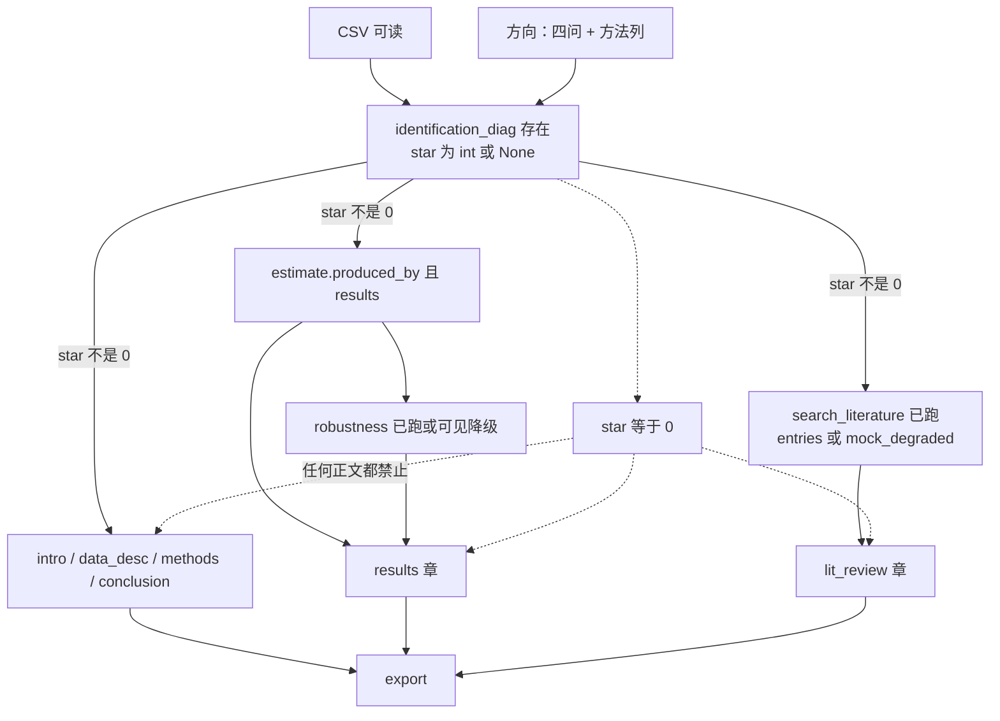

# 抽走测试后的 DAG

> 上级：[Proposed Design](../04-proposed-design.md)

边表示：抽走上游，下游**无法存在**（不是仅仅变差）。标题、大纲文案、引言润色都不是结果章的存在条件。

抽走检验：

| 下游 | 抽走什么仍能存在？ | 抽走什么就不能存在？ |
| --- | --- | --- |
| `identification_diag` | 标题、文献 | CSV 或方向 |
| 引言 / 数据 / 方法 / 结论 | 主表、稳健性、文献 | 识别报告，或 star=0 |
| `results` 章 | 文献、标题 | 主表或未跑稳健性 |
| `lit_review` 章 | 主表、稳健性 | 文献节点未跑 |
| 大纲对象 | 文献、稳健性、估计 | 方向（否则六槽无问题可绑） |
| `title_chapter` | 估计（只能写方向、不能点名发现） | 方向 |

线性预写仍按「估计 → 稳健性 → 文献(mock) → 标题 → 大纲」一次做完，那是固定工作流，不是把标题画成存在边。
