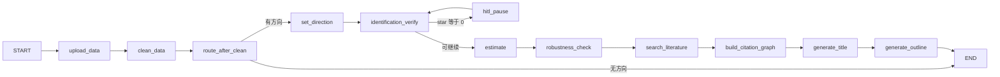
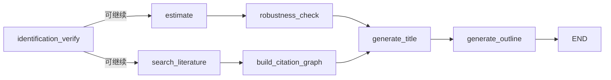

# 预写函数与第一批线性图

> 上级：[Proposed Design](../04-proposed-design.md)


抽 `agent/engine/prewrite.py`：

```python
def run_prewrite(state: dict) -> dict:
    """图与 Facade 共用。估计在文献之前。"""
    from nodes.set_direction import set_direction
    from nodes.identification_verify import identification_verify
    from nodes.estimate import estimate
    from nodes.robustness_check import robustness_check
    from nodes.search_literature import search_literature
    from nodes.citation_graph import build_citation_graph
    from nodes.generate_title import generate_title
    from nodes.generate_outline import generate_outline

    state = {**state, **set_direction(state)}
    state = {**state, **identification_verify(state)}
    if state.get("star_rating") == 0 or state.get("identification_failed"):
        return state
    state = {**state, **estimate(state)}
    state = {**state, **robustness_check(state)}
    state = {**state, **search_literature(state)}
    state = {**state, **build_citation_graph(state)}
    state = {**state, **generate_title(state)}
    state = {**state, **generate_outline(state)}
    return state
```

估计在文献之前：Crossref 10s 超时不能挡主表。`resolve_literature_source` 在 pytest 下为 mock，运行时最后一档为 `crossref`（已取代 ADR-0010「默认 mock」）。

**第一批线性图（可编译，无 `wait_*`）：**



`hitl_pause` 是图内唯一环。章节循环、评审、翻译、导出**不**编进这条预写图。

操作台写章的唯一路径是 Facade。图缩小之后，**必须**在同一条写路径上调用 `review_chapter`，否则评审节点没有产品调用方：

```python
# facade.generate_chapter / regenerate_chapter（成功写入之后）
from nodes.review_chapter import review_chapter as review_chapter_node

gen = generate_chapter_node(state)
state = {**state, **gen}
if not gen.get("write_blocked"):
    reviewed = review_chapter_node(state)
    state = {**state, **reviewed}
self.save_state(session_id, state)
return state
```

`write_blocked` 时不评审。评审若回退 `current_chapter_index`：**本请求不自动再生成**。HTTP 200，正文仍在 `body_chapters`，响应带 `auto_decision="fail"` 以及 `review_source` / `grounding_failures` / `score`。不得把回退当成通过。操作台要重写再 `POST /regenerate`。迭代上限仍是现有 `max_review_iterations`（硬上限 3）。

`regenerate_chapter` 同样：写完再审，再 `save_state`。

`route_after_clean`：无 `research_direction.question` 且无 `dv` → `END`。有方向（测试里直接灌 state 再 invoke）→ `set_direction`。

`run_upload_pipeline` 只跑到清洗后 `END`。不再指望一次 `graph.invoke` 出论文。`test_graph_has_three_nodes` 改为：节点集合含 `upload_data`/`clean_data`；空 state invoke **不得**走进 `generate_title`；`missing_count` 仍由 `clean_data` 单测覆盖（现有 `test_graph_clean_data_detects_missing`）。

**后批可选并行（不在第一批编译）：**



并行条件：LangGraph `==0.2.50`（`agent/requirements.txt`）。单独测试：`generate_title` 只执行一次（扇入不得双触发）。未写该测试前保持线性。

---
