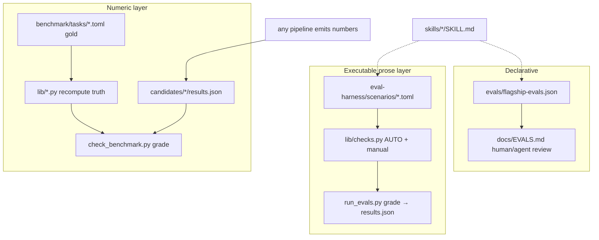

# AERS → Continuous Loop Evaluator 材料图

Date: 2026-08-06  
Source root: `/Users/mahaoxuan/Desktop/经济学论文/Auto-Empirical-Research-Skills`  
Consumer: `实证论文项目模板` Continuous Empirical Loop（L8 evaluate→learn）  
License note: AERS default **CC-BY-SA-4.0**（Attribution + ShareAlike）；导入须保留归属，canonical 规则仍 **proposal-only** 直至人工审。

---

## 一句结论

AERS 的信任面是三层：**catalog（发现）→ eval-harness（行为 rubric）→ benchmark（数字金标）**。  
本仓已把 AERS 编成 **capability / checklist 索引**（`Product/backend/auto_empirical_research_skills.py`），但 **尚未把 grader 接到 `runtime/continuous_loop.py` 的 evaluate 边**。  
Continuous Loop 的 evaluate 现在几乎只读 `paper_quality` 长度/章节 + citation + REPRO；缺的是 AERS 式 **方法陷阱机器判 + 数字重算交叉校验**。

```text
AERS layers                    Workbench continuous loop today
───────────                    ───────────────────────────────
catalog/skills.json  ──index→  capability_registry (discover only)
evals/flagship-evals.json      (not wired)
eval-harness/scenarios ──index→ cap_aers_eval_* checklist
eval-harness/lib/checks.py     NOT imported by evaluate_after_pipeline
benchmark/tasks+lib+checker    NOT run inside L8 evaluate
evidence/integrity_audit.py    parallel anti-fabrication (local)
Program/paper_quality          drives blocking/soft verdicts
```

---

## 1. AERS 是什么（机器可验证的 catalog，不是 skill 堆）

| 量 | 数 | SSOT |
|---|---:|---|
| Vendored skills | 1,072 | `catalog/skills.json` |
| Collections | 64 | 同上 |
| Flagship full-pipeline skills | 4 | `skills/00*`（StatsPAI / Python / Stata / R） |
| Numeric benchmark tasks | 5 | `benchmark/tasks/*.toml` |
| Eval scenarios / rubric items | 17 / 95 | `eval-harness/scenarios/*.toml` |
| Declarative flagship eval prompts | 8 | `evals/flagship-evals.json` → `docs/EVALS.md` |

入口：

- `README.md` / `README-zh-CN.md`：产品叙事 + `make check` 信任面
- `docs/TRUST.md`：三层质量边界（必要非充分）
- `docs/QUALITY_GATE.md`：`make catalog|validate|check`
- `docs/TAXONOMY.md`：stage/method/language 标签（生成物）

**Skill 形态：** 每个 collection 下 `SKILL.md`（YAML frontmatter: name/description/triggers）+ progressive `references/`。  
Flagship 编码 **同一 8 步实证环**（clean → construct → descriptives → diagnostics → estimate → robustness → hetero/mech → tables/figures），再叠 AER 投递与中文 de-AIGC。

**Catalog 构建（生成物勿手改）：**

| 产物 | 生成脚本 |
|------|----------|
| `catalog/skills.json` | `scripts/build-catalog.py` |
| `catalog/provenance.json` | `scripts/build-provenance.py` |
| `catalog/skill-audit.json` | `scripts/build-skill-audit.py` |
| `catalog/skills-enriched.json` | `scripts/build-catalog-enrich.py` |
| `docs/EVALS.md` | `scripts/build-evals.py` ← `evals/flagship-evals.json` |
| `docs/SKILL_CATALOG.md` | catalog 构建 |

**`catalog/skills.json` 形状（摘要）：**

```json
{
  "collections": [{
    "id": "00-Full-empirical-analysis-skill_StatsPAI",
    "path": "skills/00-...",
    "license": "MIT",
    "commercial_use": "allowed",
    "source_url": "...",
    "primary_skill": { "name", "path", "description" },
    "skill_count": 1
  }],
  "skills": [{ "collection", "name", "path", "description", "has_frontmatter" }]
}
```

本仓已消费方式：`index_aers_capabilities()` 把 collections 映射为 `namespace=external_skill`、`status∈{template,checklist,role_prompt,advisory}`，**明确 `status != executable`**。

---

## 2. 三层评测如何协作



| 层 | 问题 | 通过条件 | 失败证明 |
|----|------|----------|----------|
| **flagship-evals** | 改 skill 后期望产物/检查是什么？ | 人工或 agent 对照 checks/failure_modes | 无自动 exit code |
| **eval-harness** | agent 输出是否踩已知方法论/安全/引用雷？ | required machine-check 全过且无 open manual → `pass`；manual 未决 → `needs-manual` | required regex/numeric 失败 = 明确错 |
| **benchmark** | 报告数字是否等于数据重算真值，且不把陷阱当 headline？ | required gold 全过；`--strict --fail-on-partial` | `honest-reported-numbers` / 符号 / 偏差 gold 失败 |

设计原则（TRUST）：**fail-fast on high-cost mistakes**；regex 不证明全文正确，小 benchmark 不覆盖一切设计。

---

## 3. Benchmark 解剖（数字金标 + 反捏造）

### 3.1 文件树（应镜像的最小闭包）

```
benchmark/
  README.md
  schema/task.schema.json
  schema/candidate.schema.json
  tasks/
    lalonde-recovery.toml
    card-iv-recovery.toml
    did-staggered-recovery.toml
    rdd-recovery.toml
    bad-control-recovery.toml
  lib/
    lalonde.py          # stdlib load + SMD + naive ATT + OLS adj
    card.py             # OLS, 2SLS, first-stage F
    simdid.py           # staggered DGP + TWFE vs CS ATT
    rdd.py              # sharp RD + local linear
    badcontrol.py       # mediator / good vs bad control
  check_benchmark.py    # lint + compute_truth + grade + strict gates
  reference_pipeline.py # regenerates candidates/reference-*
  candidates/reference-{ols,iv,did,rd,badcontrol}/results.json
  data/                 # sim-*.csv when not pointing into demos
  results/*.json        # scorecards (generated)
```

**数据路径（任务 TOML `data=`）：**

| Task | Data path in AERS |
|------|-------------------|
| lalonde-recovery | `demo-notebooks/_lalonde_data.csv` |
| card-iv-recovery | `demo-StatsPAI-skill/data/card.csv` |
| did-staggered-recovery | `benchmark/data/sim-staggered-did.csv` |
| rdd-recovery | `benchmark/data/sim-rdd.csv` |
| bad-control-recovery | `benchmark/data/sim-badcontrol.csv` |

### 3.2 Task / gold 契约

- Stem == `id`；`data` 必须是 repo-relative；`reference_candidate` 单段目录名。
- 每个 `[[gold]]`：`id, description, check, required, weight` + check 专用字段。
- **Authoritative 校验器是 Python**，JSON Schema 给编辑器/人审；schema enum 的 check 名：

`imbalance_count | naive_sign | adjusted_recovery | near_benchmark | value_near | iv_gt_ols | first_stage_min | recovers_truth | biased_away | closer_to_truth | cross_check`

### 3.3 Candidate `results.json` 契约

- 必填：`task`（enum 与 5 个 id 对齐）。
- 按 task 条件 required 字段（见 `candidate.schema.json` allOf）：
  - LaLonde: `naive_att`, `adjusted_att`, `balance`
  - Card: `ols_return`, `iv_return`, `first_stage_F`, `first_stage_coef`
  - DID: `true_att`, `twfe_att`, `cs_att`
  - RDD: `true_tau`, `naive_jump`, `global_att`, `local_att`
  - Bad control: `true_total`, `naive_effect`, `good_control_effect`, `bad_control_effect`
- 数字必须是 JSON number（字符串在校验阶段拒绝）。

### 3.4 评分核心：`compute_truth` + `grade` + `cross_check`

每次 run **从 raw data 重算** truth（`check_benchmark.py::compute_truth`），再与 candidate 比对。  
`check == "cross_check"`（gold id 常为 `honest-reported-numbers`）是反捏造脊梁：捏造平衡表/漂亮 ATT 会在 required gold 上失败。

### 3.5 五任务 = 五类方法陷阱（映射到 learn 动作）

| Task | 陷阱 | 绿条件（摘要） | Loop 可映射的 next_action 线索 |
|------|------|----------------|--------------------------------|
| lalonde-recovery | 朴素 ATT 符号错 | 暴露不平衡；naive 负；adjusted 正且大 swing；数字诚实 | method_gate / rewrite identification+results |
| card-iv-recovery | 弱 IV 隐瞒 | OLS>0；IV>OLS；F≥10 报告；数字诚实 | method_gate + weak-IV diagnostics re-run |
| did-staggered-recovery | TWFE 偏差当主结果 | TWFE 当诊断；CS ATT≈truth；TWFE 明显偏 | method_gate → 换估计量 + event-study |
| rdd-recovery | 跨 cutoff 均值混趋势 | naive 偏；local-linear 恢复 jump | method_gate → RD 规范 |
| bad-control-recovery | 后处理控制当总效应 | good control = total；bad control 暴露偏 | method_gate → control set 重声明 |

### 3.6 运行命令（镜像后应保留）

```bash
python3 benchmark/reference_pipeline.py --check
python3 benchmark/check_benchmark.py --lint
python3 benchmark/check_benchmark.py --strict --fail-on-partial --fail-on-orphan-results
```

---

## 4. Eval-harness 解剖（行为 rubric）

### 4.1 最小闭包

```
eval-harness/
  README.md
  schema/scenario.schema.json
  lib/checks.py
  run_evals.py
  scenarios/*.toml          # 17
  candidates/_example/*.md  # CI 判别夹具（含故意失败 weak-iv）
  results/                  # 生成物；CI 用 --no-write
```

### 4.2 Scenario 契约

Required: `id, skill, title, category, severity, prompt, rubric`  
可选: `context_data[]`（repo-relative 存在性校验）  
`skill` 必须指向存在的 skill 目录；file stem == `id`。

### 4.3 Check 原语（`lib/checks.py`）

| check | 语义 |
|-------|------|
| `regex_any` / `regex_all` / `regex_none` | 必备/全有/禁止模式 |
| `regex_count_max` | 匹配次数上限（可 per_chars） |
| `word_count_max` / `word_count_min` | words\|chars\|cjk |
| `numeric_tolerance` / `numeric_sign` | extract 组 1 数字 |
| `manual` | 永不 auto-pass；出 judge prompt |

`section` regex（group 1）可把检查限制在摘要/正文。  
**`pass` 定义严格：** 无 required fail、无 partial machine、无 open manual。

### 4.4 17 scenarios（按 category → Continuous Loop 消费优先级）

| ID | Category | Severity | Loop 相关度 |
|----|----------|----------|-------------|
| `statspai-weak-iv` | causal-identification | critical | **P0** method red |
| `statspai-staggered-did` | causal-identification | high | **P0** |
| `statspai-bad-controls` | causal-identification | high | **P0** |
| `statspai-rdd-diagnostics` | causal-identification | high | **P0** |
| `statspai-pretrends-eventstudy` | causal-identification | high | **P0** |
| `statspai-clustered-inference` | causal-identification | high | P1 |
| `causal-inference-twfe-trap` | causal-identification | high | **P0** |
| `aer-identification-staggered` | causal-identification | high | P1 (prose audit) |
| `aer-robustness-multiple-testing` | research-integrity | high | **P0** claim degrade |
| `citation-hygiene-no-fake-refs` | citation-hygiene | high | **P0** ↔ citation_gate |
| `runtime-safety-replication-setup` | runtime-safety | critical | P1 package/repro |
| `aer-replication-package` | reproducibility | high | P1 step_09 |
| `aer-abstract-100words` | writing-compliance | medium | P2 step_06 |
| `aer-submission-preflight` | writing-compliance | medium | P2 package |
| `aer-tables-figures-housestyle` | writing-compliance | medium | P2 |
| `de-aigc-structural` | writing-style | medium | P2 CN draft |
| `english-deslop` | writing-style | medium | P2 EN draft |

**CI 覆盖期望（勿回归）：**

```bash
python3 eval-harness/run_evals.py \
  --min-scenarios 17 --min-auto-checks 80 \
  --expect-categories causal-identification,reproducibility,citation-hygiene,runtime-safety,research-integrity,writing-compliance,writing-style
```

### 4.5 代表场景：weak-IV（应成为 method_gate 模板）

`statspai-weak-iv.toml` required machine：

1. `reports-first-stage-f` — regex_any first-stage F / KP / CD  
2. `flags-weak-instrument` — F~8 判弱  
3. `weak-iv-robust-inference` — Anderson-Rubin / weak-IV-robust  
4. `no-false-reassurance` — regex_none 假性安慰  

Manual：exclusion restriction 讨论。

本仓测试夹具已 stub 该 scenario（`tests/test_auto_empirical_research_skills_contract.py`）。

---

## 5. Declarative flagship evals（8 prompts）

Source: `evals/flagship-evals.json`（生成 `docs/EVALS.md`）。

| ID | Category | 期望产物形态 |
|----|----------|--------------|
| `statspai-card-iv-pipeline` | empirical_pipeline | data_contract, first_stage, IV table, robustness |
| `python-lalonde-observational-pipeline` | empirical_pipeline | analysis.py, balance, ATT, robustness |
| `stata-lalonde-replication-do` | empirical_pipeline | .do + log + tables |
| `r-lalonde-quarto-report` | empirical_pipeline | .qmd + session_info |
| `aer-identification-staggered-did-audit` | identification_review | estimand + threat matrix |
| `aer-replication-package-audit` | replication | README/manifest/mapping |
| `aer-submission-preflight` | submission | checklist + desk-reject risks |
| `chinese-de-aigc-academic-rewrite` | writing | rewrite + diagnostic table |

用途：**回归 skill 内容** 与 **人工/agent 审阅清单**；不替代 harness/benchmark 的 exit code。  
对 Continuous Loop：可把 `expected_artifacts` 变成 step contract 文件存在性检查（artifact gate），`failure_modes` 变成 soft/hard 文案规则。

---

## 6. 本仓现状 vs 缺口

### 6.1 已有（索引层）

| 组件 | 路径 | 行为 |
|------|------|------|
| AERS adapter | `Product/backend/auto_empirical_research_skills.py` | catalog → caps；scenarios/tasks → `quality_gate` checklist |
| Default path | `AERS_SKILLS_PATH` 或 sibling `.../Auto-Empirical-Research-Skills` | 缺失则 `available=false`，不崩 |
| Policy | proposal_only_until_human_review | 不可 auto 写 canonical |
| Contract tests | `tests/test_auto_empirical_research_skills_contract.py` | BDD 1–7 |
| Loop evaluate | `runtime/continuous_loop.py::evaluate_after_pipeline` | quality verdict + citation JSON + REPRO step flag |
| Learn map | `build_learn_plan` | blocking/soft → rewrite_expand / degrade_and_rewrite / halt_honest / package_green |
| Local integrity | `evidence/integrity_audit.py` | claim-bind / 反捏造（写作侧） |

### 6.2 缺口（执行层）

1. **未 import** `eval-harness/lib/checks.py` 或 `run_evals.py` 到 L8 evaluate。  
2. **未调用** `benchmark/check_benchmark.py` 对估计产物做数字金标（demo 方法与 5 traps 对齐时）。  
3. `index_aers_quality_gates` 的 caps 是 **checklist 元数据**，不是 runtime 门禁对象。  
4. Loop `BLOCKING_VERDICTS` 偏 **长度/章节/格式/证据池**，缺 **method_trap / weak_iv / twfe_headline / fabricated_citation_numeric** 等 AERS 类码。  
5. `learn` 的 `target_steps` 固定 `REWRITE_TAIL`（06–10）；AERS 方法红更应 **回炉 05_causal_analysis**（估计/识别），而非只扩写。

---

## 7. Continuous Loop evaluator：应 import / mirror 的具体清单

原则：**vendor 最小可跑闭包 + 适配器薄封装**；不要整仓 3000+ skill md 拷进本仓。Skills 继续外部路径索引；**grader 与 fixtures 镜像**。

### 7.1 P0 — 必须镜像（stdlib-only grader 闭包）

目标路径建议：`runtime/aers_eval/`（或 `vendor/aers-eval/`），保持相对结构以便 path 校验逻辑少改。

| 源（AERS） | 镜像目标建议 | 用途 |
|------------|--------------|------|
| `eval-harness/lib/checks.py` | `runtime/aers_eval/checks.py` | prose rubric 原语 |
| `eval-harness/schema/scenario.schema.json` | `runtime/aers_eval/schema/scenario.schema.json` | 文档/校验 |
| `eval-harness/scenarios/statspai-weak-iv.toml` | `.../scenarios/` | method gate |
| `.../statspai-staggered-did.toml` | 同上 | method gate |
| `.../statspai-bad-controls.toml` | 同上 | method gate |
| `.../statspai-rdd-diagnostics.toml` | 同上 | method gate |
| `.../statspai-pretrends-eventstudy.toml` | 同上 | method gate |
| `.../causal-inference-twfe-trap.toml` | 同上 | method gate |
| `.../aer-robustness-multiple-testing.toml` | 同上 | claim integrity |
| `.../citation-hygiene-no-fake-refs.toml` | 同上 | 与 citation_gate 合流 |
| `benchmark/schema/task.schema.json` | `runtime/aers_eval/benchmark/schema/` | 契约 |
| `benchmark/schema/candidate.schema.json` | 同上 | 估计产物契约 |
| `benchmark/lib/{lalonde,card,simdid,rdd,badcontrol}.py` | `.../benchmark/lib/` | 重算 truth |
| `benchmark/check_benchmark.py` | `.../benchmark/check_benchmark.py` | grade 入口（可包一层） |
| `benchmark/tasks/*.toml`（5） | `.../benchmark/tasks/` | gold 规格 |
| `benchmark/data/*.csv`（3 sim） | `.../benchmark/data/` | 确定性 DGP |
| `demo-notebooks/_lalonde_data.csv` | `.../fixtures/lalonde.csv`（或保留相对路径） | LaLonde |
| `demo-StatsPAI-skill/data/card.csv` | `.../fixtures/card.csv` | Card IV |
| `benchmark/candidates/reference-*/results.json` | `.../candidates/` | 自检夹具 |
| `scripts/toml_compat.py` | 若目标 Python 无 tomllib 再拷；本仓 3.11+ 可用 stdlib | TOML |

**不要整仓镜像：** `skills/**` 主体、`demo-notebooks` 全量、`images/`、`SECURITY-SCAN-*` 大报告。  
Skill 内容继续 `AERS_SKILLS_PATH` 只读索引。

### 7.2 P1 — 文档与声明层（链到 materials，不必 runtime）

| 源 | 用途 |
|----|------|
| `docs/TRUST.md` | 信任边界表述（本文件已吸收） |
| `docs/QUALITY_GATE.md` | CI 命令 |
| `evals/flagship-evals.json` | step artifact 期望 + failure_modes |
| `benchmark/README.md` | 任务语义 |
| `eval-harness/README.md` | harness 语义 |
| `catalog/skills.json` | 已由 adapter 读；无需镜像副本 |

### 7.3 P2 — 可选夹具 / 回归

| 源 | 用途 |
|----|------|
| `eval-harness/candidates/_example/` | grader 判别回归（含故意 fail weak-iv） |
| `tests/test_benchmark.py` / `test_eval_checks.py` / `test_eval_scenarios.py` | 移植或对照写本仓 tests |
| `reference_pipeline.py` | 仅维护 benchmark 逻辑时需要 |

### 7.4 不建议直接 import 当 loop gate

| 源 | 原因 |
|----|------|
| 整包 1,072 SKILL.md | 上下文爆炸；loop 要的是 grader 不是 playbook dump |
| `SECURITY-SCAN-REPORT*.md` | 维护者安全审计，非论文 evaluate |
| LLM judge 路径（`--judge` + Anthropic） | loop 默认应 no-key 可跑；manual 可后置 |

---

## 8. 接到 Continuous Loop 的建议接线（结构，非实现工单）

### 8.1 Evaluate 扩展对象

在 `evaluate_after_pipeline` 之外（或内部）增加 **model-out** 块，例如：

```json
{
  "paper_quality": { "verdict": ["..."], "blocking": [], "soft": [] },
  "aers_eval": {
    "scenarios": [
      { "id": "statspai-weak-iv", "status": "pass|fail|skip|needs-manual",
        "required_failures": [], "score": "w_earned/w_possible" }
    ],
    "benchmark": [
      { "task": "card-iv-recovery", "status": "pass|fail|skip",
        "required_failures": ["honest-reported-numbers"], "score": "14/14" }
    ]
  },
  "integrity": { "from": "evidence/integrity_audit", "exit": 0 },
  "repro_ok": true,
  "is_green": false
}
```

### 8.2 Verdict 码扩展（映射 AERS → learn）

| 新/扩展码 | 触发 | next_action | target_steps |
|-----------|------|-------------|--------------|
| `method_trap_weak_iv` | weak-iv scenario required fail | degrade_and_rewrite 或 re-estimate | **`05_causal_analysis`** + rewrite tail |
| `method_trap_twfe` | staggered/twfe scenarios fail | re-estimate modern DID | `05` + `06` |
| `method_trap_bad_control` | bad-control fail | re-spec controls | `05` |
| `method_trap_rd` | rdd diagnostics fail | re-estimate RD | `05` |
| `numeric_gold_mismatch` | benchmark cross_check fail | halt_honest 或 re-run estimate | `05` + `09` |
| `citation_fabrication_risk` | citation-hygiene fail | degrade_and_rewrite | `08_format_citation` |
| `multiple_testing_abuse` | aer-robustness-multiple-testing fail | degrade claims | `06`–`07` |

Green 硬线保持：`ready_for_review` + REPRO_OK + **无 blocking**（含 method/numeric）。

### 8.3 与现有 integrity 的分工

| 系统 | 抓什么 | 不抓什么 |
|------|--------|----------|
| `evidence/integrity_audit` | 稿内数字是否 bind 到 evidence_bank | 估计器是否 TWFE 陷阱 |
| AERS eval-harness | 方法/引用/安全 **叙述属性** | 真实回归系数是否等于数据 |
| AERS benchmark | **数字 = 重算 truth** | 中文写作长度 |
| `paper_quality` | 章节/长度/课程格式 | 识别策略正确性 |

三者应 **并集进 evaluate**，任一类 hard red 禁止 `completed_green`。

### 8.4 Candidate 适配（本仓估计 → benchmark）

本仓 `Results/json/analysis_result.json` / `regression_tables.json` 需 **adapter** 写成 `results.json` 形状（task 字段 + 数值），再调 `grade_task`。  
未跑 Card/LaLonde 类任务时：benchmark **skip**（不假绿）；仅在 method profile 匹配时 enforce。

### 8.5 Prose 适配（稿 → scenario grade）

对 `Manuscripts/sections/*.md` 或 `empirical_strategy.md` / robustness 节，按 method profile 选择 scenario 子集，调用 `run_check` 逐条 rubric。  
`manual` → `needs-manual` 不计入 machine green，也不应静默 pass。

---

## 9. 推荐落地顺序（可验收）

1. **Mirror P0 闭包** 到 `runtime/aers_eval/`，单测：checks 原语 + 5 task lint + reference candidates full green。  
2. **`AersLoopEvaluator.evaluate(artifacts_dir, method_profile)`** 返回结构化 aers_eval 块。  
3. **`evaluate_after_pipeline` 合并** aers_eval failures → blocking/soft 码。  
4. **`build_learn_plan` 读 method 码** → `target_steps` 可含 `05_causal_analysis`。  
5. **CI：** 镜像包自检 + contract tests 扩展「真实 TOML 路径可 grade」。  
6. **可选：** flagship-evals `expected_artifacts` → step artifact presence gate。

Falsifier（做完应能证伪旧缺口）：

- 红灯仍 `completed_green` → FAIL  
- weak-IV 文案无 AR 却 evaluate 绿 → FAIL  
- 捏造 balance 过 numeric gate → FAIL  

---

## 10. 源路径速查（绝对路径）

| 角色 | Path |
|------|------|
| AERS root | `/Users/mahaoxuan/Desktop/经济学论文/Auto-Empirical-Research-Skills` |
| Catalog | `.../catalog/skills.json` |
| Flagship evals | `.../evals/flagship-evals.json` |
| Harness | `.../eval-harness/` |
| Benchmark | `.../benchmark/` |
| Trust docs | `.../docs/TRUST.md`, `.../docs/QUALITY_GATE.md`, `.../docs/EVALS.md` |
| Workbench adapter | `/Users/mahaoxuan/Desktop/经济学论文/实证论文项目模板/Product/backend/auto_empirical_research_skills.py` |
| Loop | `.../runtime/continuous_loop.py` |
| Integrity | `.../evidence/integrity_audit.py` |
| Structure audit | `.../docs/structure-audit/01_FINAL_APPROVED.md`, `02_L8_IMPLEMENTATION.md` |

---

## 11. 许可与归属（导入时硬约束）

- 默认 CC-BY-SA-4.0：保留作者/链接、ShareAlike、标明修改。  
- StatsPAI skill 子集可能标 MIT（见 collection `license` 字段）——按 collection 元数据分案。  
- 本仓 policy 已锁：`can_write_canonical=false`；方法规则变更进 `Program/methodology/proposals/auto-empirical-research-skills/`。

---

*Generated for structure-audit materials. Implementation not in scope of this file.*
