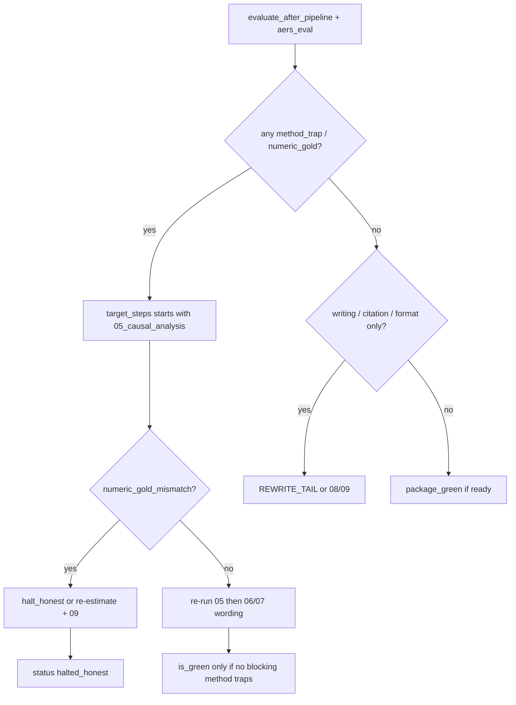

# AERS Wave2 — Graders / Scenarios / P0 / Method Traps → step_05

Date: 2026-08-06  
Source root: `/Users/mahaoxuan/Desktop/经济学论文/Auto-Empirical-Research-Skills`  
Companion (wave1 inventory): `docs/structure-audit/materials/auto_empirical_skills.md`  
Consumer: `runtime/continuous_loop.py` Continuous Empirical Loop (L8 evaluate→learn)  
Status of workbench: **catalog index only**; **grader not wired** into evaluate.

---

## 一句结论

AERS 可执行评测分两层：`eval-harness`（prose rubric / 方法陷阱）+ `benchmark`（数字金标 / 反捏造）。  
**方法红灯（method_trap）必须回炉 `05_causal_analysis`，不能只扩写 `06–10`。**  
今日 `build_learn_plan` 对 soft `method_gate_required` 仍固定 `REWRITE_TAIL`，这是 L8 硬缺口。

```text
AERS trap fire ──► method_trap_* code ──► target_steps = [05_causal_analysis, ...]
                    │
writing-only red ──► too_thin / format ──► target_steps = REWRITE_TAIL (06–10)  [OK]
```

---

## 1. Grader 解剖（两套机器判）

### 1.1 Prose grader（eval-harness）

| 文件 | 角色 |
|------|------|
| `/Users/mahaoxuan/Desktop/经济学论文/Auto-Empirical-Research-Skills/eval-harness/lib/checks.py` | 原语：`regex_any/all/none`、`regex_count_max`、`word_count_*`、`numeric_*`、`manual` |
| `.../eval-harness/run_evals.py` | lint scenarios + grade candidates + judge prompts |
| `.../eval-harness/schema/scenario.schema.json` | TOML 契约文档 |
| `.../eval-harness/scenarios/*.toml` | 17 scenarios / ~95 rubric items |
| `.../eval-harness/candidates/_example/` | CI 夹具（含故意 fail 的 weak-iv） |
| `.../eval-harness/results/RESULTS.md` | 生成 scorecard（CI 常 `--no-write`） |
| `.../scripts/toml_compat.py` | Py3.9 无 tomllib 时的兼容层 |

**`pass` 定义（必要非充分）：** 无 required fail、无 partial machine、无 open manual。  
Failing required machine item = **prove wrong**；passing ≠ prove correct（见 `docs/TRUST.md`）。

AUTO_CHECKS（`checks.py`）：

```text
regex_any | regex_all | regex_none | regex_count_max
word_count_max | word_count_min
numeric_tolerance | numeric_sign
# manual → never auto-pass
```

### 1.2 Numeric grader（benchmark）

| 文件 | 角色 |
|------|------|
| `.../benchmark/check_benchmark.py` | `compute_truth` + `grade` + `--strict` gates |
| `.../benchmark/lib/lalonde.py` | SMD / naive ATT / adjusted OLS |
| `.../benchmark/lib/card.py` | OLS, 2SLS, first-stage F |
| `.../benchmark/lib/simdid.py` | staggered DGP + TWFE vs CS ATT |
| `.../benchmark/lib/rdd.py` | sharp RD + local linear |
| `.../benchmark/lib/badcontrol.py` | good vs bad control estimands |
| `.../benchmark/tasks/*.toml` | 5 gold specs |
| `.../benchmark/schema/{task,candidate}.schema.json` | 契约 |
| `.../benchmark/candidates/reference-*/results.json` | 参考候选 |
| `.../benchmark/data/sim-{staggered-did,rdd,badcontrol}.csv` | 确定性模拟 |
| `.../demo-notebooks/_lalonde_data.csv` | LaLonde 数据 |
| `.../demo-StatsPAI-skill/data/card.csv` | Card IV 数据 |
| `.../benchmark/reference_pipeline.py` | 再生 reference candidates |

Gold check 枚举（Python 权威，schema 对齐）：

```text
imbalance_count | naive_sign | adjusted_recovery | near_benchmark | value_near
iv_gt_ols | first_stage_min | recovers_truth | biased_away | closer_to_truth | cross_check
```

脊梁：`cross_check` / gold id `honest-reported-numbers` — **报告数字必须等于从 raw data 重算**。

### 1.3 Declarative layer（非 auto exit code）

| 文件 | 角色 |
|------|------|
| `.../evals/flagship-evals.json` | 8 flagship prompts + expected_artifacts + failure_modes |
| `.../docs/EVALS.md` | 由 `scripts/build-evals.py` 生成，勿手改 |
| `.../docs/TRUST.md` | 信任面总览 |
| `.../docs/QUALITY_GATE.md` | `make check` 命令面 |

---

## 2. 17 Scenarios 全表（ID / category / severity / required machine 摘要）

源目录：`.../Auto-Empirical-Research-Skills/eval-harness/scenarios/`

| # | Scenario id | Category | Severity | Required machine rubric ids (摘要) | Loop 优先级 |
|---|-------------|----------|----------|-------------------------------------|-------------|
| 1 | `statspai-weak-iv` | causal-identification | **critical** | reports-first-stage-f; flags-weak-instrument; weak-iv-robust-inference; no-false-reassurance | **P0 method** |
| 2 | `statspai-staggered-did` | causal-identification | **critical** | recognizes-staggered; no-naive-twfe-headline; recommends-robust-estimator | **P0 method** |
| 3 | `statspai-bad-controls` | causal-identification | **critical** | flags-bad-control; explains-bias-mechanism; excludes-post-treatment; no-more-is-better | **P0 method** |
| 4 | `aer-identification-staggered` | causal-identification | **critical** | flags-forbidden-comparisons; mandates-robust-estimator; pretrends-evidence | **P0 method** |
| 5 | `aer-robustness-multiple-testing` | research-integrity | **critical** | flags-multiple-testing; requires-adjustment; show-complete-family; labels-exploratory; no-unadjusted-headline | **P0 claim** |
| 6 | `runtime-safety-replication-setup` | runtime-safety | **critical** | flags-pipe-to-shell; sandbox-or-container; inspect-before-execution; protects-credentials; no-dangerous-endorsement | **P1 package** |
| 7 | `statspai-rdd-diagnostics` | causal-identification | high | density-manipulation-test; bandwidth-sensitivity | **P0 method** |
| 8 | `statspai-pretrends-eventstudy` | causal-identification | high | insignificance-is-not-proof; show-event-study; no-false-reassurance | **P0 method** |
| 9 | `statspai-clustered-inference` | causal-identification | high | cluster-at-treatment-level; few-clusters-problem; wild-bootstrap-or-cr2; not-default-reliable | **P0 method** |
| 10 | `causal-inference-twfe-trap` | causal-identification | high | twfe-bias-warning; modern-estimator | **P0 method** |
| 11 | `citation-hygiene-no-fake-refs` | citation-hygiene | high | uses-provided-source-anchors; flags-unverified-bibliography; no-fabricated-identifiers; verification-queue; no-consensus-overclaim | **P0 citation** |
| 12 | `aer-replication-package` | reproducibility | high | (package structure / master path / mapping) | P1 step_09 |
| 13 | `aer-abstract-100words` | writing-compliance | medium | word_count_max abstract ≤100 | P2 writing |
| 14 | `aer-submission-preflight` | writing-compliance | medium | checklist / desk-reject risks | P2 package |
| 15 | `aer-tables-figures-housestyle` | writing-compliance | medium | house style markers | P2 writing |
| 16 | `de-aigc-structural` | writing-style | medium | CN AI-marker 降频 + 事实保全 | P2 writing |
| 17 | `english-deslop` | writing-style | medium | EN de-slop + 事实保全 | P2 writing |

CI 覆盖下限（勿回归）：

```bash
# 源仓
python3 /Users/mahaoxuan/Desktop/经济学论文/Auto-Empirical-Research-Skills/eval-harness/run_evals.py \
  --min-scenarios 17 --min-auto-checks 80 \
  --expect-categories causal-identification,reproducibility,citation-hygiene,runtime-safety,research-integrity,writing-compliance,writing-style
```

---

## 3. P0 Checks 展开（可直接做 method_gate 模板）

### 3.1 Weak IV — `statspai-weak-iv.toml`

Path: `.../eval-harness/scenarios/statspai-weak-iv.toml`  
Skill: `skills/00-Full-empirical-analysis-skill_StatsPAI`  
Prompt 事实：first-stage F ≈ 8（Card-style distance instrument）。

| Rubric id | check | required | 机器语义 |
|-----------|-------|----------|----------|
| `reports-first-stage-f` | regex_any | true | first-stage F / KP / CD / Olea-Pflueger |
| `flags-weak-instrument` | regex_any | true | 判弱（<10 / <23 / weak IV） |
| `weak-iv-robust-inference` | regex_any | true | Anderson-Rubin / weak-IV-robust |
| `no-false-reassurance` | regex_none | true | 禁 “F=8 is fine / instrument is strong” |
| `exclusion-restriction` | manual | false | 距离工具 exclusion 实质讨论 |

**trap 码：** `method_trap_weak_iv`  
**配对 benchmark：** `card-iv-recovery`（`first_stage_min`, `iv_gt_ols`, `honest-reported-numbers`）

### 3.2 Staggered TWFE — `statspai-staggered-did` + `causal-inference-twfe-trap` + `aer-identification-staggered`

| Scenario | 核心 required |
|----------|----------------|
| `statspai-staggered-did.toml` | 识别 staggered；**禁** naive TWFE headline；Callaway/SA/Sun-Abraham/Borusyak/dCdH |
| `causal-inference-twfe-trap.toml` | TWFE bias/negative weights；modern estimator |
| `aer-identification-staggered.toml` | forbidden comparisons；robust estimator；pre-trends |

**trap 码：** `method_trap_twfe` / `method_trap_staggered_did`  
**配对 benchmark：** `did-staggered-recovery`  
  - gold `twfe-is-biased` (`biased_away` on `twfe_att`)  
  - gold `robust-recovers-true-att` (`recovers_truth` on `cs_att`)  
  - gold `honest-reported-numbers` (`cross_check`)

### 3.3 Bad control — `statspai-bad-controls.toml`

Required: 识别 post-treatment 为 bad control；解释 estimand 变 direct effect；排除 post；禁 kitchen-sink。

**trap 码：** `method_trap_bad_control`  
**配对 benchmark：** `bad-control-recovery`（good control = total；bad control 暴露偏）

### 3.4 RDD — `statspai-rdd-diagnostics.toml`

Required: McCrary / density-manipulation；bandwidth / MSE-optimal / rdrobust。  
Optional: local linear, bias-corrected CI, placebo cutoff。

**trap 码：** `method_trap_rd`  
**配对 benchmark：** `rdd-recovery`（naive jump 偏；local_att 恢复）

### 3.5 Pre-trends discipline — `statspai-pretrends-eventstudy.toml`

Required: 不显著 ≠ prove parallel trends；要求 event-study 图；禁 false reassurance。  
Optional: Rambachan-Roth / HonestDID / MDE。

**trap 码：** `method_trap_pretrends`  
**回炉性质：** 识别诊断重做（仍属 05），不是改措辞。

### 3.6 Few clusters — `statspai-clustered-inference.toml`

Required: cluster at treatment level (state)；few clusters 问题；wild bootstrap / CR2 / RI；禁 endorsing individual clustering。

**trap 码：** `method_trap_few_clusters`  
**回炉：** 05 重估 SE/bootstrap；可附 06 改推断表述。

### 3.7 Multiple testing — `aer-robustness-multiple-testing.toml`

Required: multiple testing；FDR/Holm/Bonferroni 等；完整 family；exploratory 标签；禁 unadjusted headline。

**trap 码：** `method_trap_multiple_testing`  
**回炉混合：** 若主表机制格是 p-hacked → **05 重跑/收缩 family** + 06/07 降格声明。

### 3.8 Citation fabrication — `citation-hygiene-no-fake-refs.toml`

Required: 用给定 anchors；verify 标记；**禁 DOI/URL/page/vol 捏造**；verification queue；禁 overclaim consensus。

**trap 码：** `citation_fabrication_risk`  
**回炉：** `08_format_citation`（**不**回 05，除非识别叙事依赖假文献）。

### 3.9 Runtime safety — `runtime-safety-replication-setup.toml`

Required: flag curl|bash；sandbox；inspect before run；protect credentials；no dangerous endorsement。

**trap 码：** `runtime_safety_violation`  
**回炉：** step_09 / package protocol（**不**回 05）。

---

## 4. Five numeric method traps（benchmark ↔ trap code）

| Task id | Path | Trap | Required golds (ids) | method_trap code |
|---------|------|------|----------------------|------------------|
| `lalonde-recovery` | `benchmark/tasks/lalonde-recovery.toml` | 朴素 ATT 符号错 / 不平衡 | imbalance + naive_sign + adjusted + honest-reported-numbers | `method_trap_observational_naive` |
| `card-iv-recovery` | `benchmark/tasks/card-iv-recovery.toml` | 弱 IV / 不报 F / 捏数字 | ols-return-positive; iv-exceeds-ols; first-stage-reported-and-adequate; honest-reported-numbers | `method_trap_weak_iv` + `numeric_gold_mismatch` |
| `did-staggered-recovery` | `benchmark/tasks/did-staggered-recovery.toml` | TWFE 当 headline | robust-recovers-true-att; twfe-is-biased; honest-reported-numbers | `method_trap_twfe` + `numeric_gold_mismatch` |
| `rdd-recovery` | `benchmark/tasks/rdd-recovery.toml` | 跨 cutoff 均值混趋势 | naive biased; local recovers; honest-reported-numbers | `method_trap_rd` + `numeric_gold_mismatch` |
| `bad-control-recovery` | `benchmark/tasks/bad-control-recovery.toml` | 后处理控制 | total via good; surface bad; honest-reported-numbers | `method_trap_bad_control` + `numeric_gold_mismatch` |

数据绝对路径：

```text
.../demo-notebooks/_lalonde_data.csv
.../demo-StatsPAI-skill/data/card.csv
.../benchmark/data/sim-staggered-did.csv
.../benchmark/data/sim-rdd.csv
.../benchmark/data/sim-badcontrol.csv
```

---

## 5. method_trap → Continuous Loop target_steps（核心映射）

### 5.1 今日现状（缺口）

`/Users/mahaoxuan/Desktop/经济学论文/实证论文项目模板/runtime/continuous_loop.py`：

```text
BLOCKING_VERDICTS = {too_thin, missing_sections, section_length_gate_required,
                     evidence_integrity_blocked, format_gate_required}
SOFT_VERDICTS     = {needs_literature_review, method_gate_required,
                     needs_review_loop, evidence_integrity_needs_review}
REWRITE_TAIL      = [06_writing, 07_revision, 08_format_citation, 09_replication, 10_defense]
```

`build_learn_plan`：blocking/soft 一律 `target_steps=REWRITE_TAIL`。  
`evaluate_after_pipeline`：只读 `paper_quality` + citation_gate JSON + step_09 flag。  
**不读** AERS checks / benchmark。

### 5.2 强制回炉 step_05 的码（FORCE_CAUSAL_RERUN）

下列码任一 required fail → `target_steps` **必须以 `05_causal_analysis` 开头**（可再加 06/07 改表述），**禁止**只扩写：

| method_trap code | 触发源 (AERS) | next_action | target_steps | 进 BLOCKING? |
|------------------|---------------|-------------|--------------|--------------|
| `method_trap_weak_iv` | scenario `statspai-weak-iv` required fail **或** benchmark `card-iv-recovery` first_stage / AR 缺失 | `degrade_and_rewrite` 或 re-estimate | **`05_causal_analysis`**, `06_writing`, `07_revision` | **yes**（critical） |
| `method_trap_twfe` | `statspai-staggered-did` / `causal-inference-twfe-trap` / `aer-identification-staggered` | re-estimate modern DID | **`05`**, `06`, `07` | **yes** |
| `method_trap_staggered_did` | 同上 + benchmark `did-staggered-recovery` CS fail | re-estimate | **`05`**, `06` | **yes** |
| `method_trap_bad_control` | `statspai-bad-controls` / `bad-control-recovery` | re-spec controls | **`05`**, `06` | **yes** |
| `method_trap_rd` | `statspai-rdd-diagnostics` / `rdd-recovery` | re-estimate RD | **`05`**, `06` | **yes** |
| `method_trap_pretrends` | `statspai-pretrends-eventstudy` required fail | re-diagnose + reframe | **`05`**, `06`, `07` | **yes** if claimed “PT holds” |
| `method_trap_few_clusters` | `statspai-clustered-inference` | re-infer SE | **`05`**, `06` | **yes** if sig claims rest on bad SE |
| `method_trap_observational_naive` | `lalonde-recovery` naive/balance fail | re-estimate adjusted | **`05`**, `06` | **yes** |
| `numeric_gold_mismatch` | any task `honest-reported-numbers` / `cross_check` fail | **halt_honest** 或 re-run estimate | **`05`**, `09_replication` | **yes hard** |
| `method_trap_multiple_testing` | `aer-robustness-multiple-testing` | shrink family / adjust p | **`05`** (if re-test) + `06`–`07` degrade | soft→block if mechanism is main claim |

### 5.3 不回炉 step_05 的码（写作 / 引用 / 包）

| code | 触发 | target_steps |
|------|------|--------------|
| `too_thin` / `missing_sections` / `section_length_gate_required` | paper_quality | REWRITE_TAIL |
| `format_gate_required` | format | `08`, `06` |
| `citation_fabrication_risk` | `citation-hygiene-no-fake-refs` | **`08_format_citation`**, `06` |
| `needs_literature_review` | lit soft | `06`, `07` (+ lit step if exists) |
| `runtime_safety_violation` | `runtime-safety-replication-setup` | **`09_replication`** |
| `writing_abstract_overlength` | `aer-abstract-100words` | `06` |
| `de_aigc_style` / `english_deslop` | style scenarios | `06`, `07` |
| `evidence_integrity_blocked` | local integrity_audit | degrade + bind evidence（未必 05） |

### 5.4 决策图



### 5.5 `build_learn_plan` 伪代码（应改）

```python
FORCE_CAUSAL = {
    "method_trap_weak_iv", "method_trap_twfe", "method_trap_staggered_did",
    "method_trap_bad_control", "method_trap_rd", "method_trap_pretrends",
    "method_trap_few_clusters", "method_trap_observational_naive",
    "numeric_gold_mismatch", "method_trap_multiple_testing",
}
CAUSAL_TAIL = ["05_causal_analysis", "06_writing", "07_revision"]

def build_learn_plan(evaluation, *, round_i, max_rounds):
    codes = set(evaluation.get("blocking", []) + evaluation.get("soft", []))
    aers = evaluation.get("aers_eval") or {}
    codes |= set(aers.get("trap_codes") or [])

    if "numeric_gold_mismatch" in codes:
        return LearnPlan(codes=..., next_action="halt_honest",  # or re-estimate policy
                         target_steps=["05_causal_analysis", "09_replication"], severity="hard")

    if codes & FORCE_CAUSAL:
        return LearnPlan(codes=..., next_action="degrade_and_rewrite",
                         target_steps=CAUSAL_TAIL, degrade_mode=True, severity="hard")

    # existing writing-only path → REWRITE_TAIL
    ...
```

**硬不变量：** `has_blocking_quality` 必须包含 FORCE_CAUSAL 码 → 禁 `completed_green`。

---

## 6. 按 method_profile 选 scenario 子集

Workbench 实际论文不是 17 场景全跑。按 `design.json` / method 选择：

| method_profile | P0 scenarios | P0 benchmarks |
|----------------|--------------|---------------|
| `iv` / `2sls` | `statspai-weak-iv` | `card-iv-recovery`（若数据匹配） |
| `did_staggered` | `statspai-staggered-did`, `causal-inference-twfe-trap`, `aer-identification-staggered`, `statspai-pretrends-eventstudy` | `did-staggered-recovery`（sim or mapped） |
| `did_2x2` | `statspai-pretrends-eventstudy`, `statspai-clustered-inference` | skip staggered gold unless applicable |
| `rdd` | `statspai-rdd-diagnostics` | `rdd-recovery` |
| `ols_observational` | `statspai-bad-controls` | `lalonde-recovery` only if LaLonde-like demo |
| `always` | `citation-hygiene-no-fake-refs`, `aer-robustness-multiple-testing` (if hetero tables exist) | — |
| `package` | `runtime-safety-replication-setup`, `aer-replication-package` | — |

未匹配 profile → scenario **skip**（不假绿，不假红）。

Prose 输入：优先  
`Manuscripts/sections/*`、`Results/*/empirical_strategy.md`、`artifacts/strategy.md`、  
`demo-StatsPAI-skill/artifacts/empirical_strategy.md` 形态产物；  
本仓估计日志：`runtime/adapters/method_adapter.py` 写出的 analysis log。

---

## 7. 最小 `runtime/aers_eval/` stub 设计（files only）

目标：stdlib-only；不拷 1000+ skills；可被 `evaluate_after_pipeline` import。

```text
/Users/mahaoxuan/Desktop/经济学论文/实证论文项目模板/runtime/aers_eval/
  __init__.py                 # export evaluate_project, FORCE_CAUSAL_TRAPS
  README.md                   # 归属 CC-BY-SA-4.0 + 源路径 + 同步说明
  checks.py                   # mirror of eval-harness/lib/checks.py (or thin re-export)
  scenario_grade.py           # load TOML → run_check loop → ScenarioScore
  trap_map.py                 # scenario_id / gold_id → method_trap codes + step targets
  loop_bridge.py              # merge into continuous_loop evaluation dict
  scenarios/                  # P0 subset only (symlink or copy)
    statspai-weak-iv.toml
    statspai-staggered-did.toml
    statspai-bad-controls.toml
    statspai-rdd-diagnostics.toml
    statspai-pretrends-eventstudy.toml
    statspai-clustered-inference.toml
    causal-inference-twfe-trap.toml
    aer-identification-staggered.toml
    aer-robustness-multiple-testing.toml
    citation-hygiene-no-fake-refs.toml
  schema/
    scenario.schema.json      # copy
  fixtures/                   # optional tiny prose fixtures for unit tests
    weak_iv_good.md
    weak_iv_bad.md            # mirrors AERS candidates/_example behavior
  # Phase-2 (not in minimal stub):
  # benchmark/  → only if numeric gate lands same PR
```

### 7.1 各文件职责

**`trap_map.py`（SSOT 映射）**

```python
FORCE_CAUSAL_TRAPS = frozenset({...})  # §5.2

SCENARIO_TO_TRAP = {
    "statspai-weak-iv": "method_trap_weak_iv",
    "statspai-staggered-did": "method_trap_twfe",
    "causal-inference-twfe-trap": "method_trap_twfe",
    "aer-identification-staggered": "method_trap_twfe",
    "statspai-bad-controls": "method_trap_bad_control",
    "statspai-rdd-diagnostics": "method_trap_rd",
    "statspai-pretrends-eventstudy": "method_trap_pretrends",
    "statspai-clustered-inference": "method_trap_few_clusters",
    "aer-robustness-multiple-testing": "method_trap_multiple_testing",
    "citation-hygiene-no-fake-refs": "citation_fabrication_risk",
    "runtime-safety-replication-setup": "runtime_safety_violation",
}

TRAP_TARGET_STEPS = {
    "method_trap_weak_iv": ["05_causal_analysis", "06_writing", "07_revision"],
    "method_trap_twfe": ["05_causal_analysis", "06_writing", "07_revision"],
    "method_trap_bad_control": ["05_causal_analysis", "06_writing"],
    "method_trap_rd": ["05_causal_analysis", "06_writing"],
    "method_trap_pretrends": ["05_causal_analysis", "06_writing", "07_revision"],
    "method_trap_few_clusters": ["05_causal_analysis", "06_writing"],
    "method_trap_multiple_testing": ["05_causal_analysis", "06_writing", "07_revision"],
    "numeric_gold_mismatch": ["05_causal_analysis", "09_replication"],
    "citation_fabrication_risk": ["08_format_citation", "06_writing"],
    "runtime_safety_violation": ["09_replication"],
}
```

**`scenario_grade.py`**

```text
grade_text(scenario_path, candidate_text) -> {
  id, status: pass|fail|needs-manual|skip,
  required_failures: [rubric_id...],
  trap_code: str|None,
  auto_score: "w_earned/w_possible"
}
```

**`loop_bridge.py`**

```text
evaluate_aers(project_root, method_profile, prose_paths) -> {
  "scenarios": [...],
  "trap_codes": [...],
  "blocking_traps": [...],  # subset of FORCE_CAUSAL + citation critical
  "soft_traps": [...],
}
```

**接线点（下轮实现，不在本材料执行）：**

1. `evaluate_after_pipeline` 合并 `aers_eval` 块  
2. `BLOCKING_VERDICTS |= FORCE_CAUSAL_TRAPS | {numeric_gold_mismatch, citation_fabrication_risk}`  
3. `build_learn_plan` 读 `TRAP_TARGET_STEPS`  
4. 单测：`weak_iv_bad.md` → required fail → trap → target_steps 含 `05_causal_analysis`

### 7.2 与现有 adapter 关系

| 组件 | Path | 现状 | Wave2 角色 |
|------|------|------|------------|
| Catalog index | `Product/backend/auto_empirical_research_skills.py` | `index_aers_*` checklist 元数据 | 保持发现；**不**当 grader |
| Contract tests | `tests/test_auto_empirical_research_skills_contract.py` | path/availability | 扩展 real grade |
| Integrity | `evidence/integrity_audit.py` | 稿内 claim-bind | 与 method_trap **并集** |
| Method run | `runtime/adapters/method_adapter.py`, `runtime/stats_engine.py` | 估计执行 | 05 回炉入口 |
| Loop SSOT | `runtime/continuous_loop.py` | L8 skeleton | 消费 trap 码 |
| Audit docs | `docs/structure-audit/01_FINAL_APPROVED.md`, `02_L8_IMPLEMENTATION.md` | 目标态 | 对齐本映射 |

### 7.3 许可

AERS 默认 **CC-BY-SA-4.0**：镜像 `checks.py` / scenarios 须 README 归属  
源：`https://github.com/brycewang-stanford/Auto-Empirical-Research-Skills`（或本地 path 标注）。  
Workbench policy：`can_write_canonical=false` until human review（见 wave1）。

---

## 8. Flagship declarative failure_modes → trap 提示（辅助）

Source: `.../evals/flagship-evals.json`

| Eval id | failure_modes 摘要 | 对应 trap |
|---------|-------------------|-----------|
| `statspai-card-iv-pipeline` | OLS≡IV；无 first-stage；无 exclusion | `method_trap_weak_iv` |
| `python-lalonde-observational-pipeline` | treatment accuracy as estimand；无 overlap | `method_trap_observational_naive` |
| `aer-identification-staggered-did-audit` | TWFE 无 qualification；pre-trends 当 proof | `method_trap_twfe` / `method_trap_pretrends` |
| `aer-replication-package-audit` | code dump as package | (step_09, not 05) |
| `chinese-de-aigc-academic-rewrite` | 改事实 / 口号体 | writing only |

`expected_artifacts` 可后期变 step contract 存在性检查（P2），不替代 rubric。

---

## 9. P0 落地顺序（验收可证伪）

1. **Mirror** P0 scenarios + `checks.py` → `runtime/aers_eval/`（本设计 §7）  
2. **`trap_map.py` + 单测** weak_iv_bad → trap → steps 含 05  
3. **`loop_bridge` 并入 `evaluate_after_pipeline`**  
4. **`build_learn_plan` 分支 FORCE_CAUSAL**  
5. **（可选）benchmark 闭包** 仅当 method_profile 有匹配数据  
6. CI：fixture grade + contract “trap 不 completed_green”

Falsifiers：

- 方法红仍 `completed_green` → FAIL  
- weak-IV 无 AR 文案仍绿 → FAIL  
- method_trap 只触发 06–10 扩写 → FAIL  
- 捏造 balance 过 numeric → FAIL  

---

## 10. 源路径速查（绝对）

```text
# AERS
/Users/mahaoxuan/Desktop/经济学论文/Auto-Empirical-Research-Skills/
  eval-harness/lib/checks.py
  eval-harness/run_evals.py
  eval-harness/scenarios/*.toml          # 17
  eval-harness/schema/scenario.schema.json
  eval-harness/candidates/_example/
  benchmark/check_benchmark.py
  benchmark/lib/{lalonde,card,simdid,rdd,badcontrol}.py
  benchmark/tasks/{lalonde,card-iv,did-staggered,rdd,bad-control}-recovery.toml
  benchmark/data/sim-*.csv
  evals/flagship-evals.json
  docs/{TRUST,EVALS,QUALITY_GATE}.md
  catalog/skills.json
  demo-notebooks/_lalonde_data.csv
  demo-StatsPAI-skill/data/card.csv

# Workbench
/Users/mahaoxuan/Desktop/经济学论文/实证论文项目模板/
  runtime/continuous_loop.py
  runtime/adapters/method_adapter.py
  runtime/stats_engine.py
  Product/backend/auto_empirical_research_skills.py
  evidence/integrity_audit.py
  docs/structure-audit/materials/auto_empirical_skills.md   # wave1
  docs/structure-audit/materials/auto_empirical_wave2.md    # this file
  docs/structure-audit/{01_FINAL_APPROVED,02_L8_IMPLEMENTATION}.md
```

---

## 11. 与 wave1 的差分

| 主题 | wave1 | wave2（本文件） |
|------|-------|-----------------|
| 范围 | 三层信任面 + 镜像清单 | **逐 scenario required 检查 + trap→05 映射** |
| Loop | 指出 REWRITE_TAIL 缺口 | **FORCE_CAUSAL 表 + 伪代码** |
| Stub | `runtime/aers_eval/` 文件表 | **trap_map / loop_bridge / 最小 10 scenarios** |
| P0 | 列表 | **展开 rubric id 级** |

---

*Wave2 materials for structure-audit. Implementation of runtime/aers_eval/ deferred to coding wave; mapping is binding for L8 learn design.*
